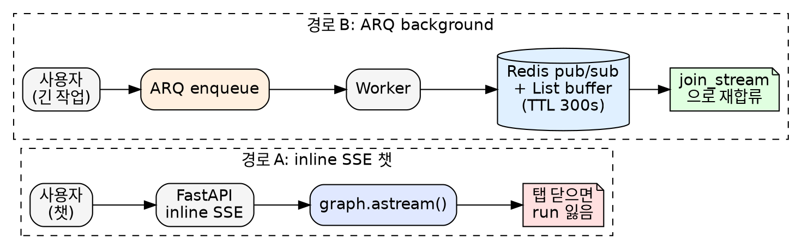
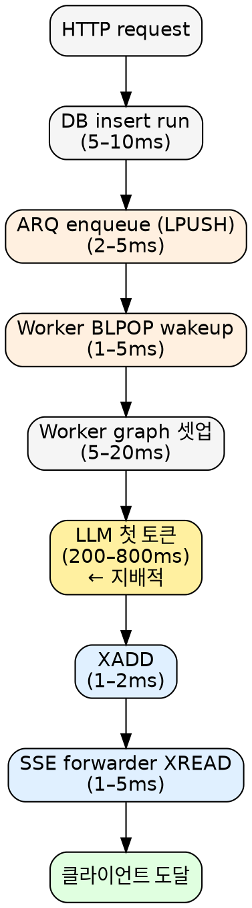
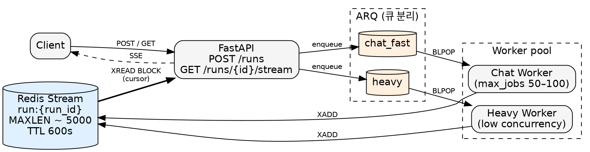

## TL;DR

- 챗(짧고 빠른 응답)과 long-running 작업(분 단위, 끊겨도 이어 봐야 함)은 표면적으로 다른 요구처럼 보이지만, **production은 단일 경로로 통일**하는 방향으로 수렴했다
- 흔한 dual-path 구현 - inline SSE 챗 + worker + Redis pub/sub + List buffer - 은 **Redis Streams를 약화된 의미로 재구현한 것**
- LangGraph Platform, OpenAI Responses API, Vercel AI SDK, Cloudflare Agents가 모두 같은 결론에 도달함: **worker 일원화 + per-run durable 이벤트 버퍼 + cursor-based resume**
- TTF 페널티는 ~10–30ms (LLM TTF 200–800ms 대비 3–5%), **챗/heavy 큐만 분리하면** 챗 UX는 거의 그대로

## 들어가며

LLM 에이전트 플랫폼을 만들다 보면 결국 두 종류의 작업을 같은 인프라에서 다뤄야 한다.

- **짧은 챗**: 사용자가 질문하면 200ms 안에 첫 토큰이 나와야 한다. 끝나면 끝.
- **Long-running 작업**: RFP 문서 파싱, multi-step agent 실행 등 수 분이 걸리는 작업. 사용자가 탭을 닫고 다른 화면에 갔다가 돌아와도 진행 상황이 이어져야 한다.

직관적으로는 **두 경로가 다른 게 자연스럽다.** 챗은 SSE로 직속 스트리밍, 긴 작업은 백그라운드 큐. 많은 스택이 그렇게 시작한다.



그런데 이 분기를 두고 작업하다 보면 자연스럽게 의문이 든다.

> 그냥 다 백그라운드 경로로 보내면 안 되나? 그러면 챗도 탭 갔다 와도 스트리밍 이어보일 텐데.

이 글은 그 의문에서 출발해서 **production 시스템들이 어떤 답을 냈는지**까지 따라간 기록이다.

---

## 흔한 dual-path 구현

전형적인 LLM 에이전트 스택 (FastAPI + LangGraph + ARQ + Redis + PostgreSQL)에서 위의 두 요구를 분리하면 자연스럽게 두 가지 실행 경로가 생긴다.

### 경로 A: inline SSE 챗

```python
@router.post("/threads/{thread_id}/runs/stream")
async def stream_run(...):
    run_id, event_gen = await run_manager.stream_run(...)
    return EventSourceResponse(event_gen)
```

내부에서 `graph.astream()`을 web 프로세스에서 직접 돌리고, 청크가 나올 때마다 SSE로 yield한다.

```python
async for chunk in graph.astream(graph_input, config=lg_config, ...):
    if cancelled.is_set():
        raise asyncio.CancelledError()
    yield format_stream_event(modes[0], chunk)
```

특징:
- 큐 안 거침 - web 프로세스가 직접 graph 실행
- 이벤트는 **어디에도 영속되지 않음**
- SSE 끊기면 `GeneratorExit` → run = `interrupted` → 끝

### 경로 B: ARQ background

```python
async def create_run(...):
    run_record = await self.db.runs.create(..., status="pending")
    await self.arq_pool.enqueue_job("execute_run", run_id, ...)
    return run_record
```

워커가 잡아서 `graph.astream()`을 돌리고, 청크마다 Redis에 publish + buffer 적재.

```python
# (worker 측 가상 코드)
await redis.publish(f"run:{run_id}:events", json.dumps(event))
await redis.rpush(f"run:{run_id}:buffer", json.dumps(event))
```

클라이언트는 `join_stream()`으로 합류:

```python
async def join_stream(self, thread_id, run_id):
    pubsub = self.redis.pubsub()
    await pubsub.subscribe(f"run:{run_id}:events")

    # buffer replay
    buffered = await self.redis.lrange(f"run:{run_id}:buffer", 0, -1)
    for raw in buffered:
        yield json.loads(raw)

    # live events
    async for msg in pubsub.listen():
        if msg["type"] == "message":
            yield json.loads(msg["data"])
```

특징:
- 워커가 실행, web은 SSE forwarder
- 이벤트가 Redis에 영속 (TTL 300s)
- 어떤 클라이언트든 `join_stream`으로 합류 가능
- 탭 닫고 돌아와도 OK

---

## 단순한 질문: "왜 다 create로 안 하지?"

답: 그래도 된다. **그게 사실 표준이다.** 다만 그 결정에는 진짜 비용이 있다.

### 비용 1: TTF (Time To First Token) 홉

inline 경로는 HTTP request → graph 직행. worker 경로는:



순 추가 비용은 **~10–30ms**. LLM TTF가 200–800ms로 지배적이라 상대값으로는 **3–5%**. 사람이 인지하기 어려운 영역.

### 비용 2: 워커 starvation

진짜 위험은 홉 자체가 아니다. 워커가 분 단위 작업에 잡혀있으면 **챗 TTF = 그 시간만큼**. 이게 inline 경로가 가진 진짜 advantage - 이런 상황이 구조적으로 발생할 수 없다.

worker 일원화가 작동하려면 **무조건 큐 분리**가 필요하다.

```
chat_fast queue  → max_jobs 50–100 (LLM은 I/O bound, 워커당 동시성 충분)
heavy queue      → max_jobs 낮음, dedicated worker
```

큐 분리 안 하면 worker 일원화는 inline보다 **전 영역에서 더 나쁘다.**

---

## 첫 번째 답: dual-publish 땜빵

worker 일원화가 너무 큰 변경이라면, 가장 작은 패치는 inline `stream_run`도 같은 Redis 버퍼에 publish하게 만드는 것.

```python
async for chunk in graph.astream(...):
    event = format_stream_event(modes[0], chunk)
    await self.redis.publish(f"run:{run_id}:events", json.dumps(event))
    await self.redis.rpush(f"run:{run_id}:buffer", json.dumps(event))
    yield event
```

이렇게 하면 inline 챗도 `join_stream`으로 재합류 가능해진다. 탭 닫고 돌아와도 OK.

근데 자세히 보면 **다섯 가지 문제**가 깔려있다.

### 문제 1: drift 위험

`stream_run`(web)과 `execute_run`(worker)에 같은 publish 로직이 두 번 작성된다. 한쪽 포맷터가 바뀌면 다른 쪽도 같이 바꿔야 함. 시간이 지나면 반드시 어긋난다.

### 문제 2: dup race

`join_stream`의 순서는 `subscribe → lrange → listen`이다. 그런데 subscribe 이후 lrange 이전에 publish된 이벤트는 **buffer와 pub/sub 양쪽에 들어있다.** 클라이언트가 같은 청크를 두 번 받음.

### 문제 3: cursor 없음

`lrange 0 -1`은 buffer를 통째로 dump한다. "내가 #50까지 봤으니 그 이후만 줘"가 안 됨. 재연결 시 항상 전체 replay.

### 문제 4: MAXLEN 없음

Chat 토큰 스트림은 수천 청크가 가능한데 List에 trim 정책이 없으면 메모리 무한 증가. `_BUFFER_TTL = 300` 상수가 있어도 `EXPIRE` 호출이 없으면 적용 안 됨.

### 문제 5: atomic 아님

`publish` + `rpush`는 2 ops다. 사이에서 fail하면 inconsistent. publish는 됐는데 buffer에 안 남거나, buffer에 남았는데 listener에는 도달 안 하거나.

---

## 두 번째 답: Redis Streams

위 다섯 가지가 사실 **Redis Streams를 약화된 의미로 재구현하다 생긴 문제**다.

| | Pub/Sub + List | Streams |
|---|---|---|
| 영속성 | List는 살지만 fire-and-forget | 명시적 trim까지 |
| Late join replay | 수동 (lrange) | `XREAD` from any ID |
| Cursor | 없음 | entry ID가 native cursor |
| MAXLEN | 수동 LTRIM | `XADD MAXLEN ~ N` |
| Crash 견딤 | List는 살지만 ack 없음 | XPENDING으로 복구 |
| Atomic publish+persist | 2 ops | 1 op |

[Redis 공식 docs](https://redis.io/docs/latest/develop/data-types/streams/) 기준 우리 패턴 - *"한 producer + 다수의 짧은 consumer + late join with replay"* - 은 **Streams 교과서적 fit**이다.

코드 변경은 이 정도:

```python
# Worker (publish)
await redis.xadd(
    f"run:{run_id}",
    {"type": event_type, "payload": json.dumps(payload)},
    maxlen=5000,
    approximate=True,
)
await redis.expire(f"run:{run_id}", 600)

# SSE 엔드포인트 (consume)
last_id = request.headers.get("Last-Event-ID", "0")
while True:
    entries = await redis.xread(
        {f"run:{run_id}": last_id},
        block=0,
        count=100,
    )
    for stream, items in entries:
        for entry_id, data in items:
            yield {"id": entry_id, "data": data["payload"]}
            last_id = entry_id
```

dup race, MAXLEN, cursor, atomic 다섯 문제가 한 번에 사라진다.

---

## 세 번째 답: 전부 worker로

Streams로 갈아타도 `stream_run`(inline)과 `execute_run`(worker) 두 경로는 여전히 따로 존재한다. 둘 다 graph를 돌리고 둘 다 Stream에 publish해야 함. drift는 줄지만 **두 실행 경로** 자체가 본질적인 비용이다.

진짜 최종 형태는 inline 경로를 통째로 없애고 **모든 run이 worker를 통과**하게 하는 것.

```
POST /threads/{thread_id}/runs
  → ARQ enqueue, 즉시 run_id 반환

GET /threads/{thread_id}/runs/{run_id}/stream?last_event_id=...
  → SSE. 내부:
     XREAD BLOCK 0 STREAMS run:{run_id} <last_id>
```

근데 정말 이게 표준일까? 그래서 다른 곳들이 뭘 하는지 봤다.

---

## Production 표준 리서치

### LangGraph Platform

가장 직접적인 레퍼런스. LangChain 본인들이 [공식 changelog](https://changelog.langchain.com/announcements/reliable-streaming-and-efficient-state-management-in-langgraph)에서 선언했다.

> Streaming runs are now powered by the job queue used for background runs.

**두 경로를 통일했다.** 우리가 지금 가진 split을 그들도 가졌었고, worker 일원화로 갔다.

[neuralware의 분석](https://neuralware.github.io/posts/langgraph-redis/index.html)에 따르면:

> Redis Lists act as FIFO queues for agent task scheduling, while Redis String and Pub/Sub are used for bi-directional signaling (output streaming/cancellations).

[공식 streaming docs](https://docs.langchain.com/langgraph-platform/streaming)는 더 흥미롭다.

> When you use `.join_stream`, output is not buffered, so any output produced before joining will not be received.

**run-level join은 best-effort**이라고 명시. 실제 durable resume의 진짜 surface는 thread-level이다.

> If the connection drops, pass the ID of the last event you received to resume without missing events. Pass `"-"` to replay from the beginning.

**Last-Event-ID 패턴**.

### OpenAI Responses API

OpenAI의 진화도 흥미롭다. 기존 Assistants API는 join-stream 엔드포인트가 없어서 [커뮤니티가 계속 항의](https://community.openai.com/t/how-to-resume-streaming-in-python-after-submitting-function-call-outputs-in-openai-assistants-api/1119902).

답이 **Responses API + Background mode**다. [공식 가이드](https://platform.openai.com/docs/guides/background)에 따르면:

- `background: true, stream: true`로 시작
- 매 이벤트에 `sequence_number`
- 끊기면 같은 response_id로 재연결 → 서버가 cursor부터 replay
- caveat: *"you can only resume streaming if the original request included `stream=true`"*

LangGraph의 `Last-Event-ID`와 **동형 패턴**이다.

### Anthropic Messages API

[Messages streaming spec](https://platform.claude.com/docs/en/api/messages-streaming)에는 reconnect/resume이 **없다.** 끊기면 끝. Anthropic은 durability를 application 레이어로 넘긴다. 즉 *우리가* 버퍼링해야 한다.

### Vercel AI SDK - `resumable-stream`

가장 코드-레벨 가까운 레퍼런스. [vercel/resumable-stream](https://github.com/vercel/resumable-stream) README는 정확하다.

> The producer will always complete the stream, even if the reader of the original stream goes away.

> a single `INCR` and `SUBSCRIBE` per stream.

Redis Pub/Sub + producer 측 in-memory buffer. **Producer-alive 제약**이 있어서 워커 죽으면 복구 불가. Upstash는 [Streams로 확장](https://upstash.com/blog/realtime-ai-sdk)해서 producer 죽음도 견디게 함.

핵심 인사이트: **탭 이동 resume**에는 pub/sub + 메모리 버퍼로 충분. **워커 크래시까지 견디려면 Streams 필요.**

### Cloudflare Agents - RFC #1257

[RFC #1257](https://github.com/cloudflare/agents/issues/1257)이 정확히 우리 문제를 다룬다. Durable Object 안에서 SQLite로 메시지 영속, `ResumableStream`이 청크 buffer.

> ResumableStream buffers streaming chunks durably.

미해결로 인정한 부분이 있다. DO 재시작 후 **inference 재호출이 필요**. 이걸 풀려고 AI Gateway를 *durable response buffer*로 만들겠다는 게 RFC의 방향. 즉 **inference 앞에 durable buffer**를 두는 게 미래.

명시적 구분도 있다 - *client-side resume*(쉬움)과 *server-side resume that doesn't re-bill tokens*(어려움, infra 버퍼 필요).

### Inngest - 두 publish 모드

[Realtime docs](https://www.inngest.com/docs/features/realtime)는 두 모드를 명시 분리한다.

- `step.realtime.publish()` - durable, retry에서 memoize, **state/decision용**
- `publish()` - non-durable, 저비용, **token/progress용**

같은 이벤트 버스에서 두 모드. Replit Agent는 [성공률 80→96%](https://mastra.ai/blog/replitagent3)로 끌어올린 게 Inngest 도입 덕분이라고 보고한다.

### Temporal - durability ≠ event streaming

["Durable by Design: Temporal Outside, LangGraph Inside"](https://medium.com/@dorangao/durable-by-design-temporal-outside-langgraph-inside-0931478bc033)는 Temporal Event History에 토큰을 모두 흘리는 건 안티패턴이라고 못 박는다. **워크플로우 영속성과 토큰 스트림은 별개 primitive**다 - 둘이 같은 Redis 안에 살더라도.

우리 매핑: ARQ = workflow durability, Streams = event stream. **분리 유지가 맞다.**

---

## 6가지 수렴점

위 시스템들을 가로질러 보면 6가지 공통 결론이 보인다.

### 1. 단일 실행 경로 (worker queue 통과)

LangGraph Platform 통일, OpenAI Responses background 통일, Cloudflare DO는 본질적으로 단일 actor worker, Inngest/Temporal은 정의상 worker. **inline streaming은 사라지는 추세.**

### 2. Per-run durable event buffer

Streams (XADD/XREAD), List+TTL, SQLite-in-DO, pub/sub + producer 메모리 - 형태는 다양하지만 **per-run buffer**가 있다는 건 공통이다. TTL은 보통 5–15분 (run 종료 후 재합류 가능 시간).

### 3. Two publish modes (durable vs ephemeral)

Inngest가 명시화. 다른 곳들은 암묵적. **state/decision은 durable, token stream은 ephemeral**로 구분.

### 4. Resume = run/thread + cursor

SSE Last-Event-ID, OpenAI sequence_number, LangGraph thread last_event_id, Vercel streamId. **전부 isomorphic.**

### 5. TTF queue hop은 더 이상 안 싸움

~5–30ms는 모델 TTF(200–800ms) 대비 <5%. 모두 받아들였다.

### 6. Workflow durability ≠ event streaming

ARQ에 토큰을 흘리지 않는다. 두 primitive를 분리해서 각자의 강점에 충실하게 쓴다.

---

## 최종 권고

**Collapse to one execution path (always-worker) + Redis Streams as event bus + two-endpoint design.**



```
POST /threads/{thread_id}/runs
  → ARQ enqueue, 즉시 run_id 반환
  → 스트림 attach 안 함 (OpenAI Responses background와 동일)

GET /threads/{thread_id}/runs/{run_id}/stream?last_event_id=...
  → SSE. 내부:
     XREAD BLOCK 0 STREAMS run:{run_id} <last_id>
     - last_id="0"  → 처음부터 replay
     - last_id=cursor → 그 이후만
     - last_id="$"  → 새 이벤트만

Worker:
  XADD run:{run_id} MAXLEN ~ 5000 * type ... payload ...
  EXPIRE run:{run_id} 600
```

### 얻는 것

#### 코드/아키텍처 단순화

- **두 실행 경로가 하나로 collapse** - inline 챗과 worker 백그라운드를 따로 구현할 필요 없음. graph 실행/이벤트 publish/cancel 처리/terminal status 같은 로직이 한 곳에만 존재
- **중복 분기 제거** - multitask strategy, langfuse scope, request-scoped context 캡처 같은 분기가 진입점 하나로 collapse
- **dual-publish 땜빵 불필요** - inline 경로가 사라지므로 같은 publish 로직을 두 곳에 둘 필요가 없음
- **web 프로세스 dimensioning 단순화** - web은 SSE forwarder만, LLM 동시성은 worker pool로 분리 조절

#### 운영/안정성

- **챗 resumability 무료** - 탭 닫고 돌아와도 `last_event_id` 들고 GET stream → 이어붙음
- **워커 크래시 견딤** - Stream entries는 trim 전까지 살아있음. web 프로세스 죽어도 이미 받은 청크는 client에 도달, ARQ retry로 worker 재시작
- **bounded memory** - `XADD MAXLEN ~ 5000`으로 토큰 수천 청크 챗에서도 메모리 확정
- **debugging 무료** - `XRANGE run:{id} - +` 한 줄로 run 이벤트 history 재생

#### 이벤트 버스 정합성

- **dup race 사라짐** - `XREAD` cursor가 atomic, replay와 live 사이 중복 구조적으로 불가능
- **atomic publish** - `XADD` 1 op (현재 `publish` + `rpush` 2 ops, 사이 fail 시 inconsistent)
- **cursor-based resume 무료** - entry ID가 native cursor, `Last-Event-ID` 그대로 사용

#### 스케일링

- **챗/heavy 큐 분리로 starvation 차단** - 짧은 챗이 분 단위 작업 뒤에 줄 서는 일이 구조적으로 불가능
- **web/worker independent scaling** - 챗 트래픽 스파이크는 web 팟만, LLM-bound work는 worker만 별도 스케일

### 유지할 듀얼리즘

**워커 풀만 분리**한다. ARQ queue 두 개:

- `chat_fast`: 짧은 챗, max_jobs 높음, 워커 동시성 50–100
- `heavy`: 분 단위 작업 (문서 파싱, multi-step agent 등), max_jobs 낮음, dedicated worker

LangGraph Platform이 priority lane이라 부르는 것과 동일.

### TTF 영향

순 추가 비용 ~10–30ms (~3–5%). LLM TTF에 묻혀서 체감 안 됨. **단 챗 큐 분리 + 워커 동시성 적정 설정이 필수 전제.**

---

## 마치며

처음 의문은 단순했다 - *"왜 다 create로 안 하지?"*

답을 따라가다 보니 production 시스템들이 모두 같은 결론에 도달했다는 걸 알게 됐다. **(1) worker 일원화 (2) Redis Streams (3) cursor resume (4) 큐 분리.**

dual-path + pub/sub + List 구조는 이 표준이 진화 과정에서 폐기한 모양이다. dual-publish로 챗에 영속성을 더하는 땜빵은 이 폐기된 구조를 잠깐 연명시키는 것일 뿐이고, 진짜 답은 **표준에 합류하는 것**이다.

PoC 단계에서 이 결정을 내리는 게 낫다. 실행 경로가 코드에 굳어진 다음에 통일하는 건 훨씬 비싸다.

---

## 참고

- [LangGraph Platform Streaming](https://docs.langchain.com/langgraph-platform/streaming)
- [LangGraph reliable streaming changelog](https://changelog.langchain.com/announcements/reliable-streaming-and-efficient-state-management-in-langgraph)
- [How LangGraph Uses Redis for Fault-Tolerant Task Execution](https://neuralware.github.io/posts/langgraph-redis/index.html)
- [OpenAI Background mode guide](https://platform.openai.com/docs/guides/background)
- [Anthropic Messages streaming](https://platform.claude.com/docs/en/api/messages-streaming)
- [Vercel resumable-stream](https://github.com/vercel/resumable-stream)
- [AI SDK UI: Chatbot Resume Streams](https://ai-sdk.dev/docs/ai-sdk-ui/chatbot-resume-streams)
- [Resumable AI SDK v5 Streams with Upstash Realtime](https://upstash.com/blog/realtime-ai-sdk)
- [Cloudflare Agents docs](https://developers.cloudflare.com/agents/)
- [Cloudflare Agents RFC #1257: AI Gateway durable response buffer](https://github.com/cloudflare/agents/issues/1257)
- [Inngest Realtime docs](https://www.inngest.com/docs/features/realtime)
- [Replit Agent 3 + Mastra/Inngest](https://mastra.ai/blog/replitagent3)
- [Temporal: Orchestrating ambient agents](https://temporal.io/blog/orchestrating-ambient-agents-with-temporal)
- [Durable by Design: Temporal Outside, LangGraph Inside](https://medium.com/@dorangao/durable-by-design-temporal-outside-langgraph-inside-0931478bc033)
- [Redis Streams 공식 docs](https://redis.io/docs/latest/develop/data-types/streams/)
- [Redis Streams vs Pub/Sub](https://oneuptime.com/blog/post/2026-01-21-redis-streams-vs-pubsub/view)
- [HTML Standard: Server-Sent Events](https://html.spec.whatwg.org/multipage/server-sent-events.html)
