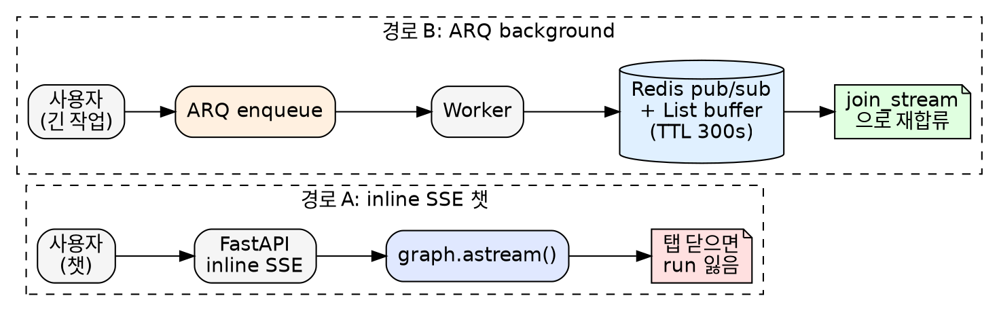
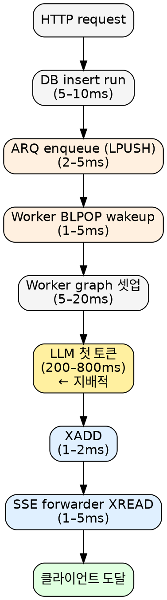
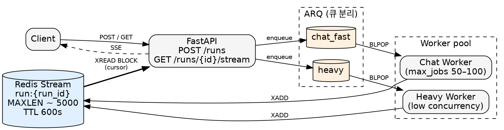

## TL;DR

- "단일 업계 표준"은 없다. 워크로드별로 4개 패턴(worker pool / actor-as-handler / inline-stateless / 장기 WebSocket)이 갈려있고, 동시에 OpenAI Realtime처럼 정반대 방향으로 가는 흐름도 있다
- **multi-minute agent platform 진영**(LangGraph Platform, OpenAI Responses background, Inngest+Mastra, Cloudflare Agents)에선 비슷한 형태로 수렴: **worker 통합 실행 경로 + per-run durable 이벤트 로그 + cursor resume + 큐 분리**
- 흔한 dual-path 구현(inline SSE 챗 + worker + Redis pub/sub + List buffer)은 이 패턴의 약화된 재구현이며, durable cursor-addressable log를 깔끔하게 만들면 다 풀린다
- TTF 페널티는 추정 ~10–30ms (LLM TTF 200–800ms 대비 3–5%), **챗/heavy 큐만 분리하면** 챗 UX는 거의 그대로 (실측 benchmark는 별도 필요)
- OSS 진영은 자체 구현(ARQ + Redis Streams) 외에 **Aegra**(Apache-2.0)가 LangGraph Platform OSS port로 같은 패턴을 이미 구현 — 새로 짜는 입장에선 둘 중 선택
- 운영(K8s) 관점에선 **KEDA Redis Lists scaler로 worker backlog 기반 autoscale + Control/Data/Integration plane 격리 + run 상태 전이 표준(terminal exactly-once)**이 필수 보강 사항

## 들어가며

LLM 에이전트 플랫폼을 만들다 보면 결국 두 종류의 작업을 같은 인프라에서 다뤄야 한다.

- **짧은 챗**: 사용자가 질문하면 200ms 안에 첫 토큰이 나와야 한다. 끝나면 끝.
- **Long-running 작업**: RFP 문서 파싱, multi-step agent 실행 등 수 분이 걸리는 작업. 사용자가 탭을 닫고 다른 화면에 갔다가 돌아와도 진행 상황이 이어져야 한다.

직관적으로는 **두 경로가 다른 게 자연스럽다.** 챗은 SSE로 직속 스트리밍, 긴 작업은 백그라운드 큐. 많은 스택이 그렇게 시작한다.



그런데 이 분기를 두고 작업하다 보면 자연스럽게 의문이 든다.

> 그냥 다 백그라운드 경로로 보내면 안 되나? 그러면 챗도 탭 갔다 와도 스트리밍 이어보일 텐데.

이 글은 그 의문에서 출발해서 **production 시스템들이 어떤 답을 냈는지**까지 따라간 기록이다.

---

## 흔한 dual-path 구현

전형적인 LLM 에이전트 스택 (FastAPI + LangGraph + ARQ + Redis + PostgreSQL)에서 위의 두 요구를 분리하면 자연스럽게 두 가지 실행 경로가 생긴다.

### 경로 A: inline SSE 챗

```python
@router.post("/threads/{thread_id}/runs/stream")
async def stream_run(...):
    run_id, event_gen = await run_manager.stream_run(...)
    return EventSourceResponse(event_gen)
```

내부에서 `graph.astream()`을 web 프로세스에서 직접 돌리고, 청크가 나올 때마다 SSE로 yield한다.

```python
async for chunk in graph.astream(graph_input, config=lg_config, ...):
    if cancelled.is_set():
        raise asyncio.CancelledError()
    yield format_stream_event(modes[0], chunk)
```

특징:
- 큐 안 거침 - web 프로세스가 직접 graph 실행
- 이벤트는 **어디에도 영속되지 않음**
- SSE 끊기면 `GeneratorExit` → run = `interrupted` → 끝

### 경로 B: ARQ background

```python
async def create_run(...):
    run_record = await self.db.runs.create(..., status="pending")
    await self.arq_pool.enqueue_job("execute_run", run_id, ...)
    return run_record
```

워커가 잡아서 `graph.astream()`을 돌리고, 청크마다 Redis에 publish + buffer 적재.

```python
# (worker 측 가상 코드)
await redis.publish(f"run:{run_id}:events", json.dumps(event))
await redis.rpush(f"run:{run_id}:buffer", json.dumps(event))
```

클라이언트는 `join_stream()`으로 합류:

```python
async def join_stream(self, thread_id, run_id):
    pubsub = self.redis.pubsub()
    await pubsub.subscribe(f"run:{run_id}:events")

    # buffer replay
    buffered = await self.redis.lrange(f"run:{run_id}:buffer", 0, -1)
    for raw in buffered:
        yield json.loads(raw)

    # live events
    async for msg in pubsub.listen():
        if msg["type"] == "message":
            yield json.loads(msg["data"])
```

특징:
- 워커가 실행, web은 SSE forwarder
- 이벤트가 Redis에 영속 (TTL 300s)
- 어떤 클라이언트든 `join_stream`으로 합류 가능
- 탭 닫고 돌아와도 OK

---

## 단순한 질문: "왜 다 create로 안 하지?"

답: 그래도 된다. **그게 사실 표준이다.** 다만 그 결정에는 진짜 비용이 있다.

### 비용 1: TTF (Time To First Token) 홉

inline 경로는 HTTP request → graph 직행. worker 경로는:



순 추가 비용은 **~10–30ms**. LLM TTF가 200–800ms로 지배적이라 상대값으로는 **3–5%**. 사람이 인지하기 어려운 영역.

### 비용 2: 워커 starvation

진짜 위험은 홉 자체가 아니다. 워커가 분 단위 작업에 잡혀있으면 **챗 TTF = 그 시간만큼**. 이게 inline 경로가 가진 진짜 advantage - 이런 상황이 구조적으로 발생할 수 없다.

worker 일원화가 작동하려면 **무조건 큐 분리**가 필요하다.

```
chat_fast queue  → max_jobs 50–100 (LLM은 I/O bound, 워커당 동시성 충분)
heavy queue      → max_jobs 낮음, dedicated worker
```

큐 분리 안 하면 worker 일원화는 inline보다 **전 영역에서 더 나쁘다.**

---

## 첫 번째 답: dual-publish 땜빵

worker 일원화가 너무 큰 변경이라면, 가장 작은 패치는 inline `stream_run`도 같은 Redis 버퍼에 publish하게 만드는 것.

```python
async for chunk in graph.astream(...):
    event = format_stream_event(modes[0], chunk)
    await self.redis.publish(f"run:{run_id}:events", json.dumps(event))
    await self.redis.rpush(f"run:{run_id}:buffer", json.dumps(event))
    yield event
```

이렇게 하면 inline 챗도 `join_stream`으로 재합류 가능해진다. 탭 닫고 돌아와도 OK.

근데 자세히 보면 **다섯 가지 문제**가 깔려있다.

### 문제 1: drift 위험

`stream_run`(web)과 `execute_run`(worker)에 같은 publish 로직이 두 번 작성된다. 한쪽 포맷터가 바뀌면 다른 쪽도 같이 바꿔야 함. 시간이 지나면 반드시 어긋난다.

### 문제 2: dup race

`join_stream`의 순서는 `subscribe → lrange → listen`이다. 그런데 subscribe 이후 lrange 이전에 publish된 이벤트는 **buffer와 pub/sub 양쪽에 들어있다.** 클라이언트가 같은 청크를 두 번 받음.

### 문제 3: cursor 없음

`lrange 0 -1`은 buffer를 통째로 dump한다. "내가 #50까지 봤으니 그 이후만 줘"가 안 됨. 재연결 시 항상 전체 replay.

### 문제 4: MAXLEN 없음

Chat 토큰 스트림은 수천 청크가 가능한데 List에 trim 정책이 없으면 메모리 무한 증가. `_BUFFER_TTL = 300` 상수가 있어도 `EXPIRE` 호출이 없으면 적용 안 됨.

### 문제 5: atomic 아님

`publish` + `rpush`는 2 ops다. 사이에서 fail하면 inconsistent. publish는 됐는데 buffer에 안 남거나, buffer에 남았는데 listener에는 도달 안 하거나.

---

## 두 번째 답: Redis Streams

위 다섯 가지가 사실 **Redis Streams를 약화된 의미로 재구현하다 생긴 문제**다.

| | Pub/Sub + List | Streams |
|---|---|---|
| 영속성 | List는 살지만 fire-and-forget | 명시적 trim까지 |
| Late join replay | 수동 (lrange) | `XREAD` from any ID |
| Cursor | 없음 | entry ID가 native cursor |
| MAXLEN | 수동 LTRIM | `XADD MAXLEN ~ N` |
| Crash 견딤 | List는 살지만 ack 없음 | XPENDING으로 복구 |
| Atomic publish+persist | 2 ops | 1 op |

[Redis 공식 docs](https://redis.io/docs/latest/develop/data-types/streams/) 기준 우리 패턴 - *"한 producer + 다수의 짧은 consumer + late join with replay"* - 은 **Streams 교과서적 fit**이다.

코드 변경은 이 정도:

```python
# Worker (publish)
await redis.xadd(
    f"run:{run_id}",
    {"type": event_type, "payload": json.dumps(payload)},
    maxlen=5000,
    approximate=True,
)
await redis.expire(f"run:{run_id}", 600)

# SSE 엔드포인트 (consume)
last_id = request.headers.get("Last-Event-ID", "0")
while True:
    entries = await redis.xread(
        {f"run:{run_id}": last_id},
        block=0,
        count=100,
    )
    for stream, items in entries:
        for entry_id, data in items:
            yield {"id": entry_id, "data": data["payload"]}
            last_id = entry_id
```

dup race, MAXLEN, cursor, atomic 다섯 문제가 한 번에 사라진다.

---

## 세 번째 답: 전부 worker로

Streams로 갈아타도 `stream_run`(inline)과 `execute_run`(worker) 두 경로는 여전히 따로 존재한다. 둘 다 graph를 돌리고 둘 다 Stream에 publish해야 함. drift는 줄지만 **두 실행 경로** 자체가 본질적인 비용이다.

진짜 최종 형태는 inline 경로를 통째로 없애고 **모든 run이 worker를 통과**하게 하는 것.

```
POST /threads/{thread_id}/runs
  → ARQ enqueue, 즉시 run_id 반환

GET /threads/{thread_id}/runs/{run_id}/stream?last_event_id=...
  → SSE. 내부:
     XREAD BLOCK 0 STREAMS run:{run_id} <last_id>
```

### 잠깐, 일반 챗까지 다 worker로?

이 권고는 "단순한 3초 Q&A"도 ARQ enqueue → BLPOP → worker → XADD → SSE forwarder를 통과한다는 뜻이다. 매 챗마다 +10–30ms 추가. 이게 **정말 필요한지는 product requirement에 달려있다.**

| 챗 resumability 요구 | 적절한 형태 |
|---|---|
| ChatGPT/Claude.ai 같은 multi-tab/multi-device 동기화 필요 | **all-worker.** 챗도 큐 통과. TTF +10–30ms는 그 기능의 가격. |
| 단발성 Q&A, 끊기면 다시 묻는 UX | **hybrid 정당.** inline 챗 + worker(긴 작업). 두 경로 유지. ARQ 경로의 dup race/cursor/MAXLEN만 Streams로 해결. |

**즉 all-worker는 "챗이 resumable해야 한다"가 product requirement일 때만 의미 있다.** 단발성 챗 위주 워크로드면 dual-path도 정당한 선택이고, 두 경로의 drift는 코드 리뷰/공유 helper로 관리할 만한 비용이다.

(이 글의 권고는 챗도 resumable한 케이스를 가정. 그렇지 않으면 hybrid가 맞음.)

근데 정말 all-worker가 표준일까? 그래서 다른 곳들이 뭘 하는지 봤다.

---

## OSS 옵션 — Aegra

이 글의 권고 패턴(worker 통합 + per-run durable cursor log)을 **자체 구현하지 않고** OSS 패키지로 받는 옵션이 있다. [Aegra](https://github.com/ibbybuilds/aegra) (Apache-2.0, 2024–) — LangGraph SDK contract를 OSS로 구현. 2026-05 시점 v0.9.7, 850+ stars, 월 5 release 페이스.

| | LangGraph Platform | Aegra |
|---|---|---|
| 라이선스 | Elastic License 2.0 (OSS 비호환) | Apache-2.0 |
| 큐 모델 | Redis Lists + BLPOP + Pub/Sub | 동일 |
| Worker 모델 | async task (closed-source `langgraph_storage.queue`) | LocalExecutor (in-memory) / WorkerExecutor (Redis BLPOP) |
| 배포 | LangSmith managed | self-hosted (PyPI / Docker) |
| Studio 호환 | yes | yes |
| 결정적 차이 | 클라우드 의존 | 단일 컨테이너로 시작 |

**자체 구현(ARQ + Redis Streams) vs Aegra 선택은 trade-off**:

- **Aegra**: 빠른 시작. internals owner는 Aegra. cron/MCP/A2A 같은 부재 기능은 upstream issue([#316](https://github.com/ibbybuilds/aegra/issues/316), [#261](https://github.com/ibbybuilds/aegra/issues/261))로 양도.
- **ARQ + Redis Streams 직접**: 우리가 owner. broker 자유, 도메인 특화 패턴 가능. 코드량 ~1500줄 자체 유지 (lease+reaper+SSE forwarder+streaming buffer).

일반 chat + multi-minute agent 워크로드면 Aegra가 ROI 우위. 2026-04 이전엔 OSS LangGraph Platform 부재(이슈 [langchain-ai/langgraph#6709](https://github.com/langchain-ai/langgraph/issues/6709))로 ARQ 자체 구현이 사실상 유일했지만, Aegra 출시 이후엔 선택지가 둘이 됨. multi-broker(NATS/Kafka) 강제 또는 Aegra 미지원 영역(예: 도메인 특화 cron 정책)이 강하게 필요할 때만 ARQ 쪽으로.

TTF에도 영향: Aegra의 LocalExecutor 모드(in-memory queue)는 Redis 안 거치므로 추가 비용 ~1-3ms. WorkerExecutor 모드(Redis BLPOP, multi-instance용)는 자체 구현 ARQ 수준의 ~10-30ms. 즉 단일 컨테이너 시작 시엔 hop 비용 자체가 없는 것이 Aegra의 부수 이득.

---

## Production 표준 리서치

### LangGraph Platform

가장 직접적인 레퍼런스. LangChain 본인들이 [공식 changelog](https://changelog.langchain.com/announcements/reliable-streaming-and-efficient-state-management-in-langgraph)에서 선언했다.

> Streaming runs are now powered by the job queue used for background runs.

**두 경로를 통일했다.** 흔한 dual-path split을 그들도 거쳐갔고, worker 일원화로 갔다.

여기서 흥미로운 사실 - **LangGraph Platform은 Redis Streams를 안 쓴다.** [neuralware의 분석](https://neuralware.github.io/posts/langgraph-redis/index.html)이 명시한다:

> Redis Lists act as FIFO queues for agent task scheduling, while Redis String and Pub/Sub are used for bi-directional signaling (output streaming/cancellations).

즉:
- **큐**: Redis Lists (`BLPOP tasks:queue 0`)
- **이벤트 스트림**: Redis Pub/Sub
- **체크포인트**: Postgres (`langgraph-checkpoint-postgres`)
- **워커**: async Python task, 워커당 기본 10잡 동시 (`N_JOBS_PER_WORKER`)
- **큐 라이브러리**: third-party 안 씀. 자체 구현 `langgraph_storage.queue`. `langgraph-api` 패키지는 **Elastic License 2.0** (source-available, OSS 호환 X). OSS 진영의 Apache-2.0 대안은 [Aegra](https://github.com/ibbybuilds/aegra) — 같은 LangGraph SDK contract를 구현하면서 PyPI publish (자세한 비교는 위 [OSS 옵션 — Aegra](#oss-옵션--aegra))

따라서 "production이 Streams로 수렴"은 **틀린 말**. LangGraph 본진도 Pub/Sub + List 조합이다. 진짜로 수렴하는 건 더 추상적인 *"durable cursor-addressable per-run log"* 이고, Streams는 그 한 구현일 뿐. SQLite-in-actor (Cloudflare), NATS JetStream, Postgres outbox + LISTEN/NOTIFY, 그리고 LangGraph의 Pub/Sub+List 모두 같은 추상의 다른 구현체.

[공식 streaming docs](https://docs.langchain.com/langgraph-platform/streaming)에 resume surface도 명시된다.

> When you use `.join_stream`, output is not buffered, so any output produced before joining will not be received.

**run-level join은 best-effort.** 실제 durable resume의 진짜 surface는 thread-level이다.

> If the connection drops, pass the ID of the last event you received to resume without missing events. Pass `"-"` to replay from the beginning.

**Last-Event-ID 패턴** - opaque event ID cursor.

### OpenAI Responses API

OpenAI의 진화도 흥미롭다. 기존 Assistants API는 join-stream 엔드포인트가 없어서 [커뮤니티가 계속 항의](https://community.openai.com/t/how-to-resume-streaming-in-python-after-submitting-function-call-outputs-in-openai-assistants-api/1119902).

답이 **Responses API + Background mode**다. [공식 가이드](https://platform.openai.com/docs/guides/background)에 따르면:

- `background: true, stream: true`로 시작
- 매 이벤트에 `sequence_number`
- 끊기면 같은 response_id로 재연결 → 서버가 cursor부터 replay
- caveat: *"you can only resume streaming if the original request included `stream=true`"*

LangGraph의 `Last-Event-ID`와 **동형 패턴**이다.

### Anthropic Messages API

[Messages streaming spec](https://platform.claude.com/docs/en/api/messages-streaming)에는 reconnect/resume이 **없다.** 끊기면 끝. Anthropic은 durability를 application 레이어로 넘긴다. 즉 *호출자가* 버퍼링해야 한다. Modal, Replicate, Baseten, Vercel AI SDK 기본 `streamText`도 같은 입장 - inline only, durability는 caller's problem.

### Counter-trend: OpenAI Realtime / WebSocket

여기까지가 한 방향이라면, 정반대 방향도 동시에 굴러가고 있다. [OpenAI Realtime API](https://openai.com/index/speeding-up-agentic-workflows-with-websockets/)와 2026년 추가된 **Responses API의 WebSocket 모드**는 큐를 *반대로* 치워버린다:

- 영구 WebSocket 연결
- 서버 메모리에 in-memory state 캐싱
- *"asynchronously block in the sampling loop"* - sampling loop 안에서 직접 대기

voice/realtime 같은 sub-200ms turn-taking 워크로드에서는 큐 홉 자체가 비싸다. 이쪽은 stateful long-lived connection 패턴으로 간다. ElevenLabs, Cartesia 같은 voice agent도 동일.

**즉 업계는 한 방향으로 수렴 안 한다.** multi-minute agent 워크로드는 worker+log 쪽으로, realtime은 WebSocket 쪽으로, raw inference vendor는 inline 쪽으로 갈라진다.

### Vercel AI SDK - `resumable-stream`

가장 코드-레벨 가까운 레퍼런스. [vercel/resumable-stream](https://github.com/vercel/resumable-stream) README는 정확하다.

> The producer will always complete the stream, even if the reader of the original stream goes away.

> a single `INCR` and `SUBSCRIBE` per stream.

Redis Pub/Sub + producer 측 in-memory buffer. **Producer-alive 제약**이 있어서 워커 죽으면 복구 불가. Upstash는 [Streams로 확장](https://upstash.com/blog/realtime-ai-sdk)해서 producer 죽음도 견디게 함.

핵심 인사이트: **탭 이동 resume**에는 pub/sub + 메모리 버퍼로 충분. **워커 크래시까지 견디려면 Streams 필요.**

### Cloudflare Agents - RFC #1257

[RFC #1257](https://github.com/cloudflare/agents/issues/1257)이 정확히 같은 문제를 다룬다. Durable Object 안에서 SQLite로 메시지 영속:

> Every chunk streamed to the client is also written to SQLite (`cf_ai_chat_stream_chunks`).

여기서 중요한 점 - Cloudflare는 **central event bus가 아니라 actor-local SQLite**에 청크를 쓴다. 즉 worker pool + 중앙 로그 패턴이 아니라 **actor-as-handler + co-located persistence** 패턴이다.

미해결로 인정한 부분도 있다. DO 재시작 후 fiber recovery만으로는 부족하고 **inference 재호출이 필요**. 이걸 풀려고 AI Gateway를 *durable response buffer*로 만들겠다는 게 RFC의 방향. 즉 **inference 앞에 durable buffer**를 두는 게 미래.

명시적 구분도 있다 - *client-side resume*(쉬움)과 *server-side resume that doesn't re-bill tokens*(어려움, infra 버퍼 필요).

### Inngest - 두 publish 모드

[Realtime docs](https://www.inngest.com/docs/features/realtime)는 두 모드를 명시 분리한다.

- `step.realtime.publish()` - durable, retry에서 memoize, **state/decision용**
- `publish()` - non-durable, 저비용, **token/progress용**

같은 이벤트 버스에서 두 모드. Replit Agent는 [성공률 80→96%](https://mastra.ai/blog/replitagent3)로 끌어올린 게 *Mastra의 durable execution + Inngest* 도입 덕분이라고 보고한다 (vendor-reported 수치, 독립 벤치마크 아님).

### Temporal - durability ≠ event streaming

["Durable by Design: Temporal Outside, LangGraph Inside"](https://medium.com/@dorangao/durable-by-design-temporal-outside-langgraph-inside-0931478bc033)는 Temporal Event History에 토큰을 모두 흘리는 건 안티패턴이라고 못 박는다. **워크플로우 영속성과 토큰 스트림은 별개 primitive**다 - 둘이 같은 Redis 안에 살더라도.

우리 매핑: ARQ = workflow durability, Streams = event stream. **분리 유지가 맞다.**

---

## 4개 패턴과 워크로드 매핑

업계는 단일 표준이 아니라 **워크로드별로 4개 패턴**으로 갈린다.

| 패턴 | 대표 시스템 | 적합한 워크로드 |
|---|---|---|
| **1. Worker pool + central durable log** | LangGraph Platform, OpenAI Responses background, Inngest+Mastra | 분 단위 multi-step agent |
| **2. Actor-as-handler + co-located persistence** | Cloudflare Agents (DO + SQLite) | edge runtime, 세션 단위 강한 일관성 |
| **3. Inline stateless + caller-side durability** | Anthropic Messages, Modal, Replicate, Baseten, Vercel AI SDK 기본 | 단발 inference, 짧은 응답 |
| **4. Stateful long-lived WebSocket** | OpenAI Realtime, OpenAI Responses WebSocket 모드, voice agents | sub-200ms turn-taking realtime |

각 패턴은 자기 영역에서 표준이지, 한 패턴이 다른 패턴을 대체하지 않는다.

## multi-minute agent 진영 안에서의 5가지 공통점

패턴 1에 속하는 시스템들(LangGraph Platform, OpenAI Responses background, Inngest+Mastra, Cloudflare Agents 일부)을 가로지르면 5가지 공통점이 보인다.

### 1. 단일 실행 경로 (worker queue 통과)

LangGraph Platform 통일, OpenAI Responses background 통일, Inngest는 정의상 worker. **이 진영에서** inline streaming은 사라지는 추세. (Cloudflare는 "actor가 곧 worker"라 사실상 같은 자리에 있음 - 단 worker pool이 아니라 actor 패턴이라 분류상 패턴 2.)

### 2. Per-run durable event log (cursor-addressable)

진짜 추상적 합의는 *"durable cursor-addressable per-run log"*. 구현체는 여러 가지:
- **Redis Pub/Sub + List/Queue** (LangGraph Platform이 실제로 쓰는 것)
- **Redis Streams** (XADD/XREAD)
- **SQLite-in-actor** (Cloudflare DO)
- **NATS JetStream** - agent runtime 진영에서 채택 사례 늘어나는 중
- **Postgres outbox + LISTEN/NOTIFY** - Postgres 이미 운영 중인 팀에 유리
- **Kafka** - 고볼륨 event sourcing

TTL은 보통 5–15분 (run 종료 후 재합류 가능 시간).

### 3. Two publish modes (durable vs ephemeral)

Inngest가 명시화 (`step.realtime.publish` vs `publish`). 다른 곳들은 암묵적. **state/decision은 durable, token stream은 ephemeral**로 구분.

### 4. Resume = run/thread + cursor

SSE Last-Event-ID, OpenAI `sequence_number` (monotonic int), LangGraph thread last_event_id (opaque), Vercel streamId. cursor 형식은 다르지만 **고수준 의미는 isomorphic.**

### 5. Workflow durability ≠ event streaming

ARQ/Temporal/Inngest 같은 워크플로우 primitive에 토큰을 흘리지 않는다. **두 primitive를 분리**해서 각자의 강점에 충실하게 쓴다.

### TTF queue hop의 비용

worker 일원화의 추가 비용은 추정 **~10–30ms** (LLM TTF 200–800ms 대비 3–5%). 단 이 수치는:
- 워커가 idle하다는 가정
- ARQ의 `poll_delay` 적정 튜닝 가정 (기본 ~500ms는 너무 김)
- DB/Redis가 같은 AZ 가정

**실측 benchmark는 자기 스택에서 측정 권장.** 워커 starvation 시 수초로 튀므로 이 가정이 깨지면 framing 자체가 바뀜.

---

## 최종 권고 (multi-minute agent 워크로드 기준)

이 글의 권고는 **패턴 1 (worker pool + central durable log)** 이 적합한 경우, 즉 chat + 분 단위 RFP 파싱 같은 multi-minute agent 워크로드에 한정됨. realtime/voice이면 패턴 4, raw inference면 패턴 3을 봐야 함.

**Collapse to one execution path (always-worker) + per-run durable cursor-addressable log + two-endpoint design.**

이벤트 로그 구현체는 선택지 있음:
- **Redis Pub/Sub + List** (LangGraph Platform이 실제로 쓰는 것 - 가장 검증됨)
- **Redis Streams** (XADD/XREAD - 단일 primitive, MAXLEN/cursor 무료)
- **Postgres outbox + LISTEN/NOTIFY** (이미 PG 운영 중이고 Redis 줄이고 싶은 경우)
- **NATS JetStream** (multi-AZ/durable 강하게 필요한 경우)

OSS로 이 패턴을 갖추는 두 옵션:

- **(a) [Aegra](https://github.com/ibbybuilds/aegra)** — LangGraph Platform OSS port. 위 패턴을 이미 구현. `pip install aegra-api`, Docker single container, `aegra.json`으로 graphs/http.app/auth 등록. 큐 모델은 LangGraph Platform과 동일(Redis Lists + BLPOP + Pub/Sub). cron만 [Aegra#316](https://github.com/ibbybuilds/aegra/issues/316) PR 진행 중.
- **(b) ARQ + Redis Streams 직접** — 우리가 owner. broker 자유, 도메인 특화 가능. lease+reaper+SSE forwarder를 직접 구현 (~1500줄).

아래는 (b) 예시. (a)는 Aegra 공식 docs 참조. LangGraph가 Pub/Sub+List를 쓰는 건 더 검증된 선택지라는 시그널이지만, (b)로 새로 짜는 입장에선 Streams가 cursor/MAXLEN/atomic을 무료로 줘서 재구현 부담을 줄임.



```
POST /threads/{thread_id}/runs
  → ARQ enqueue, 즉시 run_id 반환
  → 스트림 attach 안 함 (OpenAI Responses background와 동일)

GET /threads/{thread_id}/runs/{run_id}/stream?last_event_id=...
  → SSE. 내부:
     XREAD BLOCK 0 STREAMS run:{run_id} <last_id>
     - last_id="0"  → 처음부터 replay
     - last_id=cursor → 그 이후만
     - last_id="$"  → 새 이벤트만

Worker:
  XADD run:{run_id} MAXLEN ~ 5000 * type ... payload ...
  EXPIRE run:{run_id} 600
```

### 얻는 것

#### 코드/아키텍처 단순화

- **두 실행 경로가 하나로 collapse** - inline 챗과 worker 백그라운드를 따로 구현할 필요 없음. graph 실행/이벤트 publish/cancel 처리/terminal status 같은 로직이 한 곳에만 존재
- **중복 분기 제거** - multitask strategy, langfuse scope, request-scoped context 캡처 같은 분기가 진입점 하나로 collapse
- **dual-publish 땜빵 불필요** - inline 경로가 사라지므로 같은 publish 로직을 두 곳에 둘 필요가 없음
- **web 프로세스 dimensioning 단순화** - web은 SSE forwarder만, LLM 동시성은 worker pool로 분리 조절

#### 운영/안정성

- **챗 resumability 무료** - 탭 닫고 돌아와도 `last_event_id` 들고 GET stream → 이어붙음
- **워커 크래시 견딤** - Stream entries는 trim 전까지 살아있음. web 프로세스 죽어도 이미 받은 청크는 client에 도달, ARQ retry로 worker 재시작
- **bounded memory** - `XADD MAXLEN ~ 5000`으로 토큰 수천 청크 챗에서도 메모리 확정
- **debugging 무료** - `XRANGE run:{id} - +` 한 줄로 run 이벤트 history 재생

#### 이벤트 버스 정합성

- **dup race 사라짐** - `XREAD` cursor가 atomic, replay와 live 사이 중복 구조적으로 불가능
- **atomic publish** - `XADD` 1 op (현재 `publish` + `rpush` 2 ops, 사이 fail 시 inconsistent)
- **cursor-based resume 무료** - entry ID가 native cursor, `Last-Event-ID` 그대로 사용

#### 스케일링

- **챗/heavy 큐 분리로 starvation 차단** - 짧은 챗이 분 단위 작업 뒤에 줄 서는 일이 구조적으로 불가능
- **web/worker independent scaling** - 챗 트래픽 스파이크는 web 팟만, LLM-bound work는 worker만 별도 스케일

### 유지할 듀얼리즘

**워커 풀만 분리**한다. ARQ queue 두 개:

- `chat_fast`: 짧은 챗, max_jobs 높음, 워커 동시성 50–100
- `heavy`: 분 단위 작업 (문서 파싱, multi-step agent 등), max_jobs 낮음, dedicated worker

LangGraph Platform이 priority lane이라 부르는 것과 동일.

### ARQ ↔ LangGraph 관계 (헷갈리기 쉬움)

LangGraph Platform은 ARQ를 안 쓰고 자체 구현 큐(`langgraph_storage.queue`, closed-source wheel만 PyPI 공개)를 쓴다. 다만 그 자체 구현이 하는 일은 **Redis Lists + BLPOP + async Python task** - 즉 ARQ가 OSS로 하는 것과 동일한 패턴이다. 따라서 OSS 스택에서 ARQ 선택은 LangGraph 패턴에서 벗어나는 게 아니라 **closed-source 부분을 OSS로 같은 의미로 대체**하는 것.

| | LangGraph 자체 구현 | ARQ |
|---|---|---|
| 큐 primitive | Redis Lists | Redis Lists |
| Pickup | `BLPOP` | `BLPOP` |
| 워커 모델 | async Python task | async event loop |
| 워커당 동시성 | 기본 10 (`N_JOBS_PER_WORKER`) | 설정 가능 |
| 라이브러리 | closed-source | OSS |

### TTF 영향

순 추가 비용 추정 ~10–30ms (~3–5%). LLM TTF에 묻혀서 체감 안 됨. **단 챗 큐 분리 + 워커 동시성 적정 설정 + ARQ `poll_delay` 튜닝이 필수 전제.** 실측 benchmark는 자기 스택에서 측정 권장.

---

## 운영 관점 — K8s + KEDA로 패턴 1 구현

위 권고 패턴 1(worker pool + durable log)을 운영 환경에 깔려면 컨테이너 분리만으로 부족하다. 여러 public deployment 사례 — [LangSmith standalone deployment](https://docs.langchain.com/langsmith/deploy-standalone-server), [LangSmith Kubernetes topology](https://docs.langchain.com/langsmith/kubernetes), [Inngest worker docs](https://www.inngest.com/docs/features/realtime), Cloudflare DO 패턴 — 을 가로지르면 공통적으로 다음 셋이 보강된다: **워커 autoscale, plane 격리, run 상태 전이 표준**. K8s 환경 기준 정리.

### Worker autoscale — KEDA Redis-list trigger

worker 일원화의 핵심 가정은 "큐가 차면 워커가 늘어난다". CPU/메모리 기반 HPA는 LLM I/O-bound 워크로드엔 부적합 — **backlog(pending run 수) 기준이 더 정확**하다.

[KEDA](https://keda.sh/) 2.19+ Redis Lists scaler가 표준 구현:

```yaml
apiVersion: keda.sh/v1alpha1
kind: ScaledObject
spec:
  scaleTargetRef:
    name: langgraph-worker
  pollingInterval: 10          # 10초마다 backlog 측정
  cooldownPeriod: 120          # scale-in 보수적 (in-flight run 보호)
  minReplicaCount: 2
  maxReplicaCount: 50
  triggers:
    - type: redis
      metadata:
        listName: langgraph:run-queue
        listLength: "20"        # avg 20 jobs/worker 초과 시 추가
```

운영 노하우:

- **scale-out 빠르게, scale-in 보수적으로** — `cooldownPeriod` 길게. 장시간 run이 갑자기 죽지 않도록.
- **maxReplicaCount는 downstream 한도 기준** — Worker만 늘려도 Postgres connection pool 또는 외부 API rate limit (LLM provider/검색/내부 시스템) 이 먼저 막힘.
- **`preStop` hook + graceful shutdown** — pod 종료 시 in-flight run을 checkpoint까지 진행 후 종료.
- **chat_fast vs heavy 큐 분리는 ScaledObject 2개로** — heavy queue worker는 `maxReplicaCount` 낮게.

ARQ도 같은 패턴(KEDA가 `arq:queue:default` 같은 list 모니터). Aegra의 BLPOP queue도 마찬가지 — `listName`만 Aegra 실제 키 prefix로 바꾸면 동일하게 scale 가능.

### Plane 분리 — 장애 격리

[LangSmith Deployments topology](https://docs.langchain.com/langsmith/data-plane) 같은 실제 LangGraph 운영 reference를 보면 control/data 분리가 명시적이다. 일반화하면 3 plane:

| Plane | 포함 | 장애 영향 |
|---|---|---|
| **Control Plane** | GitOps(ArgoCD), Helm, Vault, Policy/RBAC, Tool Registry | 신규 배포 지연. 기존 run은 영향 X (이상적) |
| **Data Plane** | UI, BFF, Agent API, Worker, Redis, Postgres | 사용자 run 생성/실행/streaming 직접 영향 |
| **Integration Plane** | MCP Proxy, Egress Gateway, 외부 API/내부 시스템 어댑터, LLM Gateway | 특정 도메인 tool 실패. circuit breaker로 격리 |

**원칙**: Control Plane 장애가 Data Plane 전체 장애로 번지지 않게. ArgoCD가 죽어도 기존 Pod는 계속 실행. Vault 장애 시엔 mount된 secret TTL 내 graceful degradation. LangSmith Deployments가 control plane(LangChain 호스팅) / data plane(고객 cluster) 분리로 같은 원칙을 적용 — control plane이 끊겨도 data plane의 in-flight run은 계속.

durable cursor log 자체는 Data Plane(Postgres + Redis)에 있으므로 **Control Plane 장애에도 in-flight run의 streaming은 살아남는다.** 이게 plane 분리의 운영적 가치.

### Run 상태 전이 표준

durable cursor-addressable log는 결국 **run lifecycle이 안정 상태 전이를 가져야** 의미 있다. 표준 transition:

```
queued ─→ running ─┬─→ succeeded
                   ├─→ waiting_approval ─→ running ─→ ...
                   │                     └─→ rejected
                   ├─→ retrying ─→ running OR failed
                   └─→ cancelling ─→ cancelled
```

| 상태 | 의미 | 인프라 요구 |
|---|---|---|
| `queued` | DB에 run 저장 + Redis wake-up signal | Redis 장애 시 reconcile (DB scan으로 재신호) |
| `running` | Worker가 graph 실행 중 | preStop graceful, checkpoint 주기 |
| `waiting_approval` | HITL 승인 대기 | 장기 가능 → DB checkpoint 필수 |
| `retrying` | transient 에러 재시도 | retry budget, exponential backoff, idempotency key |
| `cancelling` | 중단 처리 중 | Redis cancellation signal + cooperative cancel |
| terminal (`succeeded`/`failed`/`rejected`/`cancelled`) | 종료 | terminal transition은 단 한 번만 |

**Terminal exactly-once**: run이 한 번 `succeeded` 되면 `failed`로 못 감. DB row constraint로 강제하고, retry는 새 run 생성으로 처리. 이게 "durable log"의 정합성을 보장.

### 데이터 소유 매트릭스

운영에서 가장 헷갈리는 건 "어느 데이터가 어디의 source of truth인가". 정리:

| 데이터 | Source of truth | Cache / Relay | 원칙 |
|---|---|---|---|
| Thread metadata | Postgres | API memory cache | DB 단일 소유 |
| Run lifecycle | Postgres | Redis wake-up signal | DB가 truth, Redis는 신호 |
| Checkpoint | Postgres | 없음 | DB만 |
| Streaming event (live) | Redis Stream | — | replay 요구 강하면 DB event table 추가 |
| Streaming event (long replay) | Postgres event table OR Object Storage | Redis 일부 | 정책 결정 |
| Approval decision | Postgres | UI cache | 감사 대상 |
| Tool call audit | Postgres OR 감사 저장소 | — | 보존 정책 |
| Artifact / attachment | Object Storage(S3/MinIO) | CDN | DB에는 URI + checksum |
| Trace / metric / log | LangSmith / OTEL / Loki | — | PII 마스킹 |

**Redis 금지 영역**: 사용자 대화 원문, tool/외부 API 결과, 최종 산출물의 source of truth. Redis는 ephemeral 신호 + 캐시 전용. Redis 전체가 날아가도 Postgres만으로 in-flight run을 복구할 수 있어야 함.

### Streaming event 표준

durable log를 다른 시스템에서 안정적으로 소비하려면 event type을 미리 표준화해야 한다. [LangGraph Platform streaming docs](https://docs.langchain.com/langgraph-platform/streaming), [OpenAI Responses streaming](https://platform.openai.com/docs/guides/background), [Inngest realtime](https://www.inngest.com/docs/features/realtime), Cloudflare DO chunk schema를 가로지르면 이름은 달라도 9가지 카테고리로 수렴:

| Event | 발생 주체 | UI 의미 | 저장 |
|---|---|---|---|
| `run.started` | API | run 시작 | DB |
| `node.started` / `node.completed` | Worker | graph 진행 단계 | trace + optional DB |
| `token.delta` | Worker | 답변 streaming | Redis relay |
| `tool.requested` / `tool.completed` | Worker / MCP | tool 호출 | 감사 DB |
| `approval.required` / `approval.decided` | Worker / API | HITL gate | DB |
| `run.completed` / `run.failed` | Worker / API | 종료 | DB |

**재연결 원칙**: UI가 stream을 놓치면 `run_id` + `Last-Event-ID`로 재연결. Redis Pub/Sub만으론 과거 replay 안 됨 — replay 요구가 강하면 최근 event를 Postgres event table 또는 Object Storage log chunk로 보존. LangGraph Platform이 정확히 이 방식이고, Cloudflare Agents도 actor-local SQLite로 같은 패턴.

이 9개 카테고리는 vendor마다 이름이 달라도 **고수준 의미는 isomorphic**. 예: OpenAI Responses의 `response.output_text.delta` ≈ `token.delta`, LangGraph의 `messages/partial` + `messages/complete` ≈ `token.delta` + `node.completed`.

---

## 마치며

처음 의문은 단순했다 - *"왜 다 create로 안 하지?"*

답을 따라가다 보니 두 가지를 알게 됐다.

첫째, **단일 업계 표준은 없다.** 워크로드별로 4개 패턴(worker pool / actor-as-handler / inline-stateless / 장기 WebSocket)이 갈려있고, 각자 자기 영역에서 표준이다. OpenAI 자체도 multi-minute agent에는 worker+log로 가면서 voice/realtime에는 WebSocket으로 정반대 방향을 동시에 밀고 있다.

둘째, 그 안에서 **multi-minute agent platform 진영**(LangGraph Platform, OpenAI Responses background, Inngest+Mastra, Cloudflare Agents)이 도달한 형태는 비교적 명확하다: **(1) worker 통합 실행 경로 (2) per-run durable cursor-addressable 이벤트 로그 (3) cursor resume (4) 큐 분리**. 이 진영의 워크로드를 다룬다면 이 형태가 합리적 시작점이다.

흔한 dual-path + pub/sub + List 구조는 이 진영이 진화 과정에서 일부 폐기한 모양이다 (LangGraph Platform은 여전히 Pub/Sub+List를 쓰지만 worker는 통합했고, dual path는 없앴다). dual-publish로 챗에 영속성을 더하는 땜빵은 이 진화의 중간 단계를 연명시키는 것일 뿐이고, 진짜 답은 **이벤트 로그를 한 번 깔끔하게 깔고 worker로 통합하는 것**이다 - 구현체는 Pub/Sub+List든 Streams든 자유롭게.

PoC 단계에서 이 결정을 내리는 게 낫다. 실행 경로가 코드에 굳어진 다음에 통일하는 건 훨씬 비싸다.

다만 모든 챗까지 worker로 보낼 가치가 있는지는 product 단에서 판단할 일이다. **챗 resumability가 PRD에 들어가 있다면 all-worker가 답이고, 그렇지 않다면 dual-path 유지하면서 ARQ 경로만 Streams로 정리하는 게 더 실용적**일 수 있다. 이 글의 권고는 전자 가정 - 후자라면 hybrid 옵션을 채택해도 부끄러울 게 없다.

---

## 참고

- [LangGraph Platform Streaming](https://docs.langchain.com/langgraph-platform/streaming)
- [LangGraph reliable streaming changelog](https://changelog.langchain.com/announcements/reliable-streaming-and-efficient-state-management-in-langgraph)
- [How LangGraph Uses Redis for Fault-Tolerant Task Execution](https://neuralware.github.io/posts/langgraph-redis/index.html)
- [Aegra (LangGraph Platform OSS port, Apache-2.0)](https://github.com/ibbybuilds/aegra)
- [LangGraph #6709 — OSS Postgres runtime issue](https://github.com/langchain-ai/langgraph/issues/6709)
- [OpenAI Background mode guide](https://platform.openai.com/docs/guides/background)
- [OpenAI: Speeding up agentic workflows with WebSockets](https://openai.com/index/speeding-up-agentic-workflows-with-websockets/)
- [Anthropic Messages streaming](https://platform.claude.com/docs/en/api/messages-streaming)
- [Vercel resumable-stream](https://github.com/vercel/resumable-stream)
- [AI SDK UI: Chatbot Resume Streams](https://ai-sdk.dev/docs/ai-sdk-ui/chatbot-resume-streams)
- [Resumable AI SDK v5 Streams with Upstash Realtime](https://upstash.com/blog/realtime-ai-sdk)
- [Cloudflare Agents docs](https://developers.cloudflare.com/agents/)
- [Cloudflare Agents RFC #1257: AI Gateway durable response buffer](https://github.com/cloudflare/agents/issues/1257)
- [Inngest Realtime docs](https://www.inngest.com/docs/features/realtime)
- [Replit Agent 3 + Mastra/Inngest](https://mastra.ai/blog/replitagent3)
- [Temporal: Orchestrating ambient agents](https://temporal.io/blog/orchestrating-ambient-agents-with-temporal)
- [Durable by Design: Temporal Outside, LangGraph Inside](https://medium.com/@dorangao/durable-by-design-temporal-outside-langgraph-inside-0931478bc033)
- [KEDA Redis Lists Scaler](https://keda.sh/docs/2.19/scalers/redis-lists/)
- [Kubernetes NetworkPolicy](https://kubernetes.io/docs/concepts/services-networking/network-policies/)
- [LangSmith self-hosted deployment](https://docs.langchain.com/langsmith/deploy-standalone-server)
- [Redis Streams 공식 docs](https://redis.io/docs/latest/develop/data-types/streams/)
- [Redis Streams vs Pub/Sub](https://oneuptime.com/blog/post/2026-01-21-redis-streams-vs-pubsub/view)
- [HTML Standard: Server-Sent Events](https://html.spec.whatwg.org/multipage/server-sent-events.html)
