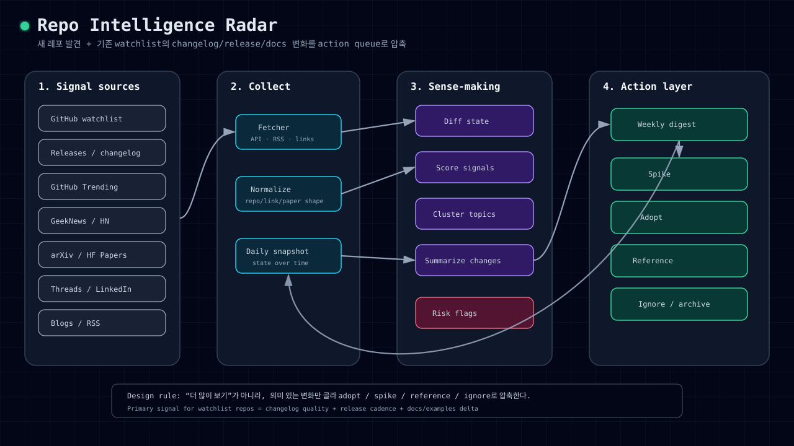
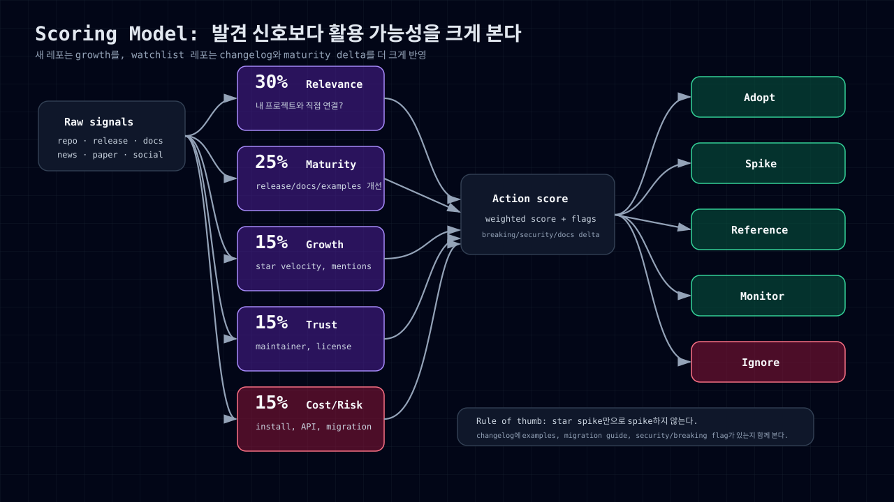
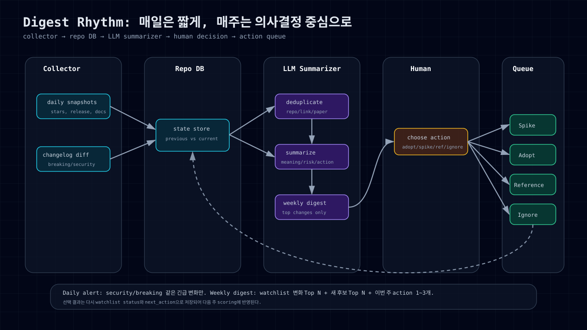

## 들어가며

AI와 개발 도구 생태계를 따라가다 보면 정보가 너무 많다. 매일 새로운 레포가 나오고, GitHub Trending에는 낯선 프로젝트가 올라오고, GeekNews나 Hacker News에는 흥미로운 글이 쌓인다. 여기에 arXiv, Hugging Face Papers, Threads, LinkedIn까지 보면 정보량은 금방 감당하기 어려워진다.

그런데 진짜 문제는 **새로운 것만 많다는 점이 아니다.** 이미 알고 있던 레포들도 계속 변한다. 어떤 레포는 release note가 좋아지고, 어떤 레포는 changelog에 migration guide가 붙고, 어떤 레포는 examples와 docs가 늘어나면서 갑자기 실전 적용 가능성이 높아진다.

그래서 필요한 것은 단순한 북마크 목록이 아니라 다음 질문에 답하는 시스템이다.

- 새로 봐야 할 것은 무엇인가?
- 이미 watchlist에 있던 것 중 의미 있게 변한 것은 무엇인가?
- 이번 주에 실험해볼 것은 무엇인가?
- 사용자에게 공유할 만한 정보는 무엇인가?
- 나중에 지식 위키로 승격할 만한 insight는 무엇인가?

나는 이 구조를 **Repo Intelligence Radar**라고 부르고 싶다.

> 관련 위키 노트: [[repo-intelligence-radar]]

---

## Repo Radar는 지식 위키가 아니다

먼저 경계를 분명히 해야 한다.

Repo Radar는 최종적으로 지식 위키에 일부 내용이 들어갈 수 있지만, 출발점은 **지식 그 자체가 아니라 별도의 외부 정보 소스**다. 즉, 사용자가 읽을 수 있는 trend/feed/digest에 가깝다.

지식 위키는 오래 남길 만한 내용을 정제해서 보관하는 곳이다. 반면 Repo Radar는 훨씬 더 빠르고, 넓고, 휘발성이 강하다.

| Layer | 역할 | 독자 | 보관 방식 |
|---|---|---|---|
| Raw signals | GitHub, changelog, 뉴스, 논문, 소셜 링크 수집 | 시스템/수집기 | 짧게 보관, 중복 제거 |
| Intelligence feed | 이번 주 볼 것, 변화가 큰 레포, 실험 후보 제공 | 사용자/구독자 | daily/weekly digest |
| Action queue | spike/adopt/reference/ignore 결정 | 나 또는 팀 | 처리될 때까지 유지 |
| Knowledge promotion | 검증된 insight만 위키화 | 나중에 검색할 나/팀 | 장기 보관 |

모든 수집 항목을 지식에 넣으면 안 된다. 대부분은 digest에서 소비되고 사라져야 한다. 지식으로 승격하는 기준은 좁게 잡는 편이 좋다.

- 같은 레포나 기술이 여러 주 반복해서 등장한다.
- 실제 spike/adopt/reference 결과가 생겼다.
- 내부 프로젝트의 설계, 도구 선택, 운영 방식에 영향을 줬다.
- 나중에 다시 설명하거나 의사결정 근거로 써야 한다.
- 단순 뉴스가 아니라 reusable pattern, comparison, playbook이 됐다.

---

## 전체 구조

Repo Radar는 크게 네 단계로 나눌 수 있다.

1. 여러 source에서 signal을 모은다.
2. repo, release, paper, link 형태로 정규화한다.
3. 이전 상태와 비교해 의미 있는 변화를 찾는다.
4. 사용자에게 digest와 action queue로 제공한다.



핵심은 “더 많이 보여주기”가 아니라 “결정할 수 있게 압축하기”다. 수집량이 늘어날수록 좋은 시스템이 아니라, 사용자가 볼 정보가 줄어들수록 좋은 시스템이다.

---

## Source map: 어디를 볼 것인가

Repo Radar의 source는 하나가 아니다. GitHub만 봐도 부족하고, 논문만 봐도 부족하다. 각 source의 역할이 다르다.

| Source | 무엇을 보기 좋은가 | 수집 방식 | 주의점 |
|---|---|---|---|
| GitHub watchlist | 이미 관심 있는 레포의 변화 | GitHub API, releases, events, Atom feed | rate limit, 중복 이벤트 처리 필요 |
| GitHub Trending | 새로 뜨는 레포 발견 | topic/language별 daily scrape 또는 RSS mirror | star spike는 hype일 수 있음 |
| Changelog/release note | 기존 레포의 성숙도 변화 | GitHub Releases API, CHANGELOG.md diff | 단순 버전 업데이트와 의미 있는 변화를 구분해야 함 |
| GeekNews | 한국 개발/스타트업 맥락 | 뉴스레터, RSS/웹, 수동 큐레이션 | 코멘트 맥락을 함께 봐야 함 |
| Hacker News | 글로벌 개발자 반응 | Official API, Algolia Search API | 댓글 품질 편차가 큼 |
| arXiv | 최신 논문 원천 | arXiv API query | 구현체가 있는지 별도 확인 필요 |
| Hugging Face Papers | ML 논문/모델 트렌드 | trending page, paper metadata | paper popularity와 production readiness는 다름 |
| Blogs/RSS | maintainer 의도와 roadmap | RSS/Atom, blogwatcher | feed 품질이 제각각 |
| Threads/LinkedIn | 실무자 반응과 adoption signal | 수동 저장, 링크 inbox, 제한적 API | 자동화보다 큐레이션이 현실적 |

Threads와 LinkedIn은 처음부터 완전 자동화를 목표로 잡지 않는 편이 낫다. 로그인, 권한, 약관, noise 문제가 커서, 초반에는 좋은 스레드나 포스트를 link inbox에 저장하고 주간 digest에서 함께 요약하는 semi-manual 방식이 현실적이다.

---

## Watchlist는 repo만 보면 부족하다

GitHub star를 누르는 것은 시작일 뿐이다. 실제로 봐야 하는 것은 repo의 현재 상태와 변화량이다.

특히 watchlist에는 레포뿐 아니라 다음 항목이 함께 들어가야 한다.

- release note
- changelog
- docs 변화
- examples/cookbook 변화
- benchmark/eval 변화
- issue/PR activity
- maintainer 반응성
- external mention

예를 들어 어떤 레포가 star는 많이 늘지 않았더라도, 최근 release에 migration guide와 production example이 추가됐다면 실전 활용 가능성이 크게 올라간 것이다. 반대로 star가 급증했지만 changelog가 없고 README만 화려하다면 reference-only 또는 monitor 정도로 두는 게 낫다.

추적할 changelog signal은 다음과 같다.

| Changelog signal | 의미 |
|---|---|
| breaking change | 도입 전 검토 필요 |
| new example/tutorial | 실제 사용 가능성 상승 |
| performance improvement | benchmark나 production 적용 가능성 상승 |
| bug fix only | 안정화 중일 가능성 |
| migration guide | API가 성숙하거나 크게 바뀌는 중 |
| deprecation | 의존 중이면 대체 계획 필요 |
| security fix | 즉시 확인 필요 |
| docs restructure | 프로젝트 방향성 변화 가능성 |

좋은 watchlist는 “v0.4.2가 나왔다”에서 멈추지 않는다. 아래처럼 의미와 액션까지 정리해야 한다.

```text
owner/repo v0.4.2
- 의미: examples와 docs가 크게 늘어 try-soon 후보로 상승
- 리스크: API rename이 있어 기존 코드와 호환성 확인 필요
- 액션: 1시간 spike로 sample 실행
```

---

## 최소 watchlist schema

처음부터 거창한 데이터베이스를 만들 필요는 없다. 아래 정도만 있어도 충분히 시작할 수 있다.

```yaml
repo: owner/name
url: https://github.com/owner/name
category: agent | rag | eval | inference | ui | infra | research | devtool
status: watch | rising | maturing | try-soon | adopt-candidate | reference-only | ignored
first_seen: 2026-05-18
last_checked: 2026-05-18

repo_signals:
  stars: 12000
  star_growth_7d: 430
  commits_30d: 52
  merged_prs_30d: 18
  open_issues: 41
  latest_commit_at: 2026-05-16

release_signals:
  latest_release: v0.8.2
  latest_release_at: 2026-05-14
  changelog_summary: "examples added, API renamed, migration guide included"
  breaking_change: true
  security_fix: false
  docs_or_examples_changed: true

external_signals:
  github_trending: false
  geeknews_mentions_30d: 1
  hn_mentions_30d: 2
  paper_links: []
  social_links: []

assessment:
  relevance: high
  maturity: medium
  risk: medium
  reason: "agent workflow에 바로 참고 가능하지만 API rename 확인 필요"

next_action:
  type: spike
  priority: high
  owner: syshin0116
  due: 2026-05-24
```

이 스키마에서 가장 중요한 필드는 `next_action`이다. 정보가 아무리 많아도 다음 행동이 없으면 결국 다시 쌓이기만 한다.

---

## Scoring model

점수화는 완벽한 예측 모델을 만들기 위한 것이 아니다. 레포를 비교 가능한 언어로 만들기 위한 장치다.



권장 가중치는 다음 정도로 시작할 수 있다.

| Dimension | Weight | Example signal |
|---|---:|---|
| Relevance | 30% | 내 프로젝트와 직접 연결되는가 |
| Maturity delta | 25% | release, docs, examples, issue/PR 개선 |
| Growth | 15% | star velocity, trending, mentions |
| Trust | 15% | maintainer, company, citations, license |
| Adoption cost | 15% | 설치 난이도, API 안정성, migration cost |

새 레포는 growth 비중을 조금 높여도 된다. 하지만 watchlist에 이미 들어온 레포라면 star growth보다 maturity delta, changelog quality, docs/examples 변화가 더 중요하다.

---

## Daily alert와 Weekly digest

Repo Radar는 매일 긴 리포트를 보내면 실패한다. 매일은 짧아야 하고, 매주는 의사결정 중심이어야 한다.



### Daily alert

매일은 긴급하거나 명확한 변화만 알려준다.

```markdown
# Repo Radar Daily

## 긴급 확인
- owner/repo: security fix 포함 release
- owner/repo2: breaking change 포함 v1.0 release

## 의미 있는 변화
- owner/repo3: examples 추가 → try-soon 후보
- owner/repo4: 60일째 release 없음 → risk 상승
```

### Weekly digest

주간 리포트는 의사결정 중심으로 만든다.

```markdown
# Weekly Repo Intelligence

## 1. Watchlist에서 변화가 큰 레포
1. owner/repo
   - 변화: v0.8 release, changelog에 migration guide 추가
   - 해석: API 안정화 단계로 보임
   - 추천: spike

## 2. 새로 발견한 레포
1. owner/new-repo
   - 근거: GitHub Trending + HN discussion + maintainer blog
   - 추천: reference-only

## 3. 최신 논문/구현체 연결
- Paper A → implementation repo X 존재
- Paper B → 아직 구현체 없음, 아이디어만 기록

## 4. 이번 주 액션
- [ ] repo X 1시간 spike
- [ ] repo Y changelog만 follow
- [ ] repo Z ignore 처리
```

---

## 활용 액션: adopt / spike / reference / ignore

수집한 정보는 반드시 action으로 이어져야 한다.

| Action | 언제 선택하는가 | 산출물 |
|---|---|---|
| adopt | 안정적이고 지금 프로젝트에 바로 필요 | 도입 계획, ADR, PR |
| spike | 좋아 보이지만 검증 필요 | 1~3시간 실험 노트 |
| reference | 구조/아이디어/UX만 참고 | wiki note, code pattern link |
| monitor | 아직 이르지만 계속 볼 가치 있음 | watchlist 유지 |
| ignore | hype가 크지만 쓸모/신뢰 낮음 | archive reason |

Spike 결과도 길 필요가 없다.

```markdown
## Spike result: owner/repo

결론: adopt-candidate / reference-only / ignore

좋았던 점:
- 

막힌 점:
- 

내 프로젝트 적용 가능성:
- 

다음 액션:
- 
```

중요한 것은 “좋아 보인다”에서 끝내지 않는 것이다. 직접 써봤으면 결과를 남기고, 도입하지 않기로 했으면 그 이유도 남긴다.

---

## 4주짜리 시작 로드맵

### Week 1: Manual watchlist

- 관심 레포 30~100개를 `watch`, `try-soon`, `reference-only`로 분류한다.
- 레포마다 category와 reason을 1줄씩 적는다.
- changelog URL, release URL, docs URL을 같이 저장한다.

### Week 2: GitHub collector

- GitHub API로 repo metadata와 releases를 매일 snapshot한다.
- latest release body를 LLM으로 3줄 요약한다.
- 이전 snapshot과 비교해 `new release`, `star spike`, `inactive`, `docs/examples changed`를 감지한다.

### Week 3: External signal collector

- GitHub Trending, GeekNews, HN, arXiv, Hugging Face Papers를 topic별로 수집한다.
- 같은 repo/link/paper를 dedupe한다.
- social source는 자동화보다 링크 inbox로 시작한다.

### Week 4: Digest and action queue

- 매주 Slack 또는 블로그 draft로 digest를 만든다.
- 상위 3개만 spike 후보로 올린다.
- 매월 watchlist에서 `ignored`, `dead-or-risky`, `adopted`를 정리한다.

---

## 마무리

Repo Intelligence Radar의 목적은 더 많은 탭을 열게 만드는 것이 아니다. 목적은 다음 네 가지 질문에 빨리 답하게 만드는 것이다.

1. 지금 새로 봐야 할 것은 무엇인가?
2. 이미 보고 있던 것 중 의미 있게 변한 것은 무엇인가?
3. 이번 주에 실험할 것은 무엇인가?
4. 버리거나 보류할 것은 무엇인가?

이 네 질문에 답하지 못하는 수집은 정보 수집이 아니라 정보 부채다.

그리고 이 시스템은 지식 위키와 연결되지만, 지식 위키와 동일하지 않다. Repo Radar는 user-facing intelligence feed이고, 지식 위키는 그중 오래 남길 만한 것만 정제해 보관하는 곳이다.

즉 흐름은 이렇게 보는 것이 좋다.

```text
external signals → intelligence feed → action queue → selected knowledge promotion
```

이렇게 나누면 새롭게 나오는 것과 기존에 발전하는 것을 동시에 추적하면서도, 모든 정보를 지식으로 쌓아두는 부담을 줄일 수 있다.
