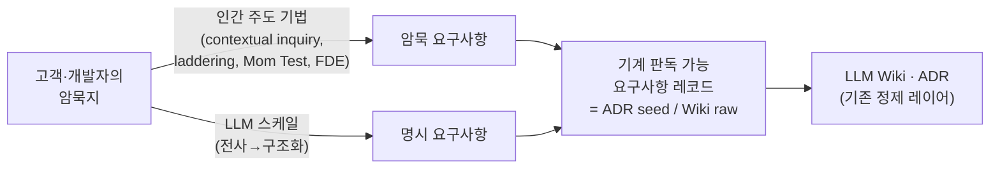

> "사람들은 자기가 원하지 *않는* 걸 보기 전까지는 뭘 원하는지 모른다."
> - Mark Coleman, NetBox Labs 공동창업자[^coleman]

## 들어가며: AX 프로젝트가 매번 같은 자리에서 막힌다

AI로 일을 바꾸고 싶다는 고객을 만난다. 또는 사내에서 "이건 AI로 자동화하자"는 프로젝트가 시작된다. 그리고 거의 항상 같은 자리에서 막힌다.

> 고객도, 그 일을 맡을 개발자도, 정확히 뭘 원하는지 모른다.

혼자만의 인상이 아니다. IBM이 2025년 CEO 2,000명을 조사했더니, AI 투자에서 **기대한 ROI를 낸 건 25%뿐**이었고, **약 3분의 2가 "가치를 명확히 이해하기도 전에" FOMO로 투자했다고 인정**했다.[^ibm] 시작점부터 "뭘 원하는지 모르는 채로" 들어간다는 뜻이다.

고객은 "그 반복 업무를 AI가 알아서 해줬으면 좋겠다"고 말하지만, 그 업무가 실제로 어떻게 돌아가는지 글로 적어달라고 하면 못 적는다. 개발자는 "데이터만 주시면 됩니다"라고 하지만, 막상 받은 데이터로는 모델이 엉뚱한 답을 낸다. 양쪽 다 거짓말을 하는 게 아니다. **둘 다 자기가 아는 걸 말로 옮기지 못할 뿐**이다.

그래서 많은 팀이 인터뷰를 "요구사항을 받아 적는 자리"로 운영한다. 고객이 말하면 적고, 그걸 사양서로 정리한다. 이 방식은 거의 항상 실패한다. 받아 적을 수 있는 건 고객이 **말로 표현할 수 있는** 요구사항뿐이고, AX 프로젝트가 실제로 걸려 넘어지는 건 고객이 말로 표현하지 못하는 암묵지(tacit knowledge)이기 때문이다.

이 글은 그 문제를 정면으로 다룬다. 결론부터 적으면 이렇다.

- "이해관계자가 원하는 걸 모른다"는 건 새 문제가 아니다. 고전 요구공학(Requirements Engineering)이 40년 전에 풀었다. 단 **선언을 요청하는 게 아니라 암묵지를 끄집어내는 기법**으로 풀었다.
- AX 인터뷰는 사양서 받아쓰기가 아니라 **암묵지를 기계 판독 가능한 요구사항으로 변환(컴파일)하는 행위**다. 그 산출물은 슬라이드가 아니라 이 블로그가 이미 쓰고 있는 ADR/Wiki 기질로 흘러 들어가야 한다.
- 고객이 **AI를 만능으로 오해할수록** 요구사항을 *덜* 말하게 된다. 이 인식을 인터뷰에서 교정하는 것 자체가 앞단의 일이다.
- 2025~2026년 벤치마크는 LLM이 바로 이 **어려운 절반(암묵 요구사항)에서 가장 약하다**는 걸 측정으로 증명한다. 그래서 인터뷰는 사람이 돌리고, LLM은 쉬운 절반(전사 → 구조화 → 빈틈 표시)을 스케일하는 분업이 맞다.

> [!note] 기존 글과의 관계
> [[llm-wiki|LLM Wiki]](의미 기억)와 ADR(결정 기억), [[agentic-decision-workflow|agentic decision workflow]]은 "에이전트가 이슈를 읽는 순간"부터의 이야기였다. 이 글은 그 이슈에 들어갈 **요구사항이 어디서 오는가**, 즉 더 앞단을 다룬다.

---

## "원하는 걸 모른다"는 40년 전에 풀린 문제다

소프트웨어 공학에서 [[정보처리기사|요구사항 분석]]은 가장 오래된 주제 중 하나다. 그리고 이 분야는 일찌감치 깨달았다. **사람에게 "뭘 원하세요?"라고 물으면 가장 중요한 것은 안 나온다.** 진짜 중요한 건 본인도 의식하지 못한 채 몸으로 하는 일, 즉 암묵지에 들어 있기 때문이다.

이걸 현장 엔지니어들은 더 거칠게 말한다. "엔지니어링에서 가장 어려운 건 요구사항"이라는 Hacker News 글의 베스트 댓글은 이렇다.

> "요구사항은 *모이지* 않는다. **발명된다**(invented)."[^hn]

같은 스레드의 다른 댓글은 더 구체적이다. "사용자들은 대개 자기가 원하는 걸 말한다. 자기 머릿속 완벽한 구현을 묘사한다. 그런데 자기가 가진 *진짜 필요*를 묘사하는 일은 거의 없다."[^hn] 제품 디스커버리 코치 Teresa Torres도 같은 말을 한다. "사람들은 자기가 뭘 원하는지 전혀 모른다. 그래도 그들과 이야기해야 한다. 그들의 문제를, 그들의 하루를 물어라. 목표는 *무엇을 만들지*가 아니라 *누구를 위해 만드는지*를 배우는 것이다."[^torres]

그래서 요구공학은 "선언을 받는" 대신 "행동을 캐는" 기법들을 만들어 냈다. 핵심만 추리면 다섯 가지다.

| 기법 | 출처 | 한 줄 | 무엇을 캐는가 |
|------|------|-------|---------------|
| Contextual Inquiry | Holtzblatt & Beyer, DEC 1980년대 중후반[^ci] | 엔지니어가 사용자를 master로 두고 자기는 apprentice로서 실제 작업을 관찰 | 인터뷰로는 안 나오는 현장의 암묵 절차 |
| The Mom Test | Rob Fitzpatrick, 2013[^momtest] | 미래 가정이 아니라 **과거 사건**을 묻는다 | 의견/희망사항이 아닌 실제 행동 증거 |
| Laddering (means-end chain) | Gutman, 1982[^laddering] | "그게 왜 중요하죠?"를 반복해 속성 → 결과 → 가치로 올라간다 | 본인도 모르는 밑바닥 동기·가치 |
| 5 Whys | Sakichi Toyoda / Toyota[^fivewhys] | "왜"를 다섯 번 물어 증상에서 근본으로 | 표면 요구 뒤의 진짜 필요 |
| JTBD / ODI | Ulwick(JTBD 1990, ODI 1999), Christensen 대중화 2003[^jtbd] | 고객은 제품을 "고용"해 job을 해낸다 | 안정적인 job(= 측정 가능한 성공 지표) |

이 표에서 가장 중요한 공통점은 **아무도 고객에게 "사양을 적어 오세요"라고 하지 않는다**는 것이다.

- **Contextual Inquiry**의 핵심은 자세(stance)다. 엔지니어가 전문가 행세를 하는 게 아니라, 사용자를 스승으로 모시고 옆에서 일을 배우는 도제(apprentice)가 된다.[^ci] AX 맥락에서 이건 통째로 빌려 쓸 수 있다. **앞으로 그 일을 위임받을 AI 에이전트가 바로 새로운 apprentice다.** 도제에게 일을 안 가르치면 일을 못 하듯, as-is 워크플로우를 포착하지 않으면 에이전트도 일을 못 한다(이건 다음 글의 주제다).
- **The Mom Test**의 규칙은 단순하다. 내 아이디어가 아니라 상대의 삶을 이야기하고, 미래의 "할 것 같다"가 아니라 과거의 "지난번에 이랬다"를 묻고, 내가 말하는 시간보다 듣는 시간을 늘린다.[^momtest] "이거 쓰실래요?"를 "지난번에 이 문제를 마지막으로 만났을 때 어떻게 하셨어요?"로 바꾸는 한 수가 전부다.
- **Laddering과 5 Whys**는 둘 다 "왜 체인"이다. 흥미로운 사실 하나. 5 Whys는 원래 불량의 근본 원인을 찾는 도구가 아니라 **"왜 이 기능/기법이 필요한가"를 이해하기 위한 도구**였다.[^fivewhys] 즉 태생이 elicitation 도구다.
- **JTBD**는 모호한 비즈니스 목표를 측정 가능한 성공 지표로 번역한다. 그리고 AX에서 결정적인 함의가 하나 더 있다. **job은 안정적이고 구현은 휘발적이다.** 고객이 해내려는 job("이 서류 더미에서 위험 조항을 빨리 찾아낸다")은 10년이 지나도 그대로지만, 그걸 어떤 도구로 구현하느냐는 매년 바뀐다. 그래서 **안정적인 job이 곧 AI에 위임할 후보**다.

요지는 이렇다. 당신이 "고객이 자기가 뭘 원하는지 모른다"는 문제로 고생하고 있다면, 그건 새로 풀 문제가 아니라 **이미 잘 정리된 기법을 안 쓰고 있는 문제**일 가능성이 높다.

---

## 현장 증거: Palantir는 왜 고객사에 엔지니어를 심었나

이게 학계 이야기만은 아니다. 이 문제를 **돈으로 가장 비싸게 풀어낸** 회사가 Palantir다.

Palantir는 2010년대 초에 *forward deployed engineer*(FDE, 현장 배치 엔지니어)라는 직군을 만들었다. 이유가 정확히 이 글의 주제다. 초기 고객(미국 정보기관)은 자기 요구사항을 **말할 수도, 공개할 수도 없었다.** 그래서 정상적인 제품 디스커버리가 불가능했고, 유일한 방법은 엔지니어를 고객사에 직접 심어서 *함께 만들며* 진짜 문제를 배우는 것이었다.[^palantir] Palantir 자신의 표현으로, 일반 개발자가 "하나의 기능을 여러 고객에게" 만든다면 FDE는 "한 고객에게 여러 기능을" 만든다. 그리고 결정적으로, **"우리의 가장 가치 있는 제품 개선 중 일부는 현장에서 나왔다."**[^palantir]

이건 인터뷰의 본질을 그대로 보여준다. 스펙은 받아 적는 게 아니라 현장에서 만들어진다(invented). Palantir의 Ontology(고객의 업무를 객체·관계·행위로 모델링하는 층)가 도구를 갈아끼워도 남는 durable substrate가 된 것도 같은 맥락이다.

흥미로운 건 2025~2026년 들어 **AI 회사들이 이 모델을 그대로 베끼고 있다**는 점이다. OpenAI는 2025년 초 Colin Jarvis를 필두로 FDE 조직을 만들었고, Anthropic은 FDE를 연봉 20만~30만 달러에 채용하며, Salesforce는 Agentforce를 위해 FDE 1,000명과 파트너 네트워크(Accenture·Deloitte 등)를 선언했다.[^fde] FDE 채용 공고는 2025년 한 해에만 8배 가까이 늘었다.[^fde] OpenAI FDE 책임자 Colin Jarvis의 요지는 한 문장으로 압축된다. **"스코핑 단계에서 고객이 설명한 것은 현장의 데이터·시스템 현실과 일치하지 않는 경우가 많다."**[^jarvis]

이건 남의 회사 얘기만은 아니다. 내가 통과한 한 멀티벤더 AI 프로젝트에서도 똑같았다. 착수 직후 "기존 자산은 부채니 처음부터 새로 짓는다"는 아키텍처 결정을 박았는데, 며칠 만에 실제 작업 범위를 들여다보니 핵심 검증 대상이 서너 개뿐이고 대부분은 기존 시스템을 리팩토링해 재사용하면 되는 일이었다. 그 결정은 통째로 폐기됐다. Jarvis의 "스코핑 때 들은 것과 현장 현실이 다르다"를 인용이 아니라 내 재작업으로 증명한 셈이다. 더 비쌌던 건, 다른 팀이 먼저 끊어둔 작업 티켓들이 우리와 완전히 다른 이식 전략을 전제하고 있던 것이다. 같은 프로젝트 안에서도 "무엇을 만드는가"에 대한 암묵 가정이 팀마다 달랐고, 그 불일치를 앞단에서 안 맞춰둔 대가를 티켓 재조율로 치렀다.

왜 가장 앞선 AI 회사들이, 모델이 이렇게 좋아진 시대에, 사람을 고객사에 *몸으로* 심을까? 요구사항이 여전히 수집이 아니라 발굴 대상이기 때문이다. 모델이 좋아질수록 오히려 "현장에서 진짜 문제를 캐는" 사람의 가치가 올라간다.

---

## 인터뷰는 받아쓰기가 아니라 컴파일이다

여기서 이 시리즈를 관통하는 한 줄이 나온다.

> **Elicitation 산출물은 컴파일러의 입력이고, 도구는 컴파일러일 뿐이다.**

무슨 뜻인가. 인터뷰의 진짜 산출물은 "회의록"이나 "요구사항 문서"가 아니다. 진짜 산출물은 **암묵지를 기계 판독 가능한 요구사항 레코드로 변환한 결과물**이다. 받아쓰기는 고객의 말을 그대로 옮긴다(garbage in, garbage out). 컴파일은 고객의 행동에서 추출한 암묵지를 구조화된 형태로 변환한다.

이 블로그 독자라면 이 그림이 익숙할 것이다. [[llm-wiki|LLM Wiki]]는 의미 기억(지금 무엇이 참인가)을, ADR은 결정 기억(왜 그렇게 정했나)을 맡는다. 그런데 그 두 레이어가 컴파일하는 **원재료(raw)는 어디서 오는가?** 바로 여기, 인터뷰에서 온다. 인터뷰가 원재료를 잘 못 캐면 그 아래 모든 정제 레이어가 쓰레기를 정제하게 된다.



이렇게 보면 인터뷰는 별도 학문이 아니라 **기존 ADR/Wiki/3층 기억 아키텍처의 프론트엔드**다. 인터뷰에서 캔 "배경 → 문제 → 후보 → 이유 → 선택"은 그 자체로 **elicitation 시점에 씨앗을 심은 ADR**이다. 이렇게 잘 정리된 결정 기록은 다음 프로젝트 인터뷰의 입력으로 되먹임된다(feed-forward). 이 루프가 뒤쪽 글의 주제다.

이 "컴파일"을 한 번 쓰고 버리지 않고 재사용 자산으로 굳힌 사례를 봤다. 한 팀은 발굴 절차 자체를 한 장짜리 메타 프롬프트로 표준화했다. 맨 위에 네댓 개 변수 블록(대상 기능, 출력 폴더, 우선순위순으로 참조할 도메인 문서)만 채우게 하고 본문 절차는 손대지 못하게 못 박아, 수십 개 기능을 같은 한 장으로 발굴했다. 두 가지가 인상적이었다. 하나는 "목차(범위)에 합의하기 전에는 상세를 쓰지 마라"를 안티패턴으로 박아, 잘못된 범위 위에 비싼 상세를 쌓는 낭비를 막은 것이다. 다른 하나는 절차 안에 "도메인 지식이 모자라면 추측하지 말고 질문하라"를 게이트로 넣은 것이다. 문서를 먼저 쓰는 방식이어도 발굴 단계에는 불확실성 구멍이 남는다는 걸 절차 스스로 인정한 셈이다.

구체적으로 어떤 모습인지 보자. 고객이 이렇게 말한다면(가상의 예다):

> "그 견적서들 들어오면 일단 대충 훑어보고, 좀 이상하다 싶은 건 따로 빼서 김 과장한테 물어봐요. 보통은 그냥 통과시키고."

이걸 **받아쓰면** "견적서를 검토한다" 한 줄이 남는다. **컴파일하면** 이렇게 분리된다.

```yaml
job: 들어온 견적서에서 "이상한 건"을 걸러낸다
as_is:
  - 전건 육안 훑어보기 (대부분 통과)
  - 이상 징후 발견 시 분리 → 김 과장(도메인 전문가)에게 확인
tacit: '"이상하다"의 기준이 김 과장 머릿속 암묵지 → laddering/CDM으로 캐야 함'
ai_candidate: 이상 징후 1차 스크리닝 (전문가 확인은 인간 게이트 유지)
data_needed: 과거 견적서 + "이상/정상" 라벨 + 분리 사유
open_question: '"이상"의 합격 기준을 통계치로 어떻게 정의할까 → 3편'
```

받아쓰기는 "검토한다"에서 멈추지만, 컴파일은 암묵지·위임 후보·필요한 데이터·미해결 질문을 분리해 낸다. 이 레코드는 그대로 Wiki raw로 들어가고, "1차 스크리닝만 AI에 맡기고 전문가 확인은 인간이 한다"는 한 줄은 ADR 씨앗이 된다.

---

## 그런데 AI 프로젝트의 요구사항은 구조가 다르다

고전 기법을 그대로 가져와도, AX에는 전통 요구공학이 다루지 않던 항목이 추가된다. AI/ML 시스템의 요구공학은 구조적으로 다르기 때문이다.[^reml]

| 관점 | 전통 SW 요구사항 | AI/ML 요구사항 |
|------|------------------|----------------|
| 요구사항의 일부 | 기능·비기능 | **데이터** 자체가 요구사항(수집·포맷·양·품질) |
| 합격 기준 | pass/fail (결정적) | **통계치**(precision/recall/F1) - 비결정적 시스템이라 |
| 누락되기 쉬운 것 | 비기능 요구사항 | 설명가능성·공정성·윤리 같은 인간 중심 요구사항 |
| 검증 시점 | 출시 전 | **지속 검증** - 학습 데이터가 운영 데이터와 어긋나면 재학습 |

세 가지가 특히 중요하다.

1. **데이터가 요구사항이다.** Vogelsang & Borg(2019)는 ML 프로젝트의 요구공학에서 데이터의 수집·포맷·범위·양·품질이 1급 요구사항이 된다고 정리한다.[^reml] "데이터만 주시면 됩니다"가 위험한 이유가 여기 있다. **어떤 데이터를, 어떤 포맷으로** 줄지가 요구사항의 핵심인데 그걸 인터뷰에서 안 캔 것이다.
2. **합격 기준이 통계치다.** 비결정적 시스템이라 "되거나/안 되거나"가 아니라 "정밀도 0.92, 재현율 0.85"가 합격선이 된다. 그런데 pass/fail로만 생각하는 비전문가 고객에게서 어떻게 허용 오차를 끌어낼 것인가? 요령은 "몇 %까지 괜찮으세요?"를 직접 묻지 않는 것이다. "틀리면 무슨 일이 생기고 그 비용은 누가 무나"를 물어 *오류 비용*에서 허용치를 역산한다(구체적 방법은 3편에서 다룬다).
3. **인간 중심 요구사항이 v1에서 체계적으로 누락된다.** Ahmad 외(2023)는 당뇨 mHealth 앱 사례 연구에서 **대부분의 인간 중심 요소(가치·윤리)가 첫 버전에서 전혀 고려되지 않았다**는 걸 실증했다.[^ahmad] 비기능 요구사항(설명가능성·공정성·법적 준수)이 실무에서 일관되게 누락된다는 건 후속 연구들도 확인한다.[^nfrml]

함의는 분명하다. AX 인터뷰는 고전 기법(암묵지 추출)에 더해 **AI 특화 항목**을 반드시 캐야 한다. (1) 사람이 전에 어떻게 일했는지, (2) AI가 실제로 어떻게 작동하는지에 대한 비전문가용 멘탈 모델, (3) 무엇을 AI에 위임할지, (4) 그 일을 잘 하려면 어떤 정보가 필요한지, (5) 그 데이터가 어떤 포맷이어야 하는지, (6) 무엇을 조심해야 하는지. 이걸 하나의 양식으로 응결시키는 게 뒤쪽 글의 일이다.

---

## 고객이 AI를 오해하면 요구사항이 사라진다

앞의 6가지 중 (2)번, "AI가 실제로 어떻게 작동하는지에 대한 멘탈 모델"이 사실 나머지 전부를 무너뜨리는 뿌리다. AI가 워낙 빠르게 발전한 탓에 **전문가를 포함해 사람마다 이해 수준이 천차만별**이고, 많은 고객이 AI를 *만능 오라클*처럼 과대평가한다. "알아서 다 해주겠지"라고 믿으면 요구사항을 더 이상 구체화하지 않는다. **과대평가가 디스커버리를 멈추게 하는 것이다.** (오래된 격언대로 "충분히 발달한 기술은 마법과 구별할 수 없"지만[^clarke], 그 구별 불가는 기술의 능력이 아니라 *보는 사람의 이해 격차*에서 온다.) 이 오해는 세 갈래로 나타난다.

**1. 능력의 경계가 보이지 않는다 (jagged frontier).** AI는 어려워 보이는 일을 초인적으로 해내면서 바로 옆 쉬워 보이는 일에서 무너진다. 그 경계는 **들쭉날쭉하고 눈에 보이지 않는다.** HBS·BCG가 컨설턴트 758명으로 한 2023년 현장실험(2025년 *Organization Science* 게재)이 이걸 측정했다. 경계 *안*에서는 GPT-4를 쓴 그룹이 12.2% 더 많은 과제를 25.1% 빠르게 약 40% 높은 품질로 해냈지만, 경계 *밖* 과제에서는 AI를 쓴 쪽이 오히려 정답률이 19%p 낮았다.[^jagged] 경계가 안 보이니 고객도 전문가도 "AI가 이건 되고 저건 안 된다"를 **미리 설계할 수 없다.** (위임을 다루는 뒤쪽 글의 핵심이다.)

| 과제 | 사람의 직관 | AI 실제 |
|------|------------|---------|
| "strawberry"의 r 개수 세기 | 너무 쉬움 | 자주 틀림 |
| 긴 보고서 초안 잡기 | 어려움 | 곧잘 함 |
| 최신 사내 규정 반영해 답하기 | 쉬워 보임 | 환각 |
| 모호한 표 데이터 요약 | 어려움 | 잘함 |

겉보기 난이도와 실제 AI 성능이 *따로 논다.* 그래서 "이건 되겠지/안 되겠지"라는 직관이 자꾸 빗나가고, 경계는 직접 찔러보기 전엔 보이지 않는다.

**2. 리터러시는 원래 제각각이다.** "전문가도 이해가 제각각"인 건 당신 고객만의 문제가 아니라 **학계의 기본 상태**다. AI 리터러시를 정의한 정전 격 논문(Long & Magerko, CHI 2020)은 17개 역량을 5개 주제로 묶는데, 그중 한 주제가 통째로 "사람들은 AI를 어떻게 *인식*하는가"(의인화 포함)다.[^ailit] 인식 자체가 연구 영역이라는 뜻이다. 2026년 조사에서도 기업 리더의 72%가 AI 리터러시를 필수라 하면서 59%가 자기 조직에 AI 역량 격차가 있다고 답했다.[^datacamp] **이해도가 제각각인 건 예외가 아니라 기본값이다.**

**3. DX 없이 AX를 바란다.** 디지털 데이터가 있어야 AI를 학습시키고, 프로세스가 디지털화돼 있어야 AI를 현장에 붙인다. BCG의 "10-20-70" 법칙이 이걸 숫자로 말한다. AI 가치의 10%만 알고리즘이고 20%가 기술·데이터, **70%가 사람과 프로세스**다.[^bcg] 고객이 기대하는 "자동화"는 그 10%이고, 나머지 90%가 없으면 작동하지 않는다(MIT CISR도 데이터 사일로 통합 전 단계의 기업은 재무 성과가 업계 평균을 밑돈다고 본다[^cisr]). RAND의 AI 실패 조사에서도 데이터 부족은 여러 원인 중 하나였고 **가장 흔한 1차 원인은 "프로젝트 의도의 오해·오소통"**이었다[^rand] - 실패의 뿌리는 모델이 아니라 앞단이라는 뜻이다.

오해의 대가가 데모 실패에 그치지도 않는다. Air Canada는 챗봇이 실제 환불 정책과 다른 안내를 했다가 캐나다 법정에서 배상 판결을 받았다. "챗봇은 별개 주체"라는 항변은 받아들여지지 않았다.[^aircanada] AI를 "알아서 잘하는 직원"으로 두고 실제 규칙에 묶어두지 않으면, 그 결과는 회사가 떠안는다.

> [!tip] 인터뷰어의 절반은 기대치를 맞추는 일이다
> AI를 오라클이 아니라 *도구*로 보게 만드는 처방은 단순하다. Simon Willison의 말처럼 LLM을 "단어 계산기"로 보는 것이다. "최대한 가치를 끌어내고 함정을 피하려면, 그것이 어떻게 작동하고 *어디서 가장 틀리기 쉬운지* 정확한 멘탈 모델을 세워야 한다."[^willison] 인터뷰의 절반은 요구사항을 *캐는* 일이고, 나머지 절반은 고객의 기대치를 실제 능력에 맞추는 일이다. Ethan Mollick의 말대로 "AI의 마법은 아주 빠르게 닳기" 때문에,[^mollick] 그게 닳기 전에 결정의 근거를 기록으로 남겨두는 편이 낫다.

---

## 고객 인터뷰와 개발자 인터뷰는 다른 진실을 캔다

여기서 중요한 갈래 하나. 인터뷰는 고객에게만 하는 게 아니다. **고객과 개발자 양쪽에 같은 규율로 인터뷰해야** 문서가 제대로 나온다. 둘이 캐는 진실이 다르기 때문이다.

| | 고객 인터뷰 | 개발자 인터뷰 |
|---|------------|----------------|
| 캐는 진실 | 도메인 진실 | 구현 진실 |
| 핵심 질문 | 이 일이 실제로 어떻게 돌아가는가, "잘했다"의 기준은 무엇인가 | 데이터의 실제 상태는, 진짜 어려운 지점은 어디인가 |
| 암묵지의 형태 | 예외 처리, 직관적 판단, "원래 이렇게 함" | 시스템 제약, 숨은 의존성, "그건 사실 안 돼요" |
| 가장 흔한 거짓말 | "그냥 다 자동화하면 돼요" | "데이터만 주시면 됩니다" |

양쪽 다 같은 함정에 빠진다. **미래에 대한 가정을 답한다.** 그래서 Mom Test의 규칙이 양쪽 모두에 적용된다. 고객에게도 개발자에게도 "그러면 될 것 같아요"가 아니라 "지난번에 실제로 어떻게 했어요/막혔어요"를 묻는다.

그리고 두 인터뷰가 모순될 때(고객은 "이게 제일 중요"라는데 개발자는 "그건 데이터가 없어 불가능"이라 할 때) - 그 모순 자체가 **가장 값진 ADR 후보**다. 배경(고객의 우선순위) → 문제(데이터 부재) → 후보(대체 접근들) → 이유 → 선택. 모순을 덮지 말고 결정 기록으로 남기면, 그게 나중에 "왜 그때 그렇게 안 했지?"에 대한 답이 된다.

반대로, 개발자 인터뷰에서 "그건 사실 안 돼요"를 못 캐면 어떻게 되는지도 겪었다. 한 프로젝트에서 "승인 없이는 다음 단계로 못 넘어간다"는 핵심 업무 규칙이 시스템에 당연히 구현돼 있다고 모두가 가정했다. 사후에 코드를 직접 뜯어 보고서야 진실이 드러났다. 그 게이트는 화면에 표시만 될 뿐 백엔드 강제가 전혀 없었고, API를 직접 부르면 통째로 우회됐으며, "승인자"라는 역할 자체가 권한 모델에 존재하지도 않았다. 회의실에서 설명된 절차와 코드가 실제로 강제하는 것의 간극이 이만큼이었다. 이건 받아쓰기로는 절대 안 나온다. 개발자 인터뷰로 캐거나, 못 캐면 코드를 역추적해야 나오고, 후자는 훨씬 비싸다.

---

## 그럼 LLM한테 인터뷰를 맡기면 되지 않나?

2026년이니 당연히 나오는 질문이다. "GPT한테 인터뷰 시키고 전사·정리까지 맡기면 사람 손 안 가도 되는 거 아냐?" 답은 **"절반만 맞다"**이고, 그 절반이 어느 쪽인지가 핵심이다.

**LLM은 인터뷰를 꽤 한다.** LLMREI(Korn, Gorsch, Vogelsang, 2025)는 GPT-4o로 요구사항 elicitation 인터뷰를 진행하는 챗봇이다. 33개 시뮬레이션 인터뷰에서 **인간 인터뷰어와 비슷한 수준의 오류율**로 요구사항의 **최대 73.7%를 포착**했다.[^llmrei] 즉 1차 인터뷰와 전사 → 구조화는 LLM이 충분히 스케일한다.

**그런데 어려운 절반에서 무너진다.** ReqElicitGym(Jin 외, 베이징대, ACM TOSEM, 2026)은 LLM의 "인터뷰 역량" 자체를 평가하는 벤치마크다. 결과가 냉정하다. **최고 성능 단일 모델(DeepSeek V3.2, non-CoT, IRE=0.32)조차 암묵 요구사항의 약 32%만 커버**하고, 스타일·심미 요구사항은 거의 0%다.[^reqgym] 산업 현장 조사도 같다. arXiv 2511.01324(2025, 실무자 55명)는 **elicitation 단계가 RE 전 과정에서 AI가 가장 약하고 사람이 가장 많이 개입하는 단계**임을 보여준다. elicitation에서 인간-AI 협업 49.2%, 인간 단독 39.2%, **완전 자동은 5.4%뿐**이다.[^aire2025]

| 작업 | 누가 더 잘하나 |
|------|----------------|
| 인터뷰 전사 → 구조화 | LLM (스케일) |
| 1차 탐색 인터뷰(쉬운 명시 요구사항) | LLM 보조 가능(~74%) |
| **암묵 요구사항 캐기(laddering·Mom Test·contextual inquiry·FDE)** | **인간(LLM ~32% 천장)** |
| 적응형 후속 질문, 모순 감지, 도메인 직관 | 인간 |
| 빈틈·누락 표시, 초안 생성 | LLM 보조 |

이 분업은 새로 발명할 게 없다. HARE-SM(Abbasi 외, 2025)은 RE의 elicitation·분석·검증을 AI 연산과 인간 감독으로 나누는데,[^haresm] 이게 [[agentic-decision-workflow|agentic decision workflow]]의 **decision-gate + orchestrator/critic** 구도와 거의 1:1로 매핑된다. **사람이 어려운 암묵지·판단·검증을 맡고, LLM이 쉬운 스케일을 맡는다.**

> [!warning] "AI가 요구사항을 써준다"는 마케팅을 조심하라
> LLM은 명시 요구사항을 받아 적고 구조화하는 건 잘한다(~74%). 하지만 고객이 **말로 못 하는** 암묵 요구사항, 즉 AX 프로젝트가 실제로 걸려 넘어지는 바로 그 절반은 ~32%에서 천장을 친다. 어려운 절반을 사람이 안 맡으면, AI는 쉬운 절반만 매끈하게 정리한 그럴듯한 문서를 줄 뿐이다.

---

## 도구는 바뀌어도 기법은 남는다

LLM 인터뷰 도구는 언제든 교체된다(GPT-4o → 다음 모델, 클로드 코드 → Codex → 또 다른 무엇). 하지만 contextual inquiry·Mom Test·laddering·JTBD는 40년을 버틴 기질이고, 인터뷰 산출물(배경 → 문제 → 후보 → 이유 → 선택)도 어떤 도구로 만들었든 마크다운으로 남는다. Palantir의 forward deployed 모델이 살아남은 것도 그 산출물인 Ontology가 도구가 아니라 *데이터 모델*이라서다. 그래서 질문은 "어떤 도구를 쓸까"가 아니라 **"그 산출물이 도구에 묶이지 않는 형태로 남는가"**다. 이 갈래의 끝은 시리즈 마지막 글에서 다룬다.

---

## 정리

- "고객/개발자가 원하는 걸 모른다"는 새 문제가 아니다. 고전 요구공학이 **암묵지 추출 기법**(contextual inquiry, Mom Test, laddering, 5 Whys, JTBD)으로 이미 풀었고, Palantir는 같은 이유로 고객사에 엔지니어를 심었다(FDE). 요구사항은 수집이 아니라 발굴이다.
- AX 인터뷰는 사양서 받아쓰기가 아니라 **컴파일**이다. 산출물은 슬라이드가 아니라 ADR/Wiki 기질로 흘러드는 기계 판독 가능한 요구사항 레코드여야 한다.
- AI 프로젝트의 요구사항은 구조가 다르다. 데이터가 요구사항이고, 합격 기준이 통계치이며, 인간 중심 요구사항이 v1에서 체계적으로 누락된다.
- **고객이 AI를 만능으로 오해하면 요구사항이 사라진다.** 능력의 경계가 안 보이고(jagged frontier), 리터러시는 원래 제각각이며(Long & Magerko), DX도 안 된 채 AX를 바라면 70%의 기반이 비어 있다(BCG 10-20-70). 인터뷰어의 절반은 고객의 기대치를 실제 능력에 맞추는 일이다.
- LLM은 쉬운 절반(명시 요구사항 ~74%)을 스케일하지만, 어려운 절반(암묵 요구사항 ~32% 천장)은 사람이 맡는다. 기존 decision-gate/orchestrator+critic 패턴 그대로다.

이어지는 글에서는 이 인터뷰가 가장 먼저 캐야 하는 것, 즉 **사람이 실제로 어떻게 일하는지(as-is)**를 다룬다. 회의실에서 설명하는 깔끔한 절차(Work-as-Imagined)가 아니라, 현장에서 진짜로 일이 되게 만드는 예외와 우회(Work-as-Done)를 어떻게 포착하는지.

---

## 참고 자료

### 고전 elicitation 기법

- [Contextual Inquiry (Nielsen Norman Group)](https://www.nngroup.com/articles/contextual-inquiry/)
- [The Mom Test - Rob Fitzpatrick](https://www.momtestbook.com/)
- [Laddering: A Research Interview Technique (UXmatters)](https://www.uxmatters.com/mt/archives/2009/07/laddering-a-research-interview-technique-for-uncovering-core-values.php)
- [Five Whys (Wikipedia)](https://en.wikipedia.org/wiki/Five_whys)
- [The History of Jobs to Be Done (Strategyn / Tony Ulwick)](https://strategyn.com/jobs-to-be-done/history-of-jtbd/)
- [The hardest thing about engineering is requirements (Hacker News)](https://news.ycombinator.com/item?id=30631571)
- [Teresa Torres - Product Talk](https://www.producttalk.org/)

### Forward deployed engineer

- [A Day in the Life of a Palantir Forward Deployed Software Engineer](https://blog.palantir.com/a-day-in-the-life-of-a-palantir-forward-deployed-software-engineer-45ef2de257b1)
- [The rise of the forward deployed engineer (Pragmatic Engineer)](https://newsletter.pragmaticengineer.com/p/forward-deployed-engineers)
- [I analyzed 1,000 forward deployed engineer jobs (bloomberry)](https://bloomberry.com/blog/i-analyzed-1000-forward-deployed-engineer-jobs-what-i-learned/)

### AI/ML 요구공학

- [Requirements Engineering for Machine Learning (Vogelsang & Borg, arXiv 1908.04674)](https://arxiv.org/abs/1908.04674)
- [Requirements Elicitation and Modelling of AI Systems (Ahmad et al., arXiv 2302.06034)](https://arxiv.org/abs/2302.06034)
- [Non-functional requirements for machine learning (Requirements Engineering journal, 2022)](https://link.springer.com/article/10.1007/s00766-022-00395-3)
- [Towards Human-AI Synergy in Requirements Engineering: HARE-SM (arXiv 2510.25016)](https://arxiv.org/abs/2510.25016)

### 2025~2026 GenAI elicitation 벤치마크

- [LLMREI (Korn, Gorsch, Vogelsang, arXiv 2507.02564)](https://arxiv.org/html/2507.02564v1)
- [ReqElicitGym (Jin et al., 베이징대, ACM TOSEM, arXiv 2602.18306)](https://arxiv.org/html/2602.18306)
- [AI for Requirements Engineering (Rani et al., arXiv 2511.01324)](https://arxiv.org/html/2511.01324v1)

### AI 멘탈 모델과 능력 인식

- [Clarke's three laws (Wikipedia)](https://en.wikipedia.org/wiki/Clarke%27s_three_laws)
- [What is AI Literacy? (Long & Magerko, CHI 2020)](https://dl.acm.org/doi/10.1145/3313831.3376727)
- [Navigating the Jagged Technological Frontier (HBS/BCG, 2023)](https://www.hbs.edu/faculty/Pages/item.aspx?num=64700)
- [Think of language models like ChatGPT as a calculator for words (Simon Willison)](https://simonwillison.net/2023/Apr/2/calculator-for-words/)
- [Ethan Mollick on the jagged frontier (Insight Partners)](https://www.insightpartners.com/ideas/generative-ai-ethan-mollick/)
- [IBM 2025 CEO study](https://newsroom.ibm.com/2025-05-06-ibm-study-ceos-double-down-on-ai-while-navigating-enterprise-hurdles)
- [Where's the Value in AI? BCG 10-20-70 (BCG, 2024)](https://www.prnewswire.com/news-releases/ai-adoption-in-2024-74-of-companies-struggle-to-achieve-and-scale-value-302285294.html)
- [Building Enterprise AI Maturity (MIT CISR)](https://cisr.mit.edu/publication/2024_1201_EnterpriseAIMaturityModel_WeillWoernerSebastian)
- [The Root Causes of Failure for AI Projects (RAND, RRA2680-1)](https://www.rand.org/pubs/research_reports/RRA2680-1.html)
- [Air Canada, 챗봇 오안내 배상 판결 (CBC)](https://www.cbc.ca/news/canada/british-columbia/air-canada-chatbot-lawsuit-1.7116416)
- [DX 없이는 AX도 없다 (flow.team)](https://platform.flow.team/blog/noai-without-dx)

[^coleman]: Mark Coleman(NetBox Labs 공동창업자)이 forward deployed engineer 직무를 두고 한 말. The New Stack, ["The Forward Deployed Engineer"](https://thenewstack.io/forward-deployed-engineer-fde-openai-google/).
[^ibm]: IBM Institute for Business Value(Oxford Economics 협업), 33개국·24개 산업 CEO 2,000명 조사(2025-02~04). AI 투자의 기대 ROI 달성 25%, 전사 확산 16%, "가치를 명확히 이해하기 전에 FOMO로 투자" 약 3분의 2. [IBM newsroom](https://newsroom.ibm.com/2025-05-06-ibm-study-ceos-double-down-on-ai-while-navigating-enterprise-hurdles).
[^hn]: Hacker News, ["The hardest thing about engineering is requirements"](https://news.ycombinator.com/item?id=30631571)(2022). 댓글 인용: dalbasal "requirements ... aren't gathered. They're invented."; BrandiATMuhkuh "they describe what their perfect implementation should look like. But almost never do they describe what needs they have."
[^torres]: Teresa Torres, Product Talk. "People have no idea what they want ... Talk to them about their problems ... Your goal is to learn about for whom you are building, not what you should build." [producttalk.org](https://www.producttalk.org/).
[^ci]: Contextual Inquiry는 Karen Holtzblatt과 Hugh Beyer가 정립했고, Holtzblatt이 DEC에서 John Whiteside와 작업한 1980년대 중후반(~1987, 인쇄물로는 1988~1990)에 뿌리를 둔다. 네 원칙(context, partnership, interpretation, focus)과 master/apprentice 모델은 [NN/g](https://www.nngroup.com/articles/contextual-inquiry/)에 정리돼 있다.
[^momtest]: Rob Fitzpatrick, *The Mom Test* (2013). 세 규칙: 내 아이디어가 아니라 상대의 삶을 이야기한다, 미래 가정이 아니라 구체적 과거를 묻는다, 말하기보다 듣는다.
[^laddering]: Laddering은 means-end chain 이론(Gutman, 1982)에 뿌리를 둔 인터뷰 기법으로, "왜 그게 중요하죠?"를 반복해 속성 → 결과 → 가치 사슬을 올라간다.
[^fivewhys]: 5 Whys는 Sakichi Toyoda가 고안하고 Toyota에서 쓰였으며 Taiichi Ohno가 "도요타 과학적 접근의 기초"라 불렀다. 원래는 새 기능/기법이 *왜 필요한지*를 이해하려는 도구였다는 점이 잘 인용되지 않는다.
[^jtbd]: Tony Ulwick이 JTBD를 1990년에 구상하고 Outcome-Driven Innovation으로 1999년 명명했으며, Clayton Christensen이 *The Innovator's Solution*(2003)으로 대중화했다. 핵심: 고객 needs는 측정 가능한 성공 지표이고, 제품이 바뀌어도 job은 안정적이다.
[^palantir]: Palantir, ["A Day in the Life of a Palantir Forward Deployed Software Engineer"](https://blog.palantir.com/a-day-in-the-life-of-a-palantir-forward-deployed-software-engineer-45ef2de257b1). "FDSEs focus on enabling many capabilities for a single customer"; "Some of our most valuable product additions originated in the field through this process." FDE 직군은 2010년대 초, 요구사항을 말하거나 공개할 수 없는 초기 고객(정보기관) 때문에 만들어졌다(Pragmatic Engineer 참조).
[^fde]: OpenAI는 2025년 초 Colin Jarvis 주도로 FDE 조직을 신설했고, Anthropic은 FDE를 연봉 20만~30만 달러에 채용(공식 채용 공고), Salesforce는 Agentforce용 FDE 1,000명과 파트너 네트워크를 발표했다. FDE 채용 공고는 2025년 1~9월 약 8배 증가(Indeed 집계, Financial Times 보도). 출처: [Pragmatic Engineer](https://newsletter.pragmaticengineer.com/p/forward-deployed-engineers), [Salesforce newsroom](https://www.salesforce.com/news/stories/salesforce-launches-forward-deployed-engineer-partner-network-announcement/), [bloomberry FDE 분석](https://bloomberry.com/blog/i-analyzed-1000-forward-deployed-engineer-jobs-what-i-learned/).
[^jarvis]: Colin Jarvis(OpenAI Head of Forward Deployed Engineering)의 요지를 옮긴 것(직접 인용이 아닌 의역). FDE는 큰 모호함 속에서 일하며 "스코핑 단계에서 고객이 설명한 것이 현장의 데이터·시스템 현실과 일치하지 않는" 경우가 많고, 초기 실수는 "고객 문제를 깊이 풀기도 전에 너무 일찍 일반화한 것"이었다고 말한다. [Pragmatic Engineer, "The rise of the forward deployed engineer"](https://newsletter.pragmaticengineer.com/p/forward-deployed-engineers).
[^reml]: Andreas Vogelsang & Markus Borg, "Requirements Engineering for Machine Learning" (arXiv 1908.04674, AIRE 2019). 데이터를 요구사항에 포함하고, 합격 기준이 통계치가 되며, 지속 검증·재학습 시점을 명시해야 한다.
[^ahmad]: Khlood Ahmad 외, "Requirements Elicitation and Modelling of Artificial Intelligence Systems" (arXiv 2302.06034, 2023). 당뇨 mHealth 사례에서 대부분의 인간 중심 요소(가치·윤리)가 첫 버전에서 고려되지 않았다.
[^nfrml]: Habibullah, Gay & Horkoff, "Non-functional requirements for machine learning" (Requirements Engineering journal, 2022). 설명가능성·공정성·법적 준수 같은 ML 비기능 요구사항이 실무에서 일관되게 누락·과소 명세된다.
[^clarke]: Arthur C. Clarke의 제3법칙: "충분히 발달한 기술은 마법과 구별할 수 없다"(1962년 에세이의 1973년 개정판에 추가). [Wikipedia](https://en.wikipedia.org/wiki/Clarke%27s_three_laws). "마법은 기술이 아니라 능력과 관찰자 이해 사이의 격차에 산다"는 해설은 Clarke 본인의 말이 아니라 후대 주석(Birow)으로, 본문에서는 해석으로만 사용했다.
[^ailit]: Duri Long & Brian Magerko, "What is AI Literacy? Competencies and Design Considerations" (CHI 2020). AI 리터러시를 17개 역량·5개 주제로 정의하며, 한 주제가 "사람들은 AI를 어떻게 인식하는가"(의인화)다. [ACM](https://dl.acm.org/doi/10.1145/3313831.3376727). AI 리터러시는 정의가 분화돼 있어, 이해도가 사람마다 다른 것이 자연스럽다.
[^datacamp]: DataCamp / YouGov, "The State of Data & AI Literacy 2026"(미국·영국 기업 리더 500명+). 72%가 AI 리터러시를 필수라 답하고 59%가 조직의 AI 역량 격차를 보고. 교육 제공 관련 세부 수치는 본문에서 인용하지 않았다(검증 미비). 벤더(교육 기업) 조사라는 점에 유의.
[^jagged]: Dell'Acqua 외, "Navigating the Jagged Technological Frontier" (HBS/BCG 현장실험, 2023; 컨설턴트 758명, 18개 과제; 이후 *Organization Science* 2025 게재, DOI 10.1287/orsc.2025.21838). 경계 안 +12.2% 과제/-25.1% 시간/+40% 품질, 경계 밖 과제는 정답률 19%p 하락. [HBS](https://www.hbs.edu/faculty/Pages/item.aspx?num=64700).
[^bcg]: BCG, "Where's the Value in AI?" (2024). AI 가치는 알고리즘 10%, 기술·데이터 20%, 사람·프로세스 70%. 같은 조사에서 CxO 1,000명 중 74%가 아직 AI로 유의미한 가치를 내지 못했다고 답했다. ([PR](https://www.prnewswire.com/news-releases/ai-adoption-in-2024-74-of-companies-struggle-to-achieve-and-scale-value-302285294.html)). 이는 "리더는 이렇게 하라"는 처방적 배분이지 전체 평균이 아니며, 20%는 기술과 데이터를 합한 값이다.
[^cisr]: MIT CISR, "Building Enterprise AI Maturity"(Weill/Woerner/Sebastian, 721개 기업). 데이터 사일로 통합이 2단계 전제조건이고, 1~2단계 기업은 재무 성과가 업계 평균을 밑돈다. 상위 "AI Future Ready" 단계는 약 7%뿐. [CISR](https://cisr.mit.edu/publication/2024_1201_EnterpriseAIMaturityModel_WeillWoernerSebastian).
[^rand]: RAND, "The Root Causes of Failure for AI Projects and How They Can Succeed"(RRA2680-1, 2024). "일부 추정으로는 AI 프로젝트의 80% 이상이 실패하며, 이는 비-AI IT의 2배다." 다섯 가지 근본 원인 중 **가장 흔한 1차 원인은 프로젝트 의도·목적의 오해와 오소통**이고, 데이터·인프라 부족은 그중 하나다. [RAND](https://www.rand.org/pubs/research_reports/RRA2680-1.html).
[^aircanada]: Moffatt v. Air Canada (BC Civil Resolution Tribunal, 2024-02). 항공사 챗봇이 사별 할인(bereavement fare)을 사후 신청해도 받을 수 있다고 잘못 안내했고, 이는 실제 정책 페이지와 모순됐다. 재판소는 "챗봇도 웹사이트의 일부"라며 항공사 책임을 인정하고 약 650 CAD 배상을 명령했다. [CBC](https://www.cbc.ca/news/canada/british-columbia/air-canada-chatbot-lawsuit-1.7116416), [ABA Business Law Today](https://www.americanbar.org/groups/business_law/resources/business-law-today/2024-february/bc-tribunal-confirms-companies-remain-liable-information-provided-ai-chatbot/).
[^willison]: Simon Willison, ["Think of language models like ChatGPT as a calculator for words"](https://simonwillison.net/2023/Apr/2/calculator-for-words/)(2023-04-02). "they are capable of ... you need to ... build an accurate mental model of how they work, what they are capable of and where they are most likely to go wrong."
[^mollick]: Ethan Mollick, Insight Partners 대담. "AI magic is going to wear thin very, very quickly." [Insight Partners](https://www.insightpartners.com/ideas/generative-ai-ethan-mollick/).
[^llmrei]: Alexander Korn, Samuel Gorsch, Andreas Vogelsang, "LLMREI" (arXiv 2507.02564, RE 2025). GPT-4o 챗봇 33개 시뮬레이션 인터뷰, 인간과 비슷한 오류율로 73.7% 포착(완전 60.94% + 부분 12.76%).
[^reqgym]: Dongming Jin, Zhi Jin 외, 베이징대, "ReqElicitGym" (arXiv 2602.18306, ACM TOSEM; 저장소명 ReqElicitBench). 최고 단일 모델(DeepSeek V3.2, non-CoT, IRE=0.32)이 암묵 요구사항의 약 32%만 커버, 스타일/심미 요구사항은 0%에 가깝다. 32%는 평균이 아니라 최고 단일 모델의 천장이다.
[^haresm]: Abbasi, Ihantola, Mikkonen, Makitalo, "Towards Human-AI Synergy in Requirements Engineering" (HARE-SM, arXiv 2510.25016, IDSTA 2025). AI는 비정형 데이터의 연산 분석을, 인간은 투명성·설명가능성·편향 완화를 위한 감독을 맡는 개념 모델(초기 프로토타입).
[^aire2025]: Smita Rani, Richard Berntsson Svensson, Robert Feldt, "AI for Requirements Engineering" (arXiv 2511.01324, 2025; 실무자 55명). elicitation 단계에서 인간-AI 협업 49.2%, 인간 단독 39.2%, 완전 자동 5.4%(이 수치는 elicitation 단계 한정). 실무자들은 AI가 도메인·규제 지식·조직 기억이 없고 적응형 후속 질문·암묵 요구사항 포착을 못 한다고 지적한다.
