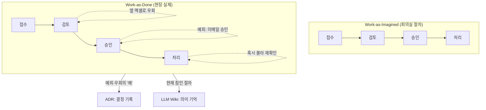

## 들어가며: 상상한 절차를 자동화하면 실패한다

지난 글에서 요구사항은 받아 적는 게 아니라 캐내는 것이라고 했다. 그렇다면 인터뷰가 가장 먼저 캐야 하는 건 무엇인가. **사람이 지금 그 일을 실제로 어떻게 하고 있는가(as-is)**다. 그리고 여기서 거의 모든 AX 프로젝트가 같은 실수를 한다.

회의실에서 담당자에게 "이 업무 어떻게 하세요?"라고 물으면, 그는 **이상화된 절차**를 설명한다. 깔끔하고, 단계가 분명하고, 예외가 없는 버전. 문제는 실제 현장에서 일이 되게 만드는 건 그 깔끔한 절차가 아니라, 그가 무의식적으로 하는 수많은 예외 처리와 우회라는 점이다. 그 둘의 간극을 모른 채 깔끔한 버전을 자동화하면, AI는 현실에서 작동하지 않는다.

IBM Watson for Oncology가 그렇게 무너졌다. MD Anderson과의 5년·6,200만 달러짜리 "Oncology Expert Advisor"는 *모든* 암을 자문하는 전능한 종양내과의를 상상했지만, 정작 의사들의 실제 진료 노트와 비정형 텍스트라는 지저분한 현실을 소화할 수 있는지 검증하지 않았고, 실제 환자 데이터가 아니라 소수의 합성·가상 케이스로 학습했다. 결과는 "안전하지 않고 부정확한" 권고였고, 시스템은 **실제 환자에게 한 번도 쓰이지 못한 채** 계약이 종료됐다.[^watson] 모델의 실패가 아니라 디스커버리의 실패다.

McDonald's와 IBM의 AI 드라이브스루도 같은 자리에서 넘어졌다. 100개 넘는 매장에서 2년간 테스트했지만 2024년 7월 중단됐다. 정확도가 80%대 초중반에서 정체됐는데, 원인은 모델이 아니라 **현장**이었다. 시끄러운 주행 소음, 다양한 억양, 겹쳐 말하는 목소리. 그 진짜 환경이 곧 요구사항이었는데, 깔끔한 드라이브스루를 상상하고 만든 것이다.[^mcd]

이 글의 결론은 단순하다.

- AX의 가장 흔한 실패는 **Work-as-Imagined(상상된 업무)를 자동화하고 Work-as-Done(실제로 일어나는 업무)을 놓치는 것**이다.
- as-is는 회의실에서 *질문*해서 얻는 게 아니라 현장에서 *관찰*하고, 전문가가 말로 못 하는 판단까지 캐내야 얻는다.
- 잘 포착한 as-is 맵은 그 자체로 [[llm-wiki|Wiki]]에 들어갈 의미 기억이고, **상상과 현실의 모든 간극은 ADR로 쓰일 결정 후보**다.

> [!note] 기존 글과의 관계
> 이 글의 산출물은 두 곳으로 흘러간다. "지금 이 업무는 실제로 이렇게 돌아간다"는 현재 지식은 [[llm-wiki|LLM Wiki]](의미 기억)로, "왜 정식 절차를 안 따르고 이렇게 우회하는가"라는 결정의 이유는 ADR(결정 기억)로. 즉 as-is 포착은 [[agentic-decision-workflow|기존 지식 파이프라인]]의 빠진 앞 레이어다.

---

## Work-as-Imagined vs Work-as-Done

이 현상에는 정확한 이름이 있다. 안전공학자 Erik Hollnagel의 **Safety-II**가 구분한 *Work-as-Imagined*(상상된 업무)와 *Work-as-Done*(실제 수행된 업무)이다.[^safety2]

- **Work-as-Imagined**: 관리자·설계자가 머릿속에 그리는, 또는 매뉴얼에 적힌 이상적 절차. 조건이 늘 일정하고 사람은 규칙대로 움직인다고 가정한다.
- **Work-as-Done**: 현장에서 실제로 벌어지는 일. 사람들은 끊임없이 바뀌는 조건에 맞춰 절차를 조정하고, 그 조정이야말로 일이 굴러가는 이유다.

Hollnagel의 핵심 주장은 **이 둘 사이엔 항상 간극이 있다**는 것이다. 그리고 그 간극을 무시한 자동화가 전형적인 실패 모드다. Watson은 "모든 암을 아는 종양내과의"라는 Work-as-Imagined를 자동화하려다, 실제 의사가 지저분한 노트와 환자 맥락을 어떻게 다루는지(Work-as-Done)를 담지 못했다.

여기서 중요한 전환이 하나 있다. **그 간극 하나하나가 사실은 ADR감이다.** "정식 절차는 A인데 현장에서는 B로 한다 - 왜?"라는 질문의 답(배경·예외·이유)이 바로 결정 기록의 내용이기 때문이다. as-is를 포착한다는 건 결국 이 간극들을 찾아 기록한다는 뜻이다.

---

## 회의실에서 그린 절차는 실제와 다르다

그래서 as-is는 물어봐서가 아니라 봐서 얻어야 한다. 이건 UX 리서치가 오래전에 정리한 원칙이다. Contextual Inquiry(Beyer & Holtzblatt)는 회상이나 회의실 설명이 *추론·동기·멘탈 모델을 빠뜨리기* 때문에, 일이 벌어지는 현장에서 관찰해야 한다고 못 박는다.[^ci] 린 생산의 *현지현물*(現地現物, Gemba walk) - "보고서 말고 현장에 가서 직접 봐라" - 도 같은 말이다.[^gemba]

McDonald's 사례가 정확히 이 교훈이다. 드라이브스루를 책상에서 모델링하면 "차가 와서, 주문하고, 결제한다"는 깔끔한 흐름이 나온다. 하지만 현장에 서 있으면 곧바로 보인다. 엔진 소음, 뒷좌석에서 끼어드는 목소리, "어... 그냥 아무거나"라는 주문. **현장의 소음이 곧 요구사항**이었는데, 그걸 관찰하지 않은 것이다.

좋은 as-is 맵의 판별 기준도 여기서 나온다. 옆에 띄워둔 엑셀, 이메일로 받는 승인, "혹시 몰라" 한 번 더 확인하는 단계 - 이런 *실제로 쓰는* 것들이 들어 있어야 한다. 정식 시스템에는 없지만 일을 굴러가게 하는 것들이기 때문이다.[^asis]

그 간극은 종종 충격적으로 크다. AI 에이전트 도입 기업 20곳을 정리한 한 분석에서, 어느 자산운용사는 고객 온보딩 절차가 *문서상 12단계*였지만 분석가 셋이 일하는 걸 실제로 관찰하니 **47단계**였다. 컴플라이언스 팀에 보내는 비공식 Slack 세 건, "다들 그냥 아는" 엑셀 두 개, 계약이 만료된 벤더와의 월간 점검까지 포함해서. 문서화된 12단계만 자동화하면 나머지 35단계가 통째로 사라진다.[^wealth]

---

## as-is를 캐는 도구상자

as-is 포착은 감으로 하는 게 아니라 도구가 있다. macro에서 micro로 내려가며, **각 도구가 어떤 미지를 죽이는지**로 정렬하면 쓸모가 분명해진다.

| 도구 | 출처 | 무엇을 캐는가 |
|------|------|---------------|
| SIPOC | Six Sigma / TQM[^sipoc] | 범위와 입출력 데이터 계약(누가 무엇을 넣고 무엇이 나오는가) |
| Value Stream Mapping | Toyota 생산방식[^vsm] | 핸드오프·대기·재작업 = 위임 가치가 큰 지점 |
| BPMN 2.0 | OMG / ISO 19510[^bpmn] | 벤더 중립 표기로 그린 프로세스 자체 |
| Hierarchical Task Analysis | Annett & Duncan, 1967[^hta] | 위임 가능한 단위까지의 과제 분해 |
| Service Blueprinting | Shostack, HBR 1984[^blueprint] | 고객·직원·시스템을 가로지르는 협업(line of visibility) |
| Cognitive Task Analysis / CDM | Klein; Hoffman et al. 1998[^cta][^cdm] | 전문가가 말로 못 하는 암묵 판단 |
| Gemba / Contextual Inquiry | Lean; Beyer & Holtzblatt[^gemba][^ci] | 현장에서만 보이는 실제 동작과 예외 |

이 중 BPMN은 따로 짚을 가치가 있다. BPMN 2.0은 OMG 표준이자 **ISO/IEC 19510**으로 국제 표준화돼 있다(2011년 2.0 릴리스, ISO 등재 2013년).[^bpmn] 즉 특정 마이닝 제품이 아니라 *표준 표기*다. 도구는 갈아끼워도 표기는 남는다. 이게 마지막 글에서 다룰 "도구에 안 묶이는 기질"의 한 예다.

---

## 전문가가 말 못 하는 판단을 캐기: CDM과 ADR이 맞물린다

as-is에서 가장 캐기 어려운 건 **전문가의 암묵 판단**이다. 숙련자일수록 자기가 어떻게 결정하는지 설명하지 못한다. Cognitive Task Analysis(CTA)는 바로 이 문제를 위해 존재하는 인터뷰 기법 묶음이고, 그중 핵심이 **Critical Decision Method(CDM)**다.[^cta]

CDM은 Gary Klein의 자연주의적 의사결정(Recognition-Primed Decision) 연구에 뿌리를 둔, 실제 결정적 사건을 거슬러 캐묻는 인터뷰다.[^cdm] 전문가에게 구체적 사건 하나를 회상하게 한 뒤, 인지 탐침(cognitive probe)으로 그 순간의 단서·대안·선택 이유를 끄집어낸다. 여기서 이 블로그 독자가 바로 알아챌 패턴이 있다.

| CDM 인터뷰가 캐는 것 | ADR이 기록하는 것 |
|----------------------|--------------------|
| 어떤 상황이었나 (background) | Context |
| 무엇이 문제였나 (cues) | Problem |
| 어떤 대안을 고려했나 (options) | Considered options |
| 왜 그걸 골랐나 (rationale) | Decision drivers |
| 결과는 (outcome) | Consequences |

두 컬럼이 거의 1:1로 맞물린다. 전문가의 암묵 판단을 CDM으로 캐는 것은, 사실상 *과거에 내려진 결정의 ADR을 사후에 복원*하는 작업이다. 그래서 as-is 포착은 단순한 프로세스 그림 그리기가 아니라, 이 도메인이 그동안 내려온 결정들을 결정 기록으로 만드는 일이 된다. 이렇게 모인 결정 기록이 다음 인터뷰를 더 좋게 만든다는 feed-forward 루프는 뒤쪽 글의 주제다.

---

## 클릭 스트림은 '무엇'만 준다, '왜'는 안 준다

"요즘은 process mining이 다 해주지 않나?" 2025~2026년에 당연히 나오는 질문이고, 절반은 맞다.

Process mining(시스템 이벤트 로그 기반)과 task mining(데스크톱 클릭·키 입력 기반)은 실제 프로세스를 자동으로 재구성한다. Gartner는 2025년 task mining을 "백오피스 도구에서 **엔터프라이즈 AI의 전략적 인에이블러**로 진화 중"이라 표현했고, 패턴은 일관된다. process intelligence가 실제 '무엇'(어떻게 일이 돌아가는가)을 공급하고 AI가 그 위에서 작동한다.[^mining] 2026년 트렌드로는 object-centric process mining(OCPM)과 실시간 process intelligence가 꼽힌다.[^mining2026] 마이닝은 Work-as-Imagined를 검증할 **Work-as-Done 그라운드 트루스**를 준다는 점에서 강력하다.

그런데 결정적 한계가 있다. 인류학자 Clifford Geertz의 구분을 빌리면, 마이닝이 주는 건 **thin description**(얇은 기술)이다.[^thick] Gilbert Ryle의 예시처럼, 눈꺼풀이 움직였다는 사실(clicks, keystrokes)은 기록하지만, 그게 윙크인지 경련인지 - 즉 *왜* 그 단계가 일어나는지, 예외가 무엇을 의미하는지 - 는 모른다. 그 **thick description**(두꺼운 기술)은 여전히 사람의 elicitation(CTA/CDM, contextual inquiry)만 잡아낸다.

그래서 마이닝과 인간 포착은 대체재가 아니라 보완재다. 마이닝이 "이 경로가 실제로 제일 많이 쓰인다"를 보여주면, 사람이 "그 경로를 *왜* 쓰는지, 예외일 때 어떻게 하는지"를 캔다. 그리고 재사용 가능한 durable 자산은 후자, 즉 **왜**다.



---

## DX 없이는 as-is도 없다

여기서 지난 글에서 짚은 문제가 구체적으로 터진다. **DX가 안 된 곳에서는 포착할 as-is 자체가 디지털로 존재하지 않는다.** 이벤트 로그가 없으니 마이닝할 게 없고, 프로세스가 종이와 머릿속에 있으니 관찰과 CDM 외엔 방법이 없다.

BCG의 "10-20-70"을 as-is 관점에서 다시 읽으면 분명해진다. 고객이 "마법"이라 부르는 알고리즘은 10%, 나머지 20%(기술·데이터)와 70%(사람·프로세스)가 바로 **당신이 포착해야 할 as-is**다.[^bcg] MIT CISR의 기업 AI 성숙도 모델도 데이터 사일로 통합을 2단계 전제조건으로 두고, 그 단계를 넘기 전 기업은 재무 성과가 업계 평균을 밑돈다고 본다.[^cisr] 한국 현장 표현으로 "DX 없이는 AX도 없다"는 말이 그대로 들어맞는다.[^dxax]

실무적 함의는 명확하다. as-is 포착은 단순한 그림 그리기가 아니라 **성숙도 진단**을 겸한다. 만약 현행 업무에 디지털 흔적이 거의 없다면, 그것 자체가 첫 번째 발견이다. "이 조직은 아직 AX가 아니라 DX 단계가 먼저"라는 결론도 정직한 산출물이다. 삼성SDS가 2025년부터 팀마다 프로세스·데이터를 잘 아는 'AI Crew'를 두고 유스케이스를 발굴하는 것도, 결국 현장의 as-is를 아는 사람을 안에 심는 방식이다.[^kr]

반대 사례도 흔하다. 국내 한 물류기업은 배송 지연 알림 AI를 IT팀 주도로 만들고 현장 기사들은 완성된 뒤에야 처음 썼는데, 알림의 약 40%가 "불필요"였다. 기사들의 실제 업무 패턴(= Work-as-Done)을 반영하지 않은 기준으로 설계했기 때문이다.[^logistics]

---

## as-is 맵은 Wiki로, 간극은 ADR로

포착한 as-is를 어디에 남기느냐가 마지막 질문이다. 답은 이 시리즈가 계속 말하는 그 기질이다.

- **현재 참인 절차** → [[llm-wiki|LLM Wiki]]의 의미 기억. "지금 이 업무는 이렇게 돌아간다"를 BPMN/서비스 블루프린트 + 산문으로.
- **상상과 현실의 간극, 예외의 이유** → ADR. "정식 절차는 A인데 현장은 B로 한다, 왜냐하면..." 각 간극이 한 건의 결정 기록.
- **표기는 표준으로** → BPMN 2.0(ISO 19510)처럼 도구에 안 묶이는 표기를 쓰면, 마이닝 제품이나 코딩 에이전트가 바뀌어도 맵은 살아남는다.

예컨대 앞서 본 견적 검토에서 "정식 절차엔 없지만 김 과장한테 물어본다"는 우회를 포착하면, 그대로 ADR 씨앗이 된다.

```markdown
# ADR: 이상 견적 1차 스크리닝은 AI, 최종 판단은 전문가 게이트
- 배경(as-is): 담당자가 전건 육안 검토, "이상한 것"만 분리해 김 과장에게 확인
- 문제: "이상하다"의 기준이 1인의 암묵지에 있음(속인화, 재현 불가)
- 후보: (a) 규칙 기반 필터 (b) AI 1차 스크리닝 (c) 현행 유지
- 선택: (b) AI 1차 스크리닝 + 전문가 확인 게이트
- 이유: 기준이 비정형이라 규칙화 어렵고, 전문가 1인 의존은 병목
- 결과: 스크리닝 재현성 확보. 단 김 과장의 라벨이 곧 학습 데이터가 됨(→ 5편)
```

이 한 장이 1편의 인터뷰 레코드와 2편의 as-is 간극을 그대로 잇는다. 같은 "배경 → 문제 → 후보 → 이유 → 결과" 골격이기 때문이다.

이렇게 하면 as-is 포착은 일회성 산출물이 아니라 누적되는 자산이 된다. IBM Garage가 Mueller와 일할 때, 임원 워크숍 *전에* 일주일을 현장에서 계약자들의 실제 작업을 관찰하는 데 썼고, 그 위에서 8주 안에 앱을 만들었다.[^mueller] 같은 IBM이 Watson에서는 상상된 as-is로 6,200만 달러를 잃었고, Garage에서는 현장 우선 포착으로 빠르게 이겼다. as-is를 실제로 캤느냐가 두 결과를 갈랐다.

---

## 정리

- AX의 가장 흔한 실패는 Work-as-Imagined(회의실 절차)를 자동화하고 Work-as-Done(현장 실제)을 놓치는 것이다(Hollnagel). Watson과 McDonald's가 그 자리에서 무너졌다.
- as-is는 물어봐서가 아니라 관찰해서(Contextual Inquiry, Gemba) 얻고, 전문가의 암묵 판단은 CTA/CDM으로 캔다.
- **CDM 인터뷰 스키마(배경·단서·대안·이유·결과)는 ADR 스키마와 거의 1:1**이다. as-is 포착은 곧 이 도메인의 결정들을 결정 기록으로 복원하는 일이다.
- process mining은 Work-as-Done의 '무엇'(thin description)을 자동으로 주지만 '왜'(thick description)는 못 준다. 사람 포착과 보완 관계다.
- DX가 안 된 곳에는 포착할 디지털 as-is가 없다. as-is 포착은 성숙도 진단을 겸하며, "AX 전에 DX가 먼저"라는 결론도 정직한 산출물이다.
- as-is 맵은 Wiki(현재 절차)로, 상상과 현실의 간극은 ADR(이유)로 남긴다. 표기는 BPMN 같은 표준으로.

이어지는 글에서는 1편(인터뷰)과 2편(as-is)에서 캔 것을 **복사해 쓸 수 있는 하나의 인테이크 양식**으로 응결시킨다. 고객과 개발자가 같은 양식의 다른 칸을 채우고, 그 출력이 Wiki와 ADR로 자동 승격되는 구조다.

---

## 참고 자료

### Work-as-Done · 인지 포착

- [From Safety-I to Safety-II: A White Paper (Hollnagel, Wears, Braithwaite, 2015 / AHRQ PSNet)](https://psnet.ahrq.gov/issue/safety-i-safety-ii-white-paper)
- [Cognitive Task Analysis: Eliciting Expert Cognition in Context (Brown, Power, Gore, Organizational Research Methods, 2025)](https://journals.sagepub.com/doi/10.1177/10944281241271216)
- [Use of the Critical Decision Method to Elicit Expert Knowledge (Hoffman, Crandall, Shadbolt, Human Factors, 1998)](https://journals.sagepub.com/doi/10.1518/001872098779480442)
- [Contextual Inquiry (Nielsen Norman Group)](https://www.nngroup.com/articles/contextual-inquiry/)
- [Thick description (Geertz, 1973)](https://en.wikipedia.org/wiki/Thick_description)

### 프로세스 표기 · 분석

- [BPMN 2.0 / ISO 19510 (OMG)](https://www.omg.org/spec/BPMN/2.0/About-BPMN)
- [Hierarchical Task Analysis (Annett & Duncan, 1967 / Stanton)](https://eprints.soton.ac.uk/73988/1/Hierarchical_Task_Analysis_Stanton.pdf)
- [Designing Services That Deliver (Shostack, HBR 1984)](https://hbr.org/1984/01/designing-services-that-deliver)
- [SIPOC (Six Sigma)](https://sixsigmadsi.com/what-is-a-sipoc-model-in-six-sigma/)
- [As-Is to-Be Process Mapping (SAP Signavio)](https://www.signavio.com/wiki/process-discovery/as-is-to-be-process-mapping/)

### Process / Task mining (2025~2026)

- [What is Task Mining (Mimica, citing 2025 Gartner Market Guide)](https://www.mimica.ai/articles/what-is-task-mining)
- [6 trends shaping process mining in 2026 (Process Excellence Network)](https://www.processexcellencenetwork.com/process-mining/articles/6-trends-shaping-process-mining-in-2026)

### 사례 · DX선행

- [How IBM Watson Overpromised and Underdelivered on AI Health Care (IEEE Spectrum)](https://spectrum.ieee.org/how-ibm-watson-overpromised-and-underdelivered-on-ai-health-care)
- [McDonald's ending its drive-thru AI test (Restaurant Business)](https://www.restaurantbusinessonline.com/technology/mcdonalds-ending-its-drive-thru-ai-test)
- [I Studied 20 Companies Using AI Agents (Medium)](https://medium.com/age-of-awareness/i-studied-20-companies-using-ai-agents-heres-why-most-will-fail-68c7413bce03)
- [기업 AI 도입 실패 원인 (windyflo)](https://blog.windyflo.com/blog/ai-agent-adoption-failure/)
- [AI and Enterprise Design Thinking / Mueller (IBM)](https://www.ibm.com/think/topics/ai-and-enterprise-design-thinking)
- [Enterprise Design Thinking framework (IBM)](https://www.ibm.com/training/enterprise-design-thinking/framework)
- [Where's the Value in AI? BCG 10-20-70 (BCG, 2024)](https://www.prnewswire.com/news-releases/ai-adoption-in-2024-74-of-companies-struggle-to-achieve-and-scale-value-302285294.html)
- [Building Enterprise AI Maturity (MIT CISR)](https://cisr.mit.edu/publication/2024_1201_EnterpriseAIMaturityModel_WeillWoernerSebastian)
- [DX 없이는 AX도 없다 (flow.team)](https://platform.flow.team/blog/noai-without-dx)

[^watson]: IBM Watson for Oncology / MD Anderson "Oncology Expert Advisor"(2012 시작, 5년·약 6,200만 달러). 실제 환자에게 쓰이기 전 계약 종료, 합성·가상 케이스로 학습, "안전하지 않고 부정확한" 권고로 비판받음. IBM은 2022년 Watson Health를 매각했다. [IEEE Spectrum](https://spectrum.ieee.org/how-ibm-watson-overpromised-and-underdelivered-on-ai-health-care).
[^mcd]: McDonald's와 IBM의 AI 자동 주문(드라이브스루)은 100개 넘는 매장에서 약 2년 테스트 후 2024년 7월 중단. 소음·억양·겹친 음성으로 정확도가 정체. [Restaurant Business](https://www.restaurantbusinessonline.com/technology/mcdonalds-ending-its-drive-thru-ai-test).
[^safety2]: Erik Hollnagel, Robert Wears, Jeffrey Braithwaite, "From Safety-I to Safety-II: A White Paper"(2015). Work-as-Imagined(이상화된 공식 절차)와 Work-as-Done(실제 수행) 사이엔 항상 간극이 있고, Work-as-Imagined는 성능이 실제 조건에 맞춰 끊임없이 조정돼야 한다는 점을 무시한다. [AHRQ PSNet](https://psnet.ahrq.gov/issue/safety-i-safety-ii-white-paper).
[^ci]: Contextual Inquiry(Hugh Beyer & Karen Holtzblatt, Contextual Design). 회상·회의실 설명은 추론·동기·멘탈 모델을 빠뜨리므로 현장 관찰이 필요하다. 네 원칙: context, partnership, interpretation, focus. [NN/g](https://www.nngroup.com/articles/contextual-inquiry/).
[^gemba]: Gemba walk(현지현물, genchi genbutsu)는 Toyota 생산방식/린의 "보고서 말고 현장에 가서 직접 보라"는 실천이다.
[^asis]: 좋은 as-is 맵은 의도된 프로세스가 아니라 실제 프로세스를 담아야 하며, 옆 엑셀·이메일 승인·반복 확인처럼 사람들이 실제로 쓰는 것을 포함해야 한다. [SAP Signavio, As-Is/To-Be Process Mapping](https://www.signavio.com/wiki/process-discovery/as-is-to-be-process-mapping/).
[^sipoc]: SIPOC(Suppliers, Inputs, Process, Outputs, Customers)는 Six Sigma/TQM 계보(Deming 시스템 사고; 흔히 Peter Scholtes에 귀속)의 매크로 스코핑 맵이다. [Six Sigma DSI](https://sixsigmadsi.com/what-is-a-sipoc-model-in-six-sigma/).
[^vsm]: Value Stream Mapping은 Toyota 생산방식에서 나와 Rother & Shook의 *Learning to See*로 대중화됐다. 흐름에서 가치 창출과 낭비(대기·핸드오프·재작업)를 구분한다.
[^bpmn]: BPMN은 BPMI(2004)에서 시작해 OMG로 이관(2005~2006 채택), BPMN 2.0은 2011년 릴리스되고 ISO/IEC 19510:2013으로 국제 표준화됐다. 비즈니스도 읽을 수 있으면서 구현에 충분히 정밀한 플로차트 표기. [OMG](https://www.omg.org/spec/BPMN/2.0/About-BPMN).
[^hta]: Hierarchical Task Analysis는 John Annett & K.D. Duncan, "Task Analysis and Training Design"(Occupational Psychology 41, 1967)에서 처음 기술됐다. 상위 과제를 하위 과제·계획의 위계로 분해한다. [Stanton 정리](https://eprints.soton.ac.uk/73988/1/Hierarchical_Task_Analysis_Stanton.pdf).
[^blueprint]: Service Blueprinting은 G. Lynn Shostack, "Designing Services That Deliver"(Harvard Business Review, 1984)에서 도입됐다. line of visibility를 기준으로 front-stage/back-stage 행위를 매핑한다. [HBR](https://hbr.org/1984/01/designing-services-that-deliver).
[^cta]: Cognitive Task Analysis는 복잡 과제 수행에 필요한 인지 과정을 끌어내는 인터뷰 기법 묶음으로, 전문가가 자기 인지 과정을 성찰하기 어렵다는 문제 때문에 존재한다. 대표 방법이 CDM과 ACTA. Brown, Power, Gore, "Cognitive Task Analysis: Eliciting Expert Cognition in Context"(Organizational Research Methods, 2025)는 이를 AI가 *대체*가 아니라 *보조*하는 의사결정 맥락으로 재정리한다. [SagePub](https://journals.sagepub.com/doi/10.1177/10944281241271216).
[^cdm]: Critical Decision Method는 Gary Klein의 Recognition-Primed Decision(자연주의적 의사결정)에 기반해 실제 결정적 사건을 인지 탐침으로 거슬러 캐묻는 회고 인터뷰다. 정전 격 방법론 논문: Hoffman, Crandall, Shadbolt, "Use of the Critical Decision Method to Elicit Expert Knowledge"(Human Factors, 1998). [SagePub](https://journals.sagepub.com/doi/10.1518/001872098779480442).
[^thick]: thick description은 Clifford Geertz, "Thick Description: Toward an Interpretive Theory of Culture"(1973)가 Gilbert Ryle의 thin/thick 구분(눈꺼풀 경련 vs 공모의 윙크)을 빌려 제시했다. 관찰 가능한 동작이 아니라 그 뒤의 의미·의도·맥락을 담는다. [Wikipedia](https://en.wikipedia.org/wiki/Thick_description).
[^mining]: 2025 Gartner Market Guide for Task Mining은 task mining을 "백오피스 도구에서 엔터프라이즈 AI의 전략적 인에이블러로 진화 중"이라 표현한다. process/task intelligence가 실제 '무엇'을 공급하고 AI가 그 위에서 작동하는 패턴. [Mimica(Gartner 인용)](https://www.mimica.ai/articles/what-is-task-mining).
[^mining2026]: 2026년 process mining 트렌드로 object-centric process mining(OCPM), 정적 리포팅에서 실시간 process intelligence로의 이동, generative AI/RPA와의 통합이 꼽힌다. [Process Excellence Network](https://www.processexcellencenetwork.com/process-mining/articles/6-trends-shaping-process-mining-in-2026).
[^bcg]: BCG "Where's the Value in AI?"(2024). AI 가치는 알고리즘 10%, 기술·데이터 20%, 사람·프로세스 70%(리더 대상 처방적 배분). [PR](https://www.prnewswire.com/news-releases/ai-adoption-in-2024-74-of-companies-struggle-to-achieve-and-scale-value-302285294.html).
[^cisr]: MIT CISR 기업 AI 성숙도 모델(Weill/Woerner/Sebastian). 데이터 사일로 통합이 2단계 전제조건이고, 1~2단계 기업은 재무 성과가 업계 평균을 밑돈다. [CISR](https://cisr.mit.edu/publication/2024_1201_EnterpriseAIMaturityModel_WeillWoernerSebastian).
[^dxax]: "DX 없이는 AX도 없다 - 디지털 데이터가 있어야 AI를 학습시키고, 프로세스가 디지털화돼 있어야 AI를 현장에 붙인다." [flow.team](https://platform.flow.team/blog/noai-without-dx).
[^kr]: 삼성SDS는 2025년부터 팀별로 프로세스·데이터 이해도가 높은 'AI Crew'를 두고 유스케이스를 발굴·확산한다(현장 as-is를 아는 사람을 안에 심는 방식). 국내 SI의 AX 전환 맥락 참고: [youngju.dev](https://www.youngju.dev/blog/culture/2026-03-23-si-industry-ai-transformation-career-guide)(실무자 블로그).
[^mueller]: IBM Garage는 Mueller Inc 프로젝트에서 임원 워크숍 전에 일주일간 현장에서 계약자들의 실제 작업을 관찰한 뒤, 8주 이내에 견적 앱을 구축했다. [IBM](https://www.ibm.com/think/topics/ai-and-enterprise-design-thinking). (일부 만족도 수치는 원문 접근 제한으로 본문에서 제외했다.)
[^wealth]: AI 에이전트 도입 기업 20곳을 정리한 글에 소개된 자산운용사 사례. 고객 온보딩이 문서상 12단계였으나 실제 관찰 시 47단계(비공식 Slack 컴플라이언스 문의, 비공식 엑셀, 계약 만료 벤더 월간 점검 포함)였다. 개별 기업 비식별 2차 정리 자료임에 유의. [Medium, "I Studied 20 Companies Using AI Agents"](https://medium.com/age-of-awareness/i-studied-20-companies-using-ai-agents-heres-why-most-will-fail-68c7413bce03).
[^logistics]: 국내 한 물류기업의 배송 지연 알림 AI 사례(블로그 정리, 기업 비식별). IT팀 주도 설계로 현장 기사 업무 패턴을 반영하지 못해 알림의 약 40%가 불필요로 평가됐다. [windyflo 블로그](https://blog.windyflo.com/blog/ai-agent-adoption-failure/).
