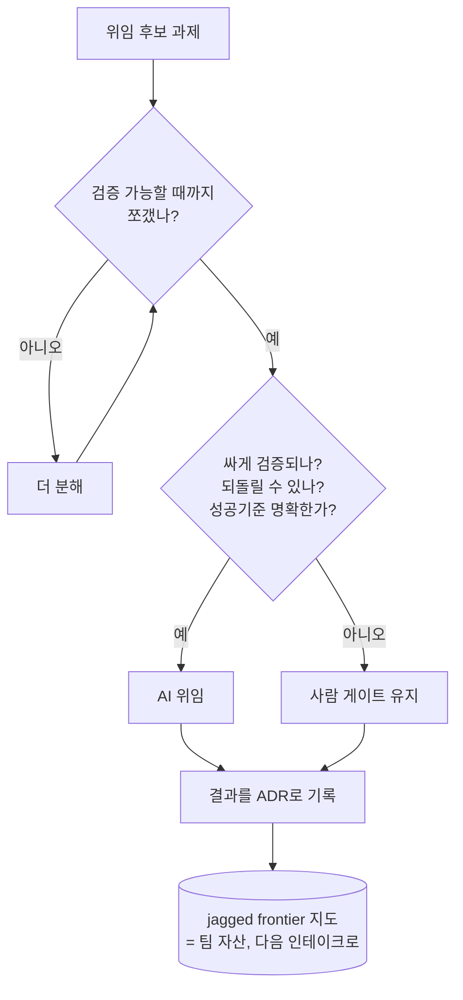

## 들어가며: "뭘 맡길까"는 75년 된 질문이다

3편의 인테이크 양식에는 "위임 경계" 칸이 있었다. 무엇을 AI에 맡기고 무엇을 사람이 쥘 것인가. 이 질문은 새것이 아니다. 1951년 Paul Fitts가 "사람이 더 잘하는 것 / 기계가 더 잘하는 것"을 11개로 나눈 목록(MABA-MABA)을 만든 이래, function allocation은 인간공학의 오래된 주제였다.[^fitts]

문제는 이 "누가 더 잘하나" 표가 AI 시대에 특히 잘 안 통한다는 것이다. 두 가지 실패가 이를 보여준다. Klarna는 2024년 2월 고객 응대를 AI에 맡기며 "상담원 700명 몫, 채팅의 75%"를 처리한다고 발표했지만, 2025년 5월 "너무 멀리 갔다, 품질이 떨어지고 신뢰가 깨졌다"며 사람을 다시 뽑았다.[^klarna] Zillow는 가격 예측에 비가역적인 주택 매입 결정을 묶었다가 3억 달러 넘게 상각하고 사업을 접었다.[^zillow] 둘 다 "AI가 이걸 할 수 있나"라는 능력 질문에는 "예"였지만, 정작 중요한 질문은 따로 있었다.

이 글의 결론을 먼저 적는다.

- "무엇을 맡길까"를 **능력으로 정하면 틀린다.** 정적 할당표는 틀린 질문이고, 진짜 문제는 사람과 AI의 *협력 방식* 설계다.
- AI 능력의 경계(jagged frontier)는 들쭉날쭉하고 보이지 않아 직관으로 미리 정하기 어렵고, 손으로 찔러봐야 안다.
- 2026년의 재정의는 위임 기준을 능력에서 검증 비용으로 옮긴다. 검증할 수 있는 단위까지 쪼개야 위임할 수 있다.
- 그리고 위임 결과를 ADR로 남기면, 보이지 않던 경계가 **팀이 공유하는 지도**가 된다.

> [!note] 기존 글과의 관계
> 이 글의 위임 게이트는 [[agentic-decision-workflow|agentic decision workflow]]의 "자동 vs 사람 게이트"와 같은 것이고, AI 코딩에 그대로 적용하면 [[vibe-coding|vibe coding]]의 검증 문제로 이어진다.

---

## 정적 할당표는 틀린 질문이다

Fitts의 목록은 75년을 버텼지만, 그 비판도 그만큼 오래됐다. Sidney Dekker와 David Woods는 2002년 논문에서 이를 *substitution myth*(대체 신화)라 불렀다. **사람이 못하는 기능에 기계를 끼워 넣어도 일의 본질이 그대로일 거라는 착각**이다.[^dekker] 기계를 넣으면 일 자체가 바뀐다. 사람의 역할이 "실행"에서 "감독"으로 옮겨가고, 새로운 조율 부담이 생긴다. 그래서 "누가 무엇을 더 잘하나"가 아니라 "둘이 어떻게 손발을 맞추나"가 설계 문제다.

Parasuraman, Sheridan, Wickens는 이를 더 정밀하게 만들었다. 자동화는 전부냐 전무냐가 아니라 **네 단계(정보 수집 → 정보 분석 → 결정 선택 → 행동 실행)에 걸쳐 각각 수준을 조절**할 수 있다.[^para] 정보 수집과 분석은 자동화하되 결정 선택은 사람이 쥐는 식의 *부분 위임*이 가능하다는 뜻이다. 이게 바로 결정 게이트다.

| 처리 단계 | 자동화하기 쉬움 | 사람이 쥐어야 할 때 |
|-----------|----------------|---------------------|
| 정보 수집 | 거의 항상 | 민감/규제 데이터 |
| 정보 분석 | 자주 | 인과 판단 필요 시 |
| 결정 선택 | 드물게 | 되돌리기 어려운 결정 |
| 행동 실행 | 저위험만 | 비가역적/고비용 행동 |

---

## 경계는 보이지 않는다

그런데 부분 위임을 설계하려 해도 막히는 지점이 있다. **AI가 어디까지 잘하는지가 안 보인다.** 1편에서 소개한 jagged frontier가 이 글의 이론적 핵심이다. HBS와 BCG가 컨설턴트 758명으로 한 현장실험(이후 *Organization Science* 게재)에서, 경계 *안* 과제는 AI를 쓴 쪽이 12.2% 더 많이, 25.1% 빠르게, 약 40% 높은 품질로 해냈지만, 일부러 경계 *밖*으로 고른 과제에서는 AI를 쓴 쪽 정답률이 오히려 19%p 낮았다.[^jagged] 능력이 좋아서 문제가 아니라, **어떤 과제가 경계 밖인지 미리 알 수 없어서** 문제다.

그래서 "바통을 어떻게 쥐느냐"가 갈린다. Ethan Mollick은 두 방식을 구분한다.[^centaur]

- **켄타우로스(Centaur)**: 사람과 AI 사이에 분명한 선을 긋고, 과제를 통째로 한쪽에 넘긴다.
- **사이보그(Cyborg)**: 한 과제 안에서 사람과 AI가 계속 번갈아 가며, 경계를 수시로 넘나든다.

경계가 보이지 않을수록 사이보그처럼 자주 확인하며 가는 편이 안전하다. 그리고 여기서 가장 위험한 함정이 *자동화 편향*이다. 자동화가 믿을 만할수록 사람은 감시를 놓아 버린다. 그래서 "human-in-the-loop"라는 말만으로는 안전장치가 되지 못한다. 더 나아가, "human-in-the-loop"가 적힌 체크리스트가 곧 안전장치라는 보장도 없다. 한 실제 멀티벤더 AI 프로젝트에서 내가 발견한 건, 검증 체크리스트가 형식상 존재했지만 실제로는 항목을 무조건 통과로 처리하는 빈 껍데기(검사 로직이 없었다)였다는 점이다. 화면에는 "검증됨"이라 떴지만 검증된 건 아무것도 없었다. 자동화 편향은 사람이 감시를 놓는 데서만 오는 게 아니라, 게이트가 있다는 표시 자체를 믿어 버리는 데서도 온다. 위임의 전제는 게이트의 존재가 아니라 그 게이트가 실제 신호를 검사하는지에 있다.[^bias]

---

## 검증할 수 없으면 위임하지 마라

2026년 들어 이 문제를 실무로 끌어내린 재정의가 나왔다. Google DeepMind의 "Intelligent AI Delegation"은 **분해(decomposition)와 위임(delegation)을 구분**한다. 분해는 과제를 쪼개는 것이고, 위임은 권한과 책임을 넘기는 것이다. 그리고 핵심 규칙은 *contract-first decomposition*이다. 각 하위 과제의 출력이 검증 가능해질 때까지 재귀적으로 쪼개고, 위임 기준은 속도나 비용이 아니라 주관성이 낮고 되돌리기 쉽고 성공 기준이 분명한지로 둔다.[^deepmind]

이게 왜 결정적인가. 코드 생성이 거의 공짜가 되면, 병목은 생산이 아니라 **검증**으로 옮겨간다.[^kohl] 그런데 현실의 검증 격차는 크다. Sonar의 2026년 조사에서 개발자의 96%가 AI 생성 코드가 맞다고 완전히 믿지 않으면서도, 커밋 전에 항상 검증하는 사람은 48%뿐이었고, 38%는 AI 코드 리뷰가 동료 코드 리뷰보다 더 품이 든다고 답했다.[^sonar] **검증 비용이 높은 일을 능력만 보고 맡기면, 그 비용은 사라지지 않고 나중에 더 크게 청구된다.** Klarna가 공감이 필요한 상담(검증이 비싼 일)을 능력만 보고 맡겼다가 되돌린 게 정확히 이것이다.

이 규칙은 추상적이지 않다. 내가 통과한 한 프로젝트에서는 AI가 만든 산출물을 도메인에 실제로 반영하는 행위를 검증 게이트 통과 뒤로 완전히 잠가 버렸다. 결정론 규칙 검사(스키마, 전제조건, 도메인 규칙)를 1차 게이트로 두고, 그걸 통과한 산출물에만 반영 승인 표시가 붙으며, 그 표시가 없으면 어떤 변경도 도메인에 들어가지 못한다. "검증할 수 있는 것만 위임한다"를 코드 경계로 옮기면 정확히 이렇게 된다. 검증 게이트가 위임의 문턱 그 자체가 되는 것이다.

그래서 위임 판정은 "할 수 있나"가 아니라 다음 세 축으로 한다.

| 축 | AI 위임 쪽 | 사람 게이트 쪽 |
|-----|-----------|----------------|
| 검증 비용 | 싸게 확인 가능 | 확인이 비싸거나 불가 |
| 되돌리기 | 쉽게 되돌림 | 비가역적 |
| 주관성/성공기준 | 명확한 정답 | 모호·가치판단 |

Brynjolfsson과 Mitchell의 "기계학습 적합성(SML)" 루브릭은 이 판정을 23개 기준으로 정교화하는데, 그 결론도 같은 방향이다. 통째로 자동화되는 직무는 드물고, 대부분의 직무는 일부 과제만 AI에 적합하므로 **직무를 과제 단위로 재설계**해야 한다.[^sml] 그리고 인과 모델이 없거나, 상식·맥락이 필요하거나, 결정을 설명하기 어렵거나, 조건이 바뀌어 재학습이 필요한 과제는 "사람이 쥐어라"는 적신호다.[^mlcannot]

---

## 위임 결정을 기록으로 남겨라

경계가 보이지 않고 시간이 지나면 또 움직인다면, 한 번의 판정으로 끝낼 수 없다. 그래서 **위임 시도와 그 결과를 결정 기록(ADR)으로 남긴다.** "X를 AI에 맡겨 봤다. 경계 밖이었다. 이유는 이렇다." 이 기록이 쌓이면, 직관으로 알 수 없던 jagged frontier가 **그 도메인에 한정된 실측 지도**가 된다.

이건 이 시리즈가 계속 말한 feed-forward 루프다. Klarna는 그 경계를 *사후에*, 비싸게 발견했다. 기록이 있었다면 다음 팀은 같은 실수를 공짜로 피한다. 반대 사례가 OpenAI의 forward deployed 방식이다. 그들은 본 개발 *전에* 고객의 도메인 전문가와 함께 평가 세트(eval set)를 만든다. **검증 기준을 먼저 합의하는 것**, 즉 검증 비용을 위임의 게이트로 앞세우는 것이다.[^openai]

3편 인테이크 양식의 "위임 경계" 칸이 이 게이트의 입력이고, 그 결정은 [[agentic-decision-workflow|agentic decision workflow]]의 게이트와 같은 자리에 놓인다. 위임은 한 번 정하고 마는 설정이 아니라, 기록되고 갱신되는 살아 있는 지도다.

이걸 외부 사례로만 말하면 남의 일 같다. 내가 통과한 한 프로젝트에서, 검증 게이트를 위임의 전제조건으로 세우자는 결정은 이상에서 나온 게 아니라 게이트가 없었다는 발견에서 나왔다. 기존 코드를 훑어 보니 단계 전이를 막던 게이트가 전부 화면 표시일 뿐 백엔드 강제가 없어서, API를 직접 부르면 통째로 우회됐다. 사람이 승인한다는 안전장치가 표시만 있고 알맹이가 없었던 셈이다. 처음부터 깔끔하게 설계한 이상이 아니라, 사고가 나기 직전에 경계를 다시 그은 사후 대응이었다. 우리는 그 방향으로(검증 게이트를 도메인 강제로 옮기는 쪽으로) 결정했고, 일부는 아직 구현 전이다.

---

## 정리

- "무엇을 AI에 맡길까"는 75년 된 function allocation 문제지만, "누가 더 잘하나" 식 정적 할당표는 틀린 질문이다(substitution myth). 진짜 문제는 협력과 게이트 설계다.
- jagged frontier는 보이지 않는다. 경계 안에서는 AI가 크게 돕고, 경계 밖에서는 오히려 해친다(정답률 19%p 하락). 그래서 직관 위임은 위험하고, 사이보그처럼 자주 검증하며 가야 한다.
- 위임은 능력이 아니라 검증 비용으로 정한다. 검증 가능할 때까지 분해하고(contract-first), 검증 비용·가역성·주관성 세 축으로 판정한다. 코드가 싸질수록 병목은 검증으로 옮겨간다.
- 위임 결정을 ADR로 남기면 보이지 않던 경계가 팀 자산이 된다. Klarna는 경계를 사후에 비싸게 발견했고, OpenAI는 eval을 먼저 합의해 검증을 게이트로 앞세웠다.

다음 글에서는 4번째 칸과 5번째 칸, **"AI가 필요로 하는 정보와 그 포맷"**을 판다. "AI-ready 데이터"라는 건 따로 없고, 용도가 정해져야 포맷이 정해진다는 이야기다.

---

## 참고 자료

### function allocation 계보

- [Why the Fitts list has persisted (de Winter & Dodou, 2011 / Fitts 1951 원전 리뷰)](https://link.springer.com/article/10.1007/s10111-011-0188-1)
- [MABA-MABA or Abracadabra? (Dekker & Woods, 2002)](https://www.humanfactors.lth.se/fileadmin/lusa/Sidney_Dekker/articles/2003_and_before/MABA_MABA.pdf)
- [A Model for Types and Levels of Human Interaction with Automation (Parasuraman, Sheridan, Wickens, 2000)](https://pubmed.ncbi.nlm.nih.gov/11760769/)

### jagged frontier · 위임 방식

- [Navigating the Jagged Technological Frontier (HBS/BCG, Organization Science)](https://pubsonline.informs.org/doi/10.1287/orsc.2025.21838)
- [Centaurs and Cyborgs on the Jagged Frontier (Ethan Mollick)](https://www.oneusefulthing.org/p/centaurs-and-cyborgs-on-the-jagged)

### 검증 비용 · 위임 규칙

- [Intelligent AI Delegation (Google DeepMind, arXiv 2602.11865)](https://arxiv.org/html/2602.11865v1)
- [When Code Becomes Abundant (Kohl & Carro, ICSE-FoSE 2026, arXiv 2602.04830)](https://arxiv.org/pdf/2602.04830)
- [Sonar: verification gap in AI coding (2026)](https://www.sonarsource.com/company/press-releases/sonar-data-reveals-critical-verification-gap-in-ai-coding/)
- [What can machine learning do? + SML rubric (Brynjolfsson & Mitchell, Science 2017)](https://www.science.org/doi/abs/10.1126/science.aap8062)
- [Suitability for Machine Learning rubric / WorldSML (Stanford Digital Economy Lab)](https://digitaleconomy.stanford.edu/project/suitability-for-machine-learning-rubric-worldsml/)
- [The Automation-Augmentation Paradox (Raisch & Krakowski, AMR 2021)](https://journals.aom.org/doi/10.5465/amr.2018.0072)

### 사례

- [Klarna, AI 상담 축소·재고용 (Entrepreneur)](https://www.entrepreneur.com/business-news/klarna-ceo-reverses-course-by-hiring-more-humans-not-ai/491396)
- [Why Zillow's algorithmic home-buying imploded (Stanford GSB)](https://www.gsb.stanford.edu/insights/flip-flop-why-zillows-algorithmic-home-buying-venture-imploded)
- [Forward deployed engineering: eval-before-build (ZenML LLMOps)](https://www.zenml.io/llmops-database/forward-deployed-engineering-bringing-enterprise-llm-applications-to-production)

[^fitts]: Fitts의 11항목 목록(MABA-MABA, "Men Are Better At / Machines Are Better At")은 Paul Fitts의 1951년 보고서가 원전이다. 링크한 de Winter & Dodou(2011)는 그 목록이 왜 70년 넘게 살아남았는지를 다룬 2차 리뷰다.
[^klarna]: Klarna는 2024년 2월 OpenAI 기반 어시스턴트가 상담원 700명 몫, 채팅의 약 75%를 처리한다고 발표했으나 2025년 5월 "너무 멀리 갔다, 품질 저하·신뢰 훼손"을 인정하고 하이브리드(루틴은 AI, 복잡·고가치는 사람)로 선회했다. [Entrepreneur](https://www.entrepreneur.com/business-news/klarna-ceo-reverses-course-by-hiring-more-humans-not-ai/491396).
[^zillow]: Zillow Offers는 가격 예측에 비가역적 매입 결정을 묶었다가 2021년 11월 3억 400만 달러 재고 상각과 함께 사업을 종료했다. 예측의 오류·검증 비용을 과소평가한 전형적 사례. [Stanford GSB](https://www.gsb.stanford.edu/insights/flip-flop-why-zillows-algorithmic-home-buying-venture-imploded).
[^dekker]: Sidney Dekker & David Woods, "MABA-MABA or Abracadabra? Progress on Human-Automation Coordination"(2002). 사람이 못하는 기능에 기계를 끼워도 일의 본질이 그대로일 거라는 substitution myth를 비판하고, 정적 할당이 아니라 인간-자동화 *조율* 설계가 문제라고 본다. [PDF](https://www.humanfactors.lth.se/fileadmin/lusa/Sidney_Dekker/articles/2003_and_before/MABA_MABA.pdf).
[^para]: Parasuraman, Sheridan & Wickens, "A Model for Types and Levels of Human Interaction with Automation"(IEEE TSMC, 2000). 자동화를 정보 수집·분석·결정 선택·행동 실행 4단계 x 수준 스케일로 일반화해 부분 위임을 정식화했다. [PubMed](https://pubmed.ncbi.nlm.nih.gov/11760769/).
[^jagged]: Dell'Acqua 외, "Navigating the Jagged Technological Frontier"(HBS/BCG 현장실험, 컨설턴트 758명·18개 과제; 이후 *Organization Science* 게재, DOI 10.1287/orsc.2025.21838). 경계 안 +12.2% 과제/-25.1% 시간/+40% 품질, 경계 밖 과제 정답률 19%p 하락. [INFORMS](https://pubsonline.informs.org/doi/10.1287/orsc.2025.21838).
[^centaur]: Ethan Mollick, "Centaurs and Cyborgs on the Jagged Frontier"(2023). 켄타우로스는 분명한 선을 긋고 과제를 통째로 넘기는 방식, 사이보그는 한 과제 안에서 사람과 AI가 계속 번갈아 가는 방식. [oneusefulthing](https://www.oneusefulthing.org/p/centaurs-and-cyborgs-on-the-jagged).
[^bias]: 자동화 편향·안주(complacency): 자동화가 신뢰할 만할수록 사람이 감시를 놓아 버리는 문서화된 실패 모드로, 고수준 자동화에서 "human-in-the-loop"가 보이는 것만큼 강한 안전장치가 아님을 시사한다.
[^deepmind]: Tomasev, Franklin, Osindero(Google DeepMind), "Intelligent AI Delegation"(arXiv 2602.11865, 2026). 분해(과제 쪼개기)와 위임(권한·책임 이양)을 구분하고, 출력이 검증 가능해질 때까지 재귀 분해해 주관성 낮고·가역적이고·성공기준 명확한 것만 위임하는 contract-first decomposition을 제안한다. [arXiv](https://arxiv.org/html/2602.11865v1).
[^kohl]: Karina Kohl & Luigi Carro, "When Code Becomes Abundant"(ICSE-FoSE 2026, arXiv 2602.04830). 코드 생성이 한계비용 0에 가까워지면 지속 병목은 생산이 아니라 검증·오케스트레이션으로 이동한다. [arXiv](https://arxiv.org/pdf/2602.04830).
[^sonar]: Sonar 2026 개발자 데이터: 96%가 AI 생성 코드를 완전히 신뢰하지 않으나 커밋 전 항상 검증은 48%, 38%는 AI 코드 리뷰가 동료 리뷰보다 품이 더 든다고 답함(검증 격차). [Sonar](https://www.sonarsource.com/company/press-releases/sonar-data-reveals-critical-verification-gap-in-ai-coding/).
[^sml]: Brynjolfsson & Mitchell의 기계학습 적합성(SML) 루브릭은 23개 기준으로 과제를 점수화하며 O*NET 과제 약 18,156개에 적용됐다. 결론: 통째로 자동화되는 직무는 드물고, 가치 실현은 직무를 과제 단위로 재설계할 때 나온다. [Stanford WorldSML](https://digitaleconomy.stanford.edu/project/suitability-for-machine-learning-rubric-worldsml/).
[^mlcannot]: Brynjolfsson & Mitchell, "What can machine learning do?"(Science 2017). 인과 모델 부재, 상식·맥락 필요, 설명 어려움, 조건 변화 시 재학습 필요 등 ML 과제가 약해지는 8가지 조건은 "사람이 쥐어라" 체크리스트로 쓸 수 있다. [Science](https://www.science.org/doi/abs/10.1126/science.aap8062).
[^openai]: OpenAI의 forward deployed 방식은 본 개발 전에 고객 도메인 전문가와 함께 평가 세트를 만들어 검증 기준을 먼저 합의하고, 결정적 가드레일과 확률적 추론을 분리한다. 검증 비용을 위임의 게이트로 앞세우는 실무. [ZenML LLMOps](https://www.zenml.io/llmops-database/forward-deployed-engineering-bringing-enterprise-llm-applications-to-production).
