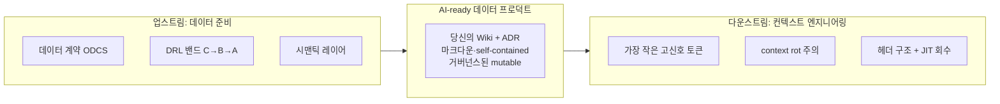

## 들어가며: "AI-ready로 만들어 주세요"는 발굴 질문이다

3편 인테이크 양식의 4번 칸은 "AI가 필요로 하는 정보와 그 포맷"이었다. 고객은 흔히 "우리 데이터를 AI-ready로 만들어 주세요"라고 말한다. 마치 한 번 청소하면 끝나는 작업처럼. 그런데 이건 청소가 아니라 **발굴 질문**이다.

Gartner는 못을 박는다. **데이터를 사전에, 일반적으로 AI-ready로 만들 방법은 없다.** 읽기는 전적으로 *어떻게 쓸 것인가*에 달려 있고, 그래서 유스케이스마다 필요한 데이터가 완전히 다르다.[^gartner] Snowflake의 AI-Ready Data Framework가 이를 숫자로 보여준다. 62개 요구사항을 점수화하는데, **같은 데이터셋이 워크로드 프로파일마다 다른 점수**를 받는다. 단순 조회(Scan)는 8개 기준, RAG는 27개, 모델 학습은 50개, 에이전트는 37개를 본다.[^snowflake] 즉 "AI-ready"는 데이터의 속성이 아니라 *데이터와 용도의 관계*다.

이 글의 결론을 먼저 적는다.

- **AI-ready 데이터는 미리 만들어 두는 게 아니다.** 용도가 정해져야 무엇이 ready인지 정의된다. 그래서 "어떤 데이터를 어떤 포맷으로"는 인테이크에서 *발견할* 대상이다.
- 데모 위의 마법 아래에는 **빙산 같은 기반**이 있다. 데모는 싸고 프로덕션은 비싸다.
- 업스트림(데이터 계약, 시맨틱 레이어)과 다운스트림(컨텍스트 엔지니어링)은 **같은 문제의 양 끝**이다.
- 그리고 당신이 이미 만든 [[llm-wiki|LLM Wiki]]와 ADR이 곧 그 조직의 **AI-ready 데이터 프로덕트**다.

---

## 데모 위의 마법, 그 아래의 빙산

고객이 AI를 마법으로 보는 1편의 문제는 데이터에서 가장 비싸게 드러난다. 데모는 마법처럼 보이지만, 그걸 프로덕션으로 만드는 건 보이지 않는 기반이다.

Google의 2015년 논문 "Hidden Technical Debt in Machine Learning Systems"의 유명한 그림 한 장이 이걸 압축한다. 실제 ML 시스템에서 **모델 코드는 작은 박스 하나일 뿐이고, 그 주위를 데이터 수집·검증·서빙·모니터링 같은 거대한 인프라가 둘러싼다.**[^sculley] 저자들은 "이런 빠른 성과가 공짜로 온다고 생각하는 건 위험하다"고 경고하고, 변화 하나가 전체를 바꾼다는 CACE(Changing Anything Changes Everything) 원리로 ML 시스템이 왜 깨지기 쉬운지 설명한다.[^sculley] 특히 시간에 쫓기면 사람은 "가장 손쉬운 신호"를 집어 쓰고 부채가 조용히 쌓인다 - **결과만 빨리 원하면 기반이 건너뛰어진다**는, 현장에서 흔히 보는 그 패턴이다.

숫자도 일관된다. 다만 정의가 제각각이라 섞으면 안 된다.

| 출처 | 수치 | 정확한 의미 |
|------|------|-------------|
| Gartner (2024 예측)[^gartner30] | GenAI 프로젝트 30%+ PoC 후 폐기 | 데이터 품질·리스크·비용·가치 불명확 |
| MIT NANDA (2025)[^nanda] | GenAI 파일럿 ~95% P&L 효과 없음 | "학습/통합 격차"이지 모델 품질 아님 |
| IDC/Lenovo (2025, 벤더 의뢰)[^idc] | PoC 33개 중 4개만 프로덕션 도달 | "데이터·프로세스·IT 인프라 준비도 낮음" |

세 수치는 방법론과 "실패"의 정의가 다르지만 가리키는 곳은 같다. **모델이 아니라 데이터·프로세스 기반이 비어 있다.**

---

## "AI-ready"는 용도 의존적이다 (업스트림)

그러면 무엇이 ready인가. 업스트림에는 쓸 만한 어휘가 있다. Neil Lawrence의 Data Readiness Levels는 세 밴드로 나눈다.[^drl]

- **밴드 C (접근성)**: 기계가 읽을 수 있고 윤리적으로 다룰 수 있는가.
- **밴드 B (충실성)**: 정확하고 대표성이 있는가, 결측·오류가 처리됐는가.
- **밴드 A (적합성)**: **이 특정 과제에** 적합한가. 라벨링이나 새 수집이 필요할 수도 있다.

핵심은 밴드 A다. "적합하다"는 언제나 *어떤 용도에 대해*다. 그래서 Gartner의 "용도가 정해져야 ready가 정의된다"는 주장과 정확히 맞물린다. 성공하는 조직이 데이터 기반에 최대 4배 더 투자한다는 Gartner의 2026년 조사도 같은 맥락이다.[^gartner4x]

용도를 무시한 채 "데이터가 있으니 ready"라고 본 대표적 실패가 Amazon의 채용 도구다. 10년치 이력서로 학습했는데, 그 데이터는 "최고의 인재"가 아니라 **"Amazon이 과거에 뽑은 사람"**을 인코딩하고 있었다. 그 결과 여성 관련 표현을 깎아내려 결국 폐기됐다.[^amazon] 추상적 목표("top talent")와 데이터가 실제로 담은 것("과거 채용 패턴")을 맞춰 보지 않은 것이다. 그래서 AWS의 GenAI 평가 질문지는 정직한 수치를 강제한다. "이 데이터 중 몇 %가 지금 접근 가능한가(예: 85%), 몇 %가 GenAI 품질 기준을 충족하는가(예: 78%, 목표 95%)."[^aws]

---

## 그럴듯하게 틀린 침묵보다 명시적 에러가 낫다

"데이터가 어떤 포맷이어야 하나"에 대한 가장 설득력 있는 답은 의견이 아니라 숫자다. dbt의 2026년 벤치마크는 LLM이 데이터를 질의할 때 **거버넌스된 시맨틱 레이어**가 원시 text-to-SQL을 압도함을 보였다. 모델링된 데이터에서 Claude Sonnet 4.6은 98.2%(시맨틱 레이어) 대 90.0%(text-to-SQL), GPT-5.3-Codex는 100% 대 84.1%였다.[^dbt]

그런데 결정적 차이는 점수가 아니라 **실패 방식**이다. text-to-SQL은 그럴듯한 틀린 숫자를 *조용히* 내놓고, 시맨틱 레이어는 답할 수 없으면 *명시적 에러*를 던진다. 잘못된 데이터를 절대 반환하지 않는다.[^dbt] 이건 이 블로그가 [[llm-text-to-sql|Text-to-SQL]] 글에서 다룬 문제이자, ADR 철학의 거울이다. **그럴듯하게 틀린 침묵보다 시끄러운 에러가 낫다.** 비결정 시스템에서 신뢰는 정답률이 아니라 "틀릴 때 어떻게 틀리는가"에서 나온다.

그래서 "포맷"의 진짜 답은 스프레드시트가 아니라 **계약**이다. Open Data Contract Standard(ODCS, 2025년 12월 v3.1.0, LF AI & Data)는 데이터의 스키마·품질 규칙·SLA·소유자를 기계가 읽을 수 있는 형태로 명시한다.[^odcs] 인테이크 4번 칸이 요청해야 할 것은 "엑셀을 주세요"가 아니라 "계약과 시맨틱 정의를 발행하세요"다.

---

## 같은 문제의 다른 끝: 컨텍스트 엔지니어링 (다운스트림)

업스트림에서 데이터를 갖췄어도, 추론 시점에 그걸 *어떻게 떠먹이느냐*가 남는다. 이게 다운스트림, 즉 컨텍스트 엔지니어링이다. Anthropic은 이를 "추론 중 최적의 토큰 집합을 큐레이팅하는 규율"로 정의하고, 핵심 격언을 **"원하는 결과를 낼 가능성을 극대화하는, 가장 작은 고신호 토큰 집합"**이라 말한다.[^context]

여기서 중요한 반전이 *context rot*다. **토큰이 많아질수록 모델이 그 안의 정보를 정확히 회상하는 능력은 오히려 떨어진다.**[^context] 컨텍스트는 공짜가 아니라 비용이다. 그래서 처방은 세 가지다.

- **구조화**: 시스템 프롬프트·문서를 마크다운 헤더나 XML 섹션으로 나눈다. `## 섹션 제목`은 문단과 의미가 다르고, 마크다운 표는 행-열 관계를 보존한다.
- **just-in-time 회수**: 모든 데이터를 앞에 쏟지 말고 파일 경로·쿼리 같은 가벼운 식별자로 필요할 때 가져온다.
- **self-contained 청크**: Anthropic의 Contextual Retrieval은 각 청크 앞에 그 청크만의 설명 맥락을 붙여 검색 실패를 35~49%(리랭커 결합 시 67%) 줄였다.[^contextual]

마지막 항목이 익숙할 것이다. 이 시리즈가 계속 말한 **"self-contained ADR이 링크 거미줄보다 낫다"**와 정확히 같은 발견이다. 청크도 ADR처럼 혼자 서 있어야 한다.

---

## 당신의 Wiki와 ADR이 곧 AI-ready 데이터 프로덕트다

여기서 두 끝이 만난다. 업스트림이 요구하는 것(거버넌스, self-contained, 계약, 의미 보존)과 다운스트림이 요구하는 것(마크다운 구조, self-contained 청크, 작은 고신호 집합)은 같다. 그리고 그 교집합을 만족하는 산출물을 당신은 이미 갖고 있다. **마크다운으로, self-contained하게, 거버넌스된 채로, 헤더 구조를 갖춰 유지되는 [[llm-wiki|LLM Wiki]]와 ADR.**

이건 [[블로그-검색-실험|검색 실험]]에서 다룬 RAG의 윗단이기도 하다. RAG가 원문을 회수한다면, 잘 구조화된 Wiki/ADR은 회수 이전에 이미 정제된 의미 레이어다. 그래서 인테이크 4번 칸의 올바른 산출물은 "스프레드시트를 보내라"가 아니라 **"계약 + 시맨틱 정의 + 마크다운 ADR/Wiki를 발행하라"**다. 도구(어떤 벡터DB, 어떤 모델)가 바뀌어도 이 마크다운과 계약은 남는다 - 8편에서 다룰 durable substrate의 핵심이다.

---

## 정리

- **AI-ready 데이터는 미리 만들 수 없다(Gartner).** 용도가 정해져야 무엇이 ready인지 정의된다. 같은 데이터가 워크로드마다 다른 점수를 받는다(Snowflake). 그래서 데이터·포맷은 인테이크에서 발견할 대상이다.
- 데모는 ML 코드라는 작은 박스, 프로덕션은 그 주변 인프라라는 빙산이다(Sculley). 시간에 쫓기면 기반이 건너뛰어지고, PoC의 다수가 프로덕션에 못 간다.
- 업스트림(DRL 밴드, 데이터 계약, 시맨틱 레이어)과 다운스트림(컨텍스트 엔지니어링, context rot, 마크다운 구조)은 한 문제의 양 끝이다.
- 신뢰는 정답률이 아니라 **틀리는 방식**에서 온다. 그럴듯하게 틀린 침묵보다 명시적 에러가 낫다(dbt 시맨틱 레이어 98~100% vs 84~90%).
- 당신이 만든 Wiki/ADR이 곧 AI-ready 데이터 프로덕트다. 인테이크는 "엑셀"이 아니라 "계약 + 마크다운"을 요청해야 한다.

다음 글에서는 6번째 주제로 넘어간다. 아무리 인테이크와 데이터를 잘 갖춰도 **사양서는 100%를 덮지 못한다.** 구현 중에 드러나는 빈틈을 결정 기록으로 흡수하고, 그게 다음 인터뷰의 입력으로 되먹이는 루프 이야기다.

---

## 참고 자료

### AI-ready 데이터 (용도 의존)

- [AI-Ready Data (Gartner)](https://www.gartner.com/en/articles/ai-ready-data)
- [Organizations with successful AI invest up to 4x more in data foundations (Gartner, 2026-04)](https://www.gartner.com/en/newsroom/press-releases/2026-04-16-gartner-says-organizations-with-successful-ai-initiatives-invest-up-to-four-times-more-in-data-and-analytics-foundations)
- [Data Readiness Levels (Neil Lawrence) / 360 Survey (arXiv 2404.05779)](https://arxiv.org/html/2404.05779v1)
- [AWS Generative AI workload assessment questionnaire](https://docs.aws.amazon.com/prescriptive-guidance/latest/generative-ai-workload-assessment/)
- [Amazon scraps AI recruiting tool that showed bias against women (Reuters)](https://www.reuters.com/article/world/insight-amazon-scraps-secret-ai-recruiting-tool-that-showed-bias-against-women-idUSKCN1MK0AG/)

### 데모-프로덕션 간극

- [Hidden Technical Debt in Machine Learning Systems (Sculley et al., NeurIPS 2015)](https://proceedings.neurips.cc/paper_files/paper/2015/file/86df7dcfd896fcaf2674f757a2463eba-Paper.pdf)
- [Gartner: 30% of GenAI projects abandoned after PoC by end 2025](https://www.gartner.com/en/newsroom/press-releases/2024-07-29-gartner-predicts-30-percent-of-generative-ai-projects-will-be-abandoned-after-proof-of-concept-by-end-of-2025)
- [The GenAI Divide: State of AI in Business 2025 (MIT NANDA, via Fortune)](https://fortune.com/2025/08/18/mit-report-95-percent-generative-ai-pilots-at-companies-failing-cfo/)
- [88% of AI pilots fail to reach production (IDC/Lenovo, via CIO.com)](https://www.cio.com/article/3850763/88-of-ai-pilots-fail-to-reach-production-but-thats-not-all-on-it.html)

### 포맷 · 시맨틱 · 컨텍스트 엔지니어링

- [Semantic Layer vs Text-to-SQL 2026 Benchmark (dbt)](https://docs.getdbt.com/blog/semantic-layer-vs-text-to-sql-2026)
- [Open Data Contract Standard (ODCS, Bitol / LF AI & Data)](https://github.com/bitol-io/open-data-contract-standard)
- [Effective context engineering for AI agents (Anthropic)](https://www.anthropic.com/engineering/effective-context-engineering-for-ai-agents)
- [Introducing Contextual Retrieval (Anthropic)](https://www.anthropic.com/news/contextual-retrieval)
- [Snowflake AI-Ready Data Framework (Snowflake Labs)](https://github.com/Snowflake-Labs/ai-ready-data-framework)

[^gartner]: Gartner, "AI-Ready Data Essentials". 데이터를 사전에 또는 일반적으로 AI-ready로 만들 방법은 없으며, readiness는 용도에 따라 정의된다. AI-ready 데이터는 특정 유스케이스에 정렬되고, 자산 단위로 거버넌스되며, 품질 게이트가 있는 파이프라인으로 뒷받침되고, 의미가 있으며, 올바르게 라벨링되고, 신뢰할 수 있는 출처여야 한다. [Gartner](https://www.gartner.com/en/articles/ai-ready-data).
[^snowflake]: Snowflake Labs, AI-Ready Data Framework. 62개 요구사항을 0~1로 점수화하고, 워크로드 프로파일(Scan 8 / RAG 27 / Feature-serving 39 / Training 50 / Agents 37)마다 다른 기준 집합을 적용한다. 즉 같은 데이터셋이 용도에 따라 다른 readiness 점수를 받는다. [GitHub](https://github.com/Snowflake-Labs/ai-ready-data-framework).
[^sculley]: D. Sculley 외(Google), "Hidden Technical Debt in Machine Learning Systems"(NeurIPS 2015). Figure 1은 ML 코드가 작은 박스이고 주변 인프라가 방대함을 보여준다. "빠른 성과가 공짜라 생각하는 건 위험하다", CACE(Changing Anything Changes Everything), 마감 압박 속 편의적 신호 사용으로 부채가 쌓인다는 지적을 담는다. [NeurIPS](https://proceedings.neurips.cc/paper_files/paper/2015/file/86df7dcfd896fcaf2674f757a2463eba-Paper.pdf).
[^gartner30]: Gartner(2024-07-29 예측): GenAI 프로젝트의 최소 30%가 데이터 품질·리스크 통제 미흡·비용 급증·가치 불명확으로 2025년 말까지 PoC 이후 폐기될 것. 관측이 아닌 예측. [Gartner](https://www.gartner.com/en/newsroom/press-releases/2024-07-29-gartner-predicts-30-percent-of-generative-ai-projects-will-be-abandoned-after-proof-of-concept-by-end-of-2025).
[^nanda]: MIT NANDA, "The GenAI Divide: State of AI in Business 2025"(Fortune 보도). 기업 GenAI 파일럿의 약 95%가 측정 가능한 P&L 효과를 내지 못했고, 원인은 모델 품질이 아니라 "학습/통합 격차"다. ("실패"는 P&L 무효과를 뜻하며 기술적 실패가 아님.) [Fortune](https://fortune.com/2025/08/18/mit-report-95-percent-generative-ai-pilots-at-companies-failing-cfo/).
[^idc]: IDC가 Lenovo 의뢰로 수행(CIO Playbook 2025): PoC 33개당 4개만 프로덕션에 도달(약 88% 미도달), 원인은 "데이터·프로세스·IT 인프라의 낮은 조직 준비도". 벤더 의뢰 연구임을 밝혀 둔다. [CIO.com](https://www.cio.com/article/3850763/88-of-ai-pilots-fail-to-reach-production-but-thats-not-all-on-it.html).
[^drl]: Neil D. Lawrence, "Data Readiness Levels"(2017); "Data Readiness for AI: A 360-Degree Survey"(arXiv 2404.05779, 2024)로 확장. 밴드 C(접근성)·B(충실성)·A(특정 과제 적합성), A가 최상위. [arXiv](https://arxiv.org/html/2404.05779v1).
[^gartner4x]: Gartner(2026-04-16, Rita Sallam): AI 이니셔티브에 성공한 조직은 데이터·분석 등 기반 영역에 실패한 조직보다 최대 4배 더 투자한다(매출 대비 비율 기준). [Gartner](https://www.gartner.com/en/newsroom/press-releases/2026-04-16-gartner-says-organizations-with-successful-ai-initiatives-invest-up-to-four-times-more-in-data-and-analytics-foundations).
[^amazon]: Amazon의 실험적 AI 채용 도구(2014~2018 폐기). 10년치(남성 편중) 이력서로 학습해 "여성" 관련 표현을 가진 이력서를 깎아내렸다. "최고 인재"가 아니라 "과거 채용 패턴"을 학습한, 추상적 AI-ready 데이터의 부재를 보여주는 대표 사례. [Reuters](https://www.reuters.com/article/world/insight-amazon-scraps-secret-ai-recruiting-tool-that-showed-bias-against-women-idUSKCN1MK0AG/).
[^aws]: AWS GenAI workload assessment questionnaire의 데이터 전략 섹션은 "이 데이터 중 몇 %가 접근 가능한가", "몇 %가 GenAI 품질 기준을 충족하는가"처럼 정량적 답을 강제한다. [AWS](https://docs.aws.amazon.com/prescriptive-guidance/latest/generative-ai-workload-assessment/).
[^dbt]: dbt, "Semantic Layer vs. Text-to-SQL 2026 Benchmark"(2026-04-07). 모델링된 데이터에서 Claude Sonnet 4.6 98.2%(시맨틱 레이어) vs 90.0%(text-to-SQL), GPT-5.3-Codex 100% vs 84.1%. 결정적 차이는 실패 방식: text-to-SQL은 그럴듯한 틀린 값을 조용히 내놓고, 시맨틱 레이어는 명시적 에러를 던진다. [dbt](https://docs.getdbt.com/blog/semantic-layer-vs-text-to-sql-2026).
[^odcs]: Open Data Contract Standard(ODCS) v3.1.0(2025-12, Bitol / LF AI & Data). 스키마·품질 규칙·실행 가능한 SLA·이해관계자·역할을 기계가 읽을 수 있게 기술하는 데이터 계약 표준. [GitHub](https://github.com/bitol-io/open-data-contract-standard).
[^context]: Anthropic, "Effective context engineering for AI agents"(2025-09). 컨텍스트 엔지니어링 = 추론 중 최적 토큰 집합을 큐레이팅하는 규율, 격언은 "가장 작은 고신호 토큰 집합". context rot: 토큰이 많아질수록 회상 정확도가 떨어진다. 마크다운/XML 섹션 구조와 just-in-time 회수를 권한다. [Anthropic](https://www.anthropic.com/engineering/effective-context-engineering-for-ai-agents).
[^contextual]: Anthropic, "Introducing Contextual Retrieval"(2024-09). 각 청크 앞에 청크별 설명 맥락을 붙여 임베딩/색인하면 상위-20 검색 실패가 35%(임베딩)~49%(임베딩+BM25), 리랭커 결합 시 67% 감소. self-contained 청크가 핵심. [Anthropic](https://www.anthropic.com/news/contextual-retrieval).
