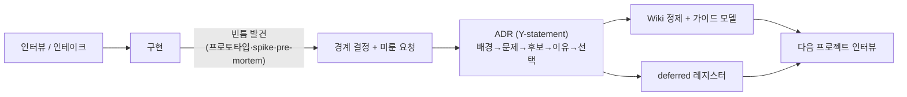

## 들어가며: 결과를 봐야 요구가 나온다

여기까지 잘 왔다고 하자. 인터뷰로 암묵지를 캐고(1편), 현행 업무를 포착하고(2편), 인테이크 양식으로 굳히고(3편), 위임 경계를 정하고(4편), 데이터까지 갖췄다(5편). 그래도 막힌다. **사양은 100%를 못 덮는다.** 구현에 들어가면 미처 생각 못 한 게 쏟아진다.

특히 AX에서는 두 모양으로 터진다. 고객은 결과물을 *보고 나서야* "어 이것도 돼요? 저건 왜 안 돼요?"를 쏟아낸다. 뭐가 가능한지 미리 몰랐으니 깊게 생각할 수가 없었던 것이다. 그러면 개발자는 반대편 함정에 빠진다. *"그럼 나중에 뭐가 나올지 모르니 다 되게 설계해야 하나?"* 그런데 다 되게 만들면 느려지고, 답이 일관되지 않는다.

좋은 소식은, 이게 새 문제가 아니라는 것이다. Barry Boehm은 2000년에 이걸 **IKIWISI**(I'll Know It When I See It)라고 이름 붙였다. *"요구사항을 말해 달라고 하면 사람들은 '어떻게 말해야 할지 모르겠지만 보면 안다'고 한다."*[^ikiwisi] 25년 된 법칙이다. 그래서 이 글의 결론은 이렇다.

- 사양이 못 덮는 건 **결함이 아니라 성질**이다. 요구사항은 구현을 거치며 *출현*한다.
- 그러니 빈틈을 **싸게, 일부러 드러내라.** 프로토타입은 발굴 도구다.
- "다 되게 만들자"는 함정이다. 답은 **좁은 코어 + 변화가 싼 구조**다. 이건 취향이 아니라 법칙이다.
- 빈틈과 경계 결정을 **ADR로 흡수**하고, 그걸 다음 인터뷰의 입력으로 되먹인다.

> [!note] 기존 글과의 관계
> 이 글은 [[agentic-decision-workflow|ADR/결정 파이프라인]]을 재설명하지 않는다. 대신 그 파이프라인에 *무엇이 흘러 들어오는가* - 구현 중 발견된 빈틈과 경계 결정 - 를 다룬다. 그리고 그 결정이 [[llm-wiki|Wiki]]로 정제되어 다음 프로젝트를 준비시킨다.

---

## 사양이 못 덮는 건 결함이 아니라 성질이다

Fred Brooks가 1986년 "No Silver Bullet"에서 이미 못을 박았다. **"소프트웨어에서 가장 어려운 건 무엇을 지을지 정하는 것이고, 고객은 자기가 뭘 원하는지 정확히 모르므로, 요구사항을 뽑아내는 가장 좋은 방법은 동작하는 소프트웨어를 지어 보는 것이다."**[^brooks] 그는 이걸 *본질적 복잡성*(essential complexity)이라 불렀다. 코딩 같은 *우연적 복잡성*(accidental complexity)과 달리, 무엇을 지을지 정하는 어려움은 도구로 없앨 수 없다.

여기 AI 시대의 반전이 있다. 코딩 에이전트가 우연적 복잡성(타이핑)을 거의 공짜로 만들수록, 본질적 복잡성(무엇을 지을지)의 비중은 *오히려 커진다.* 빈틈 찾기가 덜 중요해지는 게 아니라 더 중요해진다.

왜 사전 계획이 안 통하는지는 Cone of Uncertainty가 정량적으로 말한다. 불확실성은 프로젝트 시작에 가장 크고, 일이 진행되며 미지가 풀려야 좁아진다.[^cone] 시작 시점에 고해상도 사양을 못 갖는 건 당연하다. Korzybski의 표현으로 "지도는 영토가 아니다." 사양은 지도이고, 돌아가는 시스템과 고객의 진짜 필요가 영토다. 80% 시간을 계획에 써도 빈틈이 남는 건, 지도가 영토가 아니기 때문이다.

---

## 빈틈을 일부러, 싸게 드러내라

"결과를 봐야 요구가 나온다"가 IKIWISI라면, 처방은 분명하다. **결과를 빨리, 싸게 보여줘서 요구가 납품 후가 아니라 발견 단계에 나오게 한다.** 도구는 이미 다 있다.

| 도구 | 출처 | 성격 |
|------|------|------|
| Throwaway prototype / Spike | XP[^spike] | 버리는 실험, 한 질문에 답하고 폐기 |
| Walking skeleton | Cockburn[^skeleton] | 끝까지 가는 가는 뼈대, *유지* |
| Tracer bullet | Pragmatic Programmer[^skeleton] | 실제 조건에서 다듬는 실코드, *유지* |
| Wizard-of-Oz | Kelley 등[^woz] | AI인 척 사람이 돌려 진짜 요구를 관찰 |
| Concierge MVP | Lean Startup[^concierge] | 손으로 가치를 먼저 전달 |

AI 맥락에서 특히 강한 건 **Wizard-of-Oz**다. 가장 어려운 한 태스크를 뒤에서 사람이 처리하고 앞은 AI처럼 보이게 한 뒤, 사용자가 AI에게 *실제로* 무엇을 요구하는지 관찰한다. 그 대화록은 곧 범위 정의이자 학습 데이터가 된다.[^woz]

그리고 2025~2026년의 결정적 변화. **LLM/바이브 코딩이 프로토타입을 거의 공짜로 만든다.** 실무자 Sophia Sun의 말처럼 "문서는 모호한 생각을 숨겨 주지만 프로토타입은 디테일을 건너뛰게 두지 않는다." 같은 플로우의 버전 셋을 만들면 그 대비가 토론을 일으킨다("demo > memo").[^demomemo] 버려도 되는 데모가 공짜라면, **인테이크에서 능력의 경계를 일부러 시연**할 수 있다. "이건 됩니다 / 이건 지금은 안 합니다"를 미리 보여주면, 납품 후 "이것도 안 돼?" 폭탄을 발견 단계에서 미리 터뜨리게 된다. pre-mortem("1년 뒤 실패했다면 왜?")까지 더하면 빈틈을 구현 *전에* 캔다.

---

## spec-driven development도 빈틈은 못 푼다

2025~2026년의 유행은 spec-driven development(SDD)다. GitHub Spec Kit은 작업을 Constitution → Specify → Plan → Tasks → Implement 단계로 나눠 에이전트가 추측 대신 명시된 의도를 실행하게 한다.[^speckit] AWS Kiro는 아예 "코드는 사양의 빌드 산출물"이라 본다. 사양을 앞당기는 건 좋다. 하지만 **emergent requirement는 풀지 못한다.**

Thoughtworks의 Birgitta Bockeler가 스펙트럼으로 정리했다.[^bockeler] *spec-first*(사양을 먼저 쓰고 폐기), *spec-anchored*(유지·진화), *spec-as-source*(사람은 사양만 편집). Spec Kit/Kiro는 대체로 spec-first다. 그리고 spec-as-source는 모델 주도 개발(MDD)의 실패(경직성)에 LLM의 비결정성까지 더할 위험이 있다고 경고한다. 구현 현실에서 살아남는 건 spec-anchored인데, 그건 **빈틈을 둘 곳이 있어야만** 작동한다.

그래서 진짜 축은 "SDD냐 바이브 코딩이냐"가 아니다. **"네 사양에 emergent requirement를 흘려보낼 배수구가 있는가"**다. 그 배수구가 바로 결정 기록 레이어다.

---

## "다 되게 만들자"는 함정

이제 개발자의 딜레마를 정면으로 풀자. *"미래 요구를 흡수하려면 다 되게 설계해야 하지 않나?"* 직관은 그렇게 말한다. 그런데 over-general 시스템은 느리기만 한 게 아니다. **법칙적으로 덜 정확하고 덜 쓰인다.**

- Luciano Floridi의 *certainty-vs-scope* 추측(2025): 증명 가능한 정확성을 가지려면 시스템은 좁게 한정돼야 하고, 넓고 고차원인 시스템은 **불가피하게 오류를 떠안는다.** 둘 다 가질 수 없다.[^floridi]
- NN/g(Kate Moran, 2025): 현장 테스트에서 **좁은 범위의 AI 기능이 열린 기능보다 더 잘 작동**했다. "유연할수록 사용성은 떨어진다."[^nng]

즉 **범위를 좁히는 건 비겁한 타협이 아니라, 신뢰성과 양립하는 유일한 선택**이다. 그렇다고 "좁히고 기도"도 답이 아니다(나중에 "이것도 안 돼?"가 터지니까). 답은 같은 Boehm 논문 안에 있다. **좁고 믿을 수 있는 코어를 두되, 변화를 싸게 만든다.**

1. **변화가 올 자리를 미리 격리한다.** David Parnas의 information hiding: "이것도 돼?" 폭탄이 떨어질 *가능성이 높은 방향*을 예측해 모듈 경계 뒤에 숨긴다.[^parnas] 그러면 좁은 시스템이 *싸게* 확장된다. 미리 다 만들지 않고도.
2. **낮은 우선순위 요청은 거절도 흡수도 말고 미룬다.** Boehm의 *evolution requirements*: "나중에" 요청을 명시적 deferred 레지스터(3편 인테이크의 그 컬럼)로 보낸다.
3. **각 경계 요청은 한 줄 규칙으로 판정한다.** Boehm의 위험 규칙: **"빼는 게 위험하면 넣고, 넣는 게 위험하면 빼라."**[^ikiwisi]

여러 후보를 동시에 들고 가다 불확실성이 줄면 수렴하는 set-based 방식도 같은 정신이다. 한곳에 일찍 못 박지 않고 옵션을 남긴다.[^setbased]

---

## 빈틈을 결정으로, 결정을 다음 인터뷰로

마지막 고리. 위에서 내린 모든 경계 결정과 미룬 요청은 **그 자리에서 ADR이 된다.** 배경 → 문제 → 후보 → 이유 → 선택. 최소 포맷으로는 Olaf Zimmermann의 Y-statement가 좋다. "X 맥락에서, Y에 직면해, Z를 택하고 〈대안〉을 버렸으며, 〈이득〉을 위해 〈대가〉를 감수한다." **버린 대안과 직면한 문제가 문장 안에 강제**되니, 나중에 "우리가 이미 무슨 옵션을 따져 봤지?"로 검색된다.[^ystatement]

여기서 이 시리즈의 feed-forward가 완성된다. Zimmermann의 SOAD는 **"내려진 결정(decisions made)"**과 **"내려야 할 결정(decisions required)"**을 구분한다.[^soad] 지금까지의 ADR은 전자, 즉 절반만 일하고 있었다. 빠진 절반은 과거 프로젝트에서 수확한 *가이드 모델* - 다음 프로젝트 인터뷰가 출발점으로 삼을 "이 종류 일에서 늘 내려야 하는 결정 목록"이다. 미해결로 남은 결정은 곧 *decision debt*이고, 그게 다음 인테이크의 가장 값진 질문이 된다.

기록을 *질의 가능한 그래프*로 만들면 더 강해진다. Kruchten의 결정 온톨로지는 결정들 사이를 constrains/enables/forbids 같은 관계로 잇는다.[^kruchten] 그러면 새 요구사항이 들어올 때 "이 결정이 저 결정을 제약한다"를 추적할 수 있다. 과거 ADR을 다음 결정의 입력으로 쓰는 2025년 구현도 나왔다. 최근 K개를 컨텍스트로 주는 Last-K 방식과, 관련도 상위 K개를 검색해 few-shot으로 주는 DRAFT 방식이 두 갈래다.[^feedforward]

이건 새로운 게 아니라 좋은 팀이 늘 하던 것의 자동화다. Google·Stripe·Uber의 RFC/디자인 문서 문화는 맥락·고려한 대안·버린 아이디어·트레이드오프를 구현 전에 적는다.[^rfc] Pivotal/Tanzu Labs는 긴 프로젝트에서 약 3개월마다 *재-인셉션*을 한다. 요구사항은 한 번 잡고 끝이 아니라 계속 재발견된다는 걸 운영에 박아 넣은 것이다.[^tanzu] Palantir가 "가장 가치 있는 제품 개선이 현장에서 나왔다"고 한 것도 같은 되먹임이다.

---

## 정리

- 사양이 100%를 못 덮는 건 결함이 아니라 성질이다. 요구사항은 구현을 거치며 출현한다(Brooks, Boehm의 IKIWISI, Cone of Uncertainty). AI가 코딩을 싸게 만들수록 "무엇을 지을지"의 비중은 더 커진다.
- 빈틈은 싸게, 일부러 드러내라. 프로토타입은 발굴 도구다(throwaway, Wizard-of-Oz, "demo > memo"). 인테이크에서 능력의 경계를 시연해 "이것도 안 돼?" 폭탄을 미리 터뜨린다.
- spec-driven development도 emergent requirement는 못 푼다. 진짜 축은 "네 사양에 빈틈을 흘려보낼 배수구가 있는가"다.
- **"다 되게 만들자"는 함정이다.** over-general은 법칙적으로 덜 정확(Floridi)하고 덜 쓰인다(NN/g). 답은 좁은 코어 + 변화가 싼 구조: Parnas로 변화 자리를 격리하고, 낮은 우선순위는 deferred로 미루고, 경계 요청은 "빼는 게 위험하면 넣어라"로 판정한다.
- 모든 경계 결정과 미룬 요청은 ADR(Y-statement)이 되고, "내려야 할 결정" 가이드 모델과 deferred 레지스터가 다음 인터뷰의 입력으로 되먹인다(SOAD).

다음 글에서는 시야를 넓힌다. 한 프로젝트에서 쌓인 이 결정과 지식을 **개인 → 팀 → 조직으로 어떻게 합치는가.** "단일 진실 공급원"이 왜 잘못된 목표이고, 무엇이 맞는지.

---

## 참고 자료

### 사양은 왜 불완전한가

- [No Silver Bullet (Fred Brooks, 1986)](https://worrydream.com/refs/Brooks_1986_-_No_Silver_Bullet.pdf)
- [Requirements that Handle IKIWISI, COTS, and Rapid Change (Boehm, IEEE Computer 2000)](https://ieeexplore.ieee.org/document/869384/)
- [Cone of Uncertainty](https://en.wikipedia.org/wiki/Cone_of_uncertainty)

### 빈틈을 드러내는 도구

- [Walking skeleton / tracer bullets](https://codeclimate.com/blog/kickstart-your-next-project-with-a-walking-skeleton)
- [Wizard-of-Oz prototyping](https://en.wikipedia.org/wiki/Wizard_of_Oz_experiment)
- [demo > memo: prototyping with Lovable (Sophia Sun)](https://sophiasun.substack.com/p/demo-memo-how-i-use-lovable-to-prototype)
- [Performing a Project Premortem (Gary Klein, HBR 2007)](https://www.gary-klein.com/premortem)

### spec-driven development

- [GitHub Spec Kit](https://github.com/github/spec-kit)
- [The SDD spectrum: spec-first / spec-anchored / spec-as-source (Birgitta Bockeler, martinfowler.com)](https://martinfowler.com/articles/exploring-gen-ai/sdd-3-tools.html)

### 과잉일반화 딜레마

- [A Conjecture on a Fundamental Trade-Off between Certainty and Scope (Floridi, arXiv 2506.10130)](https://arxiv.org/abs/2506.10130)
- [Scope in Generative-AI Features (Kate Moran, NN/g)](https://www.nngroup.com/articles/scope-ai-features/)
- [Designing Software for Ease of Extension and Contraction (Parnas, IEEE TSE 1979)](https://ieeexplore.ieee.org/document/1702614)

### 결정 feed-forward

- [Architectural Decisions as Reusable Design Assets / SOAD (Zimmermann, InfoQ)](https://www.infoq.com/articles/ieee-arch-decisions/)
- [Y-statements (Olaf Zimmermann)](https://medium.com/olzzio/y-statements-10eb07b5a177)
- [An Ontology of Architectural Design Decisions (Kruchten, 2004)](https://philippe.kruchten.com/wp-content/uploads/2009/07/kruchten-2004-design-decisions.pdf)
- [DRAFT-ing Architectural Design Decisions using LLMs (arXiv 2504.08207)](https://arxiv.org/abs/2504.08207)
- [RFCs and design docs (Pragmatic Engineer)](https://blog.pragmaticengineer.com/rfcs-and-design-docs/)

[^ikiwisi]: Barry Boehm, "Requirements that Handle IKIWISI, COTS, and Rapid Change"(IEEE Computer 33(7):99-102, 2000). IKIWISI = "I'll Know It When I See It". 요구사항은 사용자가 시스템을 쓰며 더 깊이 이해하게 되면서 *출현*하지 사전 명세되지 않는다. 같은 논문의 처방: GUI를 산문으로 사전 명세하는 건 IKIWISI 때문에 위험하니 프로토타입을 초기 요구사항 정의로 쓰고, evolution requirements와 위험 규칙("빼는 게 위험하면 넣고, 넣는 게 위험하면 빼라")으로 변화에 대비하라. [IEEE Xplore](https://ieeexplore.ieee.org/document/869384/).
[^brooks]: Fred Brooks, "No Silver Bullet"(1986; *The Mythical Man-Month* 1995 개정판). "가장 어려운 건 무엇을 지을지 정하는 것이고, 고객은 정확히 뭘 원하는지 모르므로, 요구사항을 뽑는 최선은 동작하는 SW를 지어 보는 것"이라는 본질적/우연적 복잡성 구분. "plan to throw one away"(Ch.11)도 같은 책. [PDF](https://worrydream.com/refs/Brooks_1986_-_No_Silver_Bullet.pdf).
[^cone]: Cone of Uncertainty. AACE(1958) → Boehm의 funnel curve(1981) → Steve McConnell이 용어 명명(1997). 불확실성은 시작에 가장 크고 진행되며 좁아진다. [Wikipedia](https://en.wikipedia.org/wiki/Cone_of_uncertainty).
[^spike]: Spike는 XP(Beck/Cunningham)의 시간 제한 throwaway 실험으로, 특정 기술·요구 질문에 답하고 폐기한다. 불확실성을 의도적으로 줄이는 도구.
[^skeleton]: Walking skeleton(Alistair Cockburn, *Writing Effective Use Cases* 2000)은 주요 아키텍처 컴포넌트를 잇는 가는 end-to-end 구현으로 *유지*된다. Tracer bullet(Hunt & Thomas, *The Pragmatic Programmer*)은 실제 조건에서 다듬어 최종 시스템의 일부가 되는 실코드. 둘 다 버리는 프로토타입과 달리 보존된다. [참고](https://codeclimate.com/blog/kickstart-your-next-project-with-a-walking-skeleton).
[^woz]: Wizard-of-Oz 프로토타이핑: 사용자는 자율 AI로 믿지만 실제로는 숨은 사람이 조작한다. 용어는 1983년 J.F. Kelley가 자연어 인터페이스 연구에서 명명(방법 자체는 1973년부터). AI 요구 발굴에 특히 적합하며 대화록이 범위 정의 겸 학습 데이터가 된다. [Wikipedia](https://en.wikipedia.org/wiki/Wizard_of_Oz_experiment).
[^concierge]: Concierge MVP(Eric Ries, *The Lean Startup* 2011): 시스템을 짓기 전 손으로 가치를 전달해 최소 노력으로 최대 학습을 얻는 lean 패턴. 본문에서는 확립된 패턴으로 인용.
[^demomemo]: Sophia Sun, "demo > memo"(2025). "문서는 모호한 생각을 숨겨 주지만 프로토타입은 디테일을 건너뛰게 두지 않는다", AI로 같은 플로우의 세 버전을 만들면 대비가 토론을 일으킨다. 실무자 글로 2025~2026 변화의 훅. [Substack](https://sophiasun.substack.com/p/demo-memo-how-i-use-lovable-to-prototype).
[^speckit]: GitHub Spec Kit(2025-09 공개). Constitution → Specify → Plan → Tasks → Implement 단계로 SDD를 정형화(슬래시 명령은 /speckit.* 네임스페이스). "모호한 프롬프트는 모델이 명시되지 않은 수천 개 요구를 추측하게 만든다"는 문제의식. [GitHub](https://github.com/github/spec-kit).
[^bockeler]: Birgitta Bockeler(Thoughtworks, martinfowler.com, 2025-10). SDD 스펙트럼: spec-first(쓰고 폐기)/spec-anchored(유지·진화)/spec-as-source(사람은 사양만 편집). spec-as-source는 MDD의 경직성 + LLM 비결정성을 함께 물려받을 위험이 있다고 경고. [martinfowler.com](https://martinfowler.com/articles/exploring-gen-ai/sdd-3-tools.html).
[^floridi]: Luciano Floridi, "A Conjecture on a Fundamental Trade-Off between Certainty and Scope in Symbolic and Generative AI"(arXiv 2506.10130, 2025). 증명 가능한 정확성은 좁게 한정된 도메인을 요구하고, 넓고 고차원인 시스템은 무오류 성능 가능성을 포기해야 한다. [arXiv](https://arxiv.org/abs/2506.10130).
[^nng]: Kate Moran, "Scope in Generative-AI Features"(Nielsen Norman Group, 2025-02). 현장 테스트에서 좁은 범위 AI 기능이 열린 기능보다 이해·신뢰·채택에서 우위. 근저의 flexibility-usability 트레이드오프(Lidwell/Holden/Butler): "유연할수록 사용성은 떨어진다." [NN/g](https://www.nngroup.com/articles/scope-ai-features/).
[^parnas]: David Parnas, "Designing Software for Ease of Extension and Contraction"(IEEE TSE 5(2):128-138, 1979). 변화의 가능성이 높은 방향을 식별해 모듈 안에 숨기는 information hiding. "변화가 올 자리"를 격리하면 좁은 시스템도 싸게 확장된다. [IEEE](https://ieeexplore.ieee.org/document/1702614).
[^setbased]: Set-based concurrent engineering(Toyota; Ward·Liker·Cristiano·Sobek, "The Second Toyota Paradox", MIT Sloan Management Review 1995). 여러 옵션을 병렬로 들고 가다 충분히 알게 되면 수렴해 최종 결정을 늦춘다. 일찍 한곳에 못 박지 않는 전략.
[^ystatement]: Olaf Zimmermann, Y-statement(SATURN 2012). "In the context of X, facing Y, we decided for Z and against 〈alternatives〉, to achieve 〈benefits〉, accepting that 〈drawbacks〉." 버린 대안과 직면한 문제를 문장에 강제해 검색·재사용에 유리한 최소 결정 포맷. [Medium](https://medium.com/olzzio/y-statements-10eb07b5a177).
[^soad]: Olaf Zimmermann, SOA Decision Modeling(SOAD). "내려진 결정(decisions made)"의 프로젝트별 모델과, 완료 프로젝트에서 수확한 재사용 "내려야 할 결정(decisions required)" 가이드 모델을 구분한다. 가이드 모델을 다음 프로젝트로 tailoring하는 관계가 곧 feed-forward 루프. (Zimmermann & Miksovic, "Decisions Required vs. Decisions Made", 2013.) [InfoQ](https://www.infoq.com/articles/ieee-arch-decisions/).
[^kruchten]: Philippe Kruchten, "An Ontology of Architectural Design Decisions"(2004). 결정을 분류하고 결정-결정 관계(constrains/enables/forbids/decomposes/overrides) 및 요구사항·코드로의 추적을 정의해, 결정 아카이브를 리스트가 아닌 질의 가능한 그래프로 만든다. [PDF](https://philippe.kruchten.com/wp-content/uploads/2009/07/kruchten-2004-design-decisions.pdf).
[^feedforward]: 과거 ADR을 다음 결정의 입력으로 쓰는 두 전략: 최근 K개를 컨텍스트로 주는 Last-K(arXiv 2604.03826, 이 블로그의 ADR 글에서 다룸)와 관련도 상위 K개를 검색해 few-shot으로 주는 DRAFT("DRAFT-ing Architectural Design Decisions using LLMs", arXiv 2504.08207, ADR 4,911개로 평가). [DRAFT](https://arxiv.org/abs/2504.08207).
[^rfc]: RFC/디자인 문서 문화(Gergely Orosz, Pragmatic Engineer). Google·Stripe·Uber·Amazon 등 다수 기업이 맥락·고려한 대안·버린 아이디어·트레이드오프를 구현 전에 적는다. ADR은 더 가벼운 보완. [Pragmatic Engineer](https://blog.pragmaticengineer.com/rfcs-and-design-docs/).
[^tanzu]: Pivotal/VMware Tanzu Labs의 인셉션은 균형 잡힌 팀이 목표/리스크/안티골을 잡는데, 긴 프로젝트에서는 약 3개월마다 재-인셉션을 한다. 요구사항이 한 번에 확정되지 않고 계속 재발견된다는 ADR feed-forward의 현실 사례. [VMware Tanzu](https://blogs.vmware.com/tanzu/inception-knowing-what-to-build-and-where-you-should-start).
