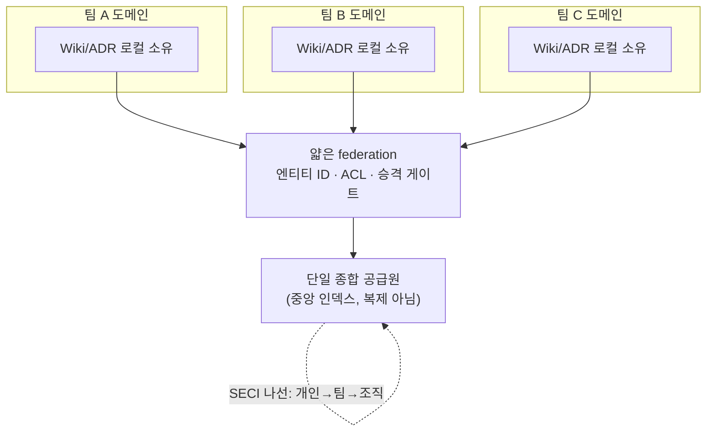

## 들어가며: 합치는 게 왜 어려운가

6편까지는 한 프로젝트 안의 이야기였다. 이제 시야를 넓힌다. 한 사람이 캔 지식, 한 팀이 쌓은 결정, 여러 팀의 인사이트를 **개인 → 팀 → 다(多)팀 → 조직**으로 합쳐 하나로 만들어야 한다.

업계는 여기에 답을 판다. **"단일 진실 공급원(single source of truth)"**이다. Google은 2026년 Gemini Enterprise의 Agent Registry를 "엔터프라이즈의 단일 진실 공급원"으로 내세운다.[^ssot] 매력적으로 들린다. 그런데 이건 잘못된 목표다.

어려움은 저장이 아니다. **부분적 관점들을, 그것을 참으로 만든 맥락째로, 평탄화하지 않고 위로 올리는 것**이 어렵다. A팀에서 "고객은 빠른 응답을 원한다"가 참인 건 그 팀의 고객·제약 안에서다. 그걸 조직 위키에 한 줄로 박아 넣는 순간 맥락이 날아가고, B팀은 그 한 줄을 자기 맥락에 잘못 적용한다. 그래서 결론은 이렇다.

- 이건 중앙집중 문제가 아니라 **federation 문제**다. 목표는 단일 *진실* 공급원이 아니라 단일 *종합* 공급원이다.
- 지식 창조는 **사다리를 오른다**(개인→그룹→조직). 이 시리즈의 ADR/Wiki 파이프라인이 그 사다리의 구현이다.
- **자발적 수평 구조는 딜리버리 압력에 무너진다.** 그래서 집계는 회의가 아니라 *워크플로우*에 배선해야 한다.

> [!note] 기존 글과의 관계
> 이 글은 [[agentic-decision-workflow|scope ladder]](개인→팀→조직 승격)와 [[second-brain-rag|조직 Second Brain]] 논의에 *이름 있는 이론*을 붙인다. 그리고 [[llm-wiki|Wiki]]가 왜 "복제본"이 아니라 "종합 인덱스"여야 하는지를 설명한다.

---

## 중앙집중이 아니라 federation이다

데이터 진영이 같은 문제를 먼저 풀었다. Zhamak Dehghani의 **data mesh**는 *federated computational governance*를 제시한다. **도메인(팀)이 로컬에서 HOW를 정하고, 얇은 federation이 WHAT(전역 표준)만 정하며, 그 전역 규칙은 중앙 위원회가 아니라 플랫폼이 계산적으로 강제한다.**[^datamesh]

이걸 지식에 그대로 옮기면 그림이 분명해진다. **팀 위키와 ADR은 그 팀이 소유한 채 로컬에 남는다.** 중앙은 모든 세부를 복제하는 곳이 아니라, 상호운용 표준(엔티티 ID 체계, 권한 규칙, 승격 게이트)만 강제하는 얇은 층이다. 이건 사실 [[agentic-decision-workflow|Hermes 엔티티 모델 + permission-before-search]] 설계와 같은 것인데, 이제 그 뒤에 이름 있는 거버넌스 이론이 붙는 셈이다.

그래서 "단일 진실 공급원" 대신 **"단일 종합 공급원(single source of synthesis)"**이 맞다. 중앙은 진실을 *보관*하지 않고 *종합*한다. 단일 진실 공급원도 물리·연합·가상의 형태가 있지만, 조직 프로세스와 거버넌스 없이 그 자체를 위해 만들면 "비싸기만 하고 쓸모없다."[^ssot]

---

## 지식 창조는 사다리를 오른다

이 사다리에는 이론적 엔진이 있다. Nonaka와 Takeuchi의 **SECI 모델**이다. 지식은 암묵지와 명시지의 변환 나선(Socialization → Externalization → Combination → Internalization)으로 창조되고, 그 나선은 **개인 → 그룹 → 조직 → 조직 간**으로 올라가도록 설계됐다.[^seci]

이 시리즈가 한 일이 정확히 이 나선의 구현이다.

| SECI 단계 | 이 시리즈의 대응 |
|-----------|------------------|
| Externalization (암묵→명시) | 결정을 ADR로 적기 (1~6편) |
| Combination (명시→명시 종합) | 여러 ADR을 Wiki로 종합 |
| Internalization (명시→암묵) | 정제된 Wiki를 읽고 체화 |
| Socialization (암묵→암묵) | 현장 인터뷰·페어링·FDE |

Nonaka가 말한 *Ba*(지식이 창조되는 공유 맥락/공간)는 여기서 **git + 마크다운**이다. 즉 이 시리즈의 파이프라인은 SECI 나선을 마크다운으로 돌리는 한 구현이라고 말할 수 있다.

---

## 자발적 수평 구조는 무너진다

그런데 사다리를 올리는 *사회적* 구조는 깨지기 쉽다. 이 시리즈를 정직하게 지키려면 가장 유명한 실패를 봐야 한다. **Spotify 모델**이다.

2012년 백서의 길드(guild, 관심 기반 자발적 모임)와 챕터(chapter, 직능 기반)는 "팀을 가로지르는 수평 지식 공유"의 교과서적 형태였고, 수많은 회사가 베꼈다. 그런데 정작 Spotify에서 이건 *스냅샷이지 청사진이 아니었다.* Jeremiah Lee의 "Spotify's Failed #SquadGoals"가 보여주듯, 길드·챕터의 지식 공유는 늘 스쿼드의 딜리버리에 밀렸다. **"자율성은 팀을 효과적으로 만들었지만, 자율적인 팀들의 *집합*은 종종 효과적이지 못했다."**[^spotify]

교훈은 분명하다. **사람이 자발적으로 모이기를 기대하는 지식 집계 층은 딜리버리 압력에 진다.** Communities of Practice도 마찬가지다. 진짜 커뮤니티가 없으면 그 산출물(공유 레퍼토리)은 썩는다.[^cop] 그래서 집계는 "월간 지식공유 회의"가 아니라 *워크플로우 자체*에 배선해야 한다. 이게 이 시리즈가 ADR feed-forward(6편)에 집착한 이유다.

---

## 엔지니어 네이티브 집계 메커니즘

그러면 어떻게 워크플로우에 배선하는가. 엔지니어에게 익숙한 메커니즘이 이미 있다.

- **Team Topologies의 3가지 상호작용 모드.** Skelton과 Pais는 팀 간 지식이 Collaboration / X-as-a-Service / Facilitating이라는 명시적 채널로 흐른다고 본다.[^teamtopo] 특히 *플랫폼 팀* 사고가 핵심이다. **지식 기질을 self-serve 내부 프로덕트로 노출**하면(위키를 X-as-a-Service로), 다른 팀이 회의 없이 가져다 쓴다.
- **InnerSource의 Trusted Committer.** 오픈소스 협업 방식을 사내에 적용해, **기여(PR)를 공유의 단위로** 삼는다. Trusted Committer는 외부 팀의 기여를 검토하고 전문성을 옮기는 cross-team 스튜어드다.[^innersource] 이게 project → team → org 승격을 검토하는 인간 게이트, 즉 이 시리즈의 승격 리뷰 게이트를 PR 단위로 구현한 것이다.
- **After-Action Review(AAR).** 미 육군이 만든 사후 검토(무엇을 하려 했나 → 실제 무엇이 → 왜 차이 → 무엇을 유지/개선)는 중앙 lessons-learned DB로 흘러든다.[^aar] 그 구조(배경→무엇→왜→교훈)는 ADR(맥락→문제→옵션→결정)과 사실상 동형이고, 중앙 DB는 조직 단위 결정/인사이트 인덱스 그 자체다.

이 세 가지의 공통점은 공유가 자발적 선의가 아니라 워크플로우의 부산물로 나온다는 것이다. PR을 머지하면 지식이 옮겨가고, 회고를 적으면 교훈이 인덱스에 쌓이는 식이다.

---

## AI 에이전트도 같은 사다리를 재발명하고 있다

흥미로운 2025~2026년 신호. **AI 에이전트 메모리가 이 사회적 사다리를 독립적으로 데이터 모델로 재발명**하고 있다. 멀티 스코프 메모리는 모든 쓰기를 `user_id` / `agent_id` / `org_id` 같은 스코프로 태깅하고, `org_id`는 문자 그대로 "공유 조직 맥락"이 되어 검색 시점에 종합된다.[^mem0] 사람의 개인→팀→조직 사다리와 같은 모양이다.

이게 시사하는 바가 크다. 사람과 에이전트가 **같은 staleness 문제, 같은 identity-resolution 문제**를 동시에 겪는다는 뜻이고, 그래서 둘 다를 떠받치는 durable substrate(엔티티 모델 + 스코프 태깅된 출처 + federated governance)는 특정 도구가 아니다. 단, federation은 리터러시가 팀 간에 평준화돼야 작동한다. 2026년 조사에서 기업 리더의 72%가 AI 리터러시를 필수라 하면서 59%가 자기 조직에 역량 격차가 있다고 답했다.[^datacamp] 한 팀만 잘 알아서는 종합이 안 된다.

Tanzu의 균형 팀이 관점을 한 명에게 몰아넣지 않고 "먼저 다 꺼내 놓고 테마로 묶는" 방식, 삼성SDS가 팀마다 'AI Crew'를 두어 팀별 암묵지를 발굴·확산하는 방식 모두, 조직 지식을 중앙화하는 대신 연합하는 같은 정신이다.

---

## 정리

- 개인→팀→조직 지식 통합은 저장 문제가 아니라 **federation 문제**다. 부분적 관점을 맥락째로, 평탄화 없이 올려야 한다. 목표는 단일 진실 공급원이 아니라 **단일 종합 공급원**이다.
- data mesh의 federated computational governance가 모델이다. 도메인이 HOW를, 얇은 federation이 WHAT(엔티티 ID·ACL·승격 게이트)만 강제한다. = Hermes 엔티티 모델에 붙는 이름 있는 이론.
- 지식 창조는 SECI 나선으로 사다리를 오른다. 이 시리즈의 ADR(Externalization)→Wiki(Combination)가 그 구현이고, git+마크다운이 Ba다.
- **자발적 수평 구조는 딜리버리 압력에 무너진다**(Spotify 길드). 그래서 집계는 워크플로우에 배선한다. Team Topologies의 X-as-a-Service, InnerSource의 Trusted Committer, AAR의 lessons-learned DB가 엔지니어 네이티브 메커니즘이다.
- AI 에이전트 메모리도 user/agent/org 스코프로 같은 사다리를 재발명 중이다. 사람과 에이전트가 같은 문제를 겪으므로, durable substrate는 도구가 아니라 엔티티 모델 + 스코프 태깅 + federation이다.

마지막 글에서는 이 시리즈 전체를 닫는다. 지금까지 만든 모든 산출물(인테이크·as-is 맵·위임 결정·데이터 계약·ADR·federation 규칙)이 **클로드 코드·Codex·Multica가 다 바뀌어도 살아남는** 이유, 즉 도구가 아니라 기질에 사는 법.

---

## 참고 자료

### federation vs 중앙집중

- [Data Mesh Principles (Zhamak Dehghani, martinfowler.com)](https://martinfowler.com/articles/data-mesh-principles.html)
- [The truth about the single version of truth (Peter Baumann)](https://peterbaumann.substack.com/p/the-truth-about-the-single-version)

### 지식 창조 · 커뮤니티

- [SECI model (Nonaka & Takeuchi)](https://en.wikipedia.org/wiki/SECI_model_of_knowledge_dimensions)
- [Introduction to Communities of Practice (Wenger-Trayner)](https://www.wenger-trayner.com/introduction-to-communities-of-practice/)

### 팀 간 지식 흐름 메커니즘

- [Team Topologies key concepts (Skelton & Pais)](https://teamtopologies.com/key-concepts)
- [Trusted Committer pattern (InnerSource Commons)](https://patterns.innersourcecommons.org/p/trusted-committer)
- [After-action review](https://en.wikipedia.org/wiki/After-action_review)

### 실패 사례 · 2026 신호

- [Spotify's Failed #SquadGoals (Jeremiah Lee)](https://www.jeremiahlee.com/posts/failed-squad-goals/)
- [State of AI Agent Memory 2026 (Mem0)](https://mem0.ai/blog/state-of-ai-agent-memory-2026)

[^ssot]: Google은 2026년 Gemini Enterprise의 Agent Registry를 "엔터프라이즈의 단일 진실 공급원"으로 마케팅한다. 한편 단일 진실 공급원은 물리(중앙 플랫폼)·연합(분산)·가상(시맨틱 레이어 + 데이터 카탈로그) 형태가 있으며, 조직 프로세스·거버넌스 없이 그 자체를 위해 구축하면 "비싸면서 동시에 쓸모없다"는 지적이 있다. [Peter Baumann](https://peterbaumann.substack.com/p/the-truth-about-the-single-version).
[^datamesh]: Zhamak Dehghani, data mesh 4원칙(Thoughtworks, 2020; O'Reilly 2022). federated computational governance: 도메인이 로컬에서 품질 구현 방식(HOW)을 정하고, federation이 전역 표준(WHAT)을 정하며, 전역 규칙은 중앙 강제가 아니라 플랫폼에 계산적으로 내장된다. [martinfowler.com](https://martinfowler.com/articles/data-mesh-principles.html).
[^seci]: Ikujiro Nonaka & Hirotaka Takeuchi, SECI 모델(*The Knowledge-Creating Company*, 1995; Nonaka·Toyama·Konno 통합 모델, Long Range Planning 2000). 암묵지/명시지 변환 나선(Socialization·Externalization·Combination·Internalization)이 개인→그룹→조직→조직 간 ontological 레벨로 확장된다. *Ba*는 지식이 창조되는 공유 맥락. [Wikipedia](https://en.wikipedia.org/wiki/SECI_model_of_knowledge_dimensions).
[^cop]: Communities of Practice(Lave & Wenger 1991; Wenger 1998; Wenger·McDermott·Snyder 2002). 도메인·커뮤니티·실천(practice)으로 정의되며, "조직의 지식은 각자 한 측면의 역량을 맡는 실천 공동체들의 성좌에 산다." 진짜 커뮤니티가 없으면 산출물이 썩는다. [Wenger-Trayner](https://www.wenger-trayner.com/introduction-to-communities-of-practice/).
[^teamtopo]: Matthew Skelton & Manuel Pais, *Team Topologies*(IT Revolution, 2019). 4개 팀 유형(stream-aligned/enabling/complicated-subsystem/platform)과 3개 상호작용 모드(Collaboration/X-as-a-Service/Facilitating)로 인지 부하를 관리하며 팀 간 지식 흐름을 규율한다. [teamtopologies.com](https://teamtopologies.com/key-concepts).
[^innersource]: InnerSource(용어: Tim O'Reilly, 2000)는 오픈소스 협업 방식을 사내에 적용한다. Trusted Committer(InnerSource Commons 패턴)는 외부 팀 기여를 검토하고 전문성을 옮기는 cross-team 스튜어드로, 기여(PR)를 공유의 단위로 삼는다. [InnerSource Commons](https://patterns.innersourcecommons.org/p/trusted-committer).
[^aar]: After-Action Review는 미 육군이 1970년대에 개발한 구조화된 사후 검토(무엇을 하려 했나/실제 무엇이/왜 차이/무엇을 유지·개선)로, 중앙 lessons-learned DB로 흘러든다. 애자일 회고·포스트모템의 원형. [Wikipedia](https://en.wikipedia.org/wiki/After-action_review).
[^spotify]: Spotify 모델(Kniberg & Ivarsson, 2012 백서)은 청사진이 아니라 스냅샷이었다. Jeremiah Lee, "Spotify's Failed #SquadGoals": 길드·챕터의 지식 공유는 스쿼드 딜리버리에 밀렸고, "자율성은 팀을 효과적으로 만들었지만 자율적 팀들의 집합은 종종 효과적이지 못했다." [jeremiahlee.com](https://www.jeremiahlee.com/posts/failed-squad-goals/).
[^mem0]: Mem0, "State of AI Agent Memory 2026". 멀티 스코프 메모리는 모든 쓰기를 user_id/agent_id/run_id/org_id로 태깅하고, org_id 스코프가 "공유 조직 맥락"이 되어 검색 시점에 종합된다(사람의 개인→팀→조직 사다리와 동형). 실무 블로그 자료로 medium 신뢰. [Mem0](https://mem0.ai/blog/state-of-ai-agent-memory-2026).
[^datacamp]: DataCamp / YouGov, "The State of Data & AI Literacy 2026"(미국·영국 기업 리더 500명+). 72%가 AI 리터러시를 필수라 답하고 59%가 조직의 AI 역량 격차를 보고. 벤더(교육 기업) 조사라는 점에 유의. federation은 리터러시가 팀 간 평준화돼야 작동한다.
