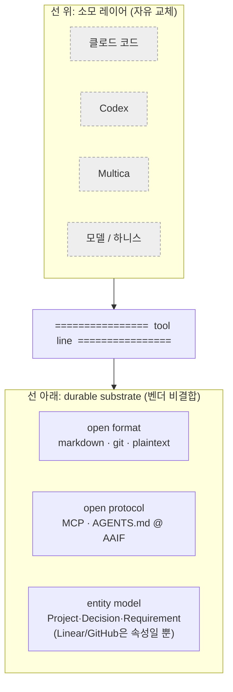

## 들어가며: 도구는 바뀐다, 산출물은 남아야 한다

이 시리즈는 많은 걸 만들었다. 인터뷰로 캔 요구사항, 현행 업무 맵, 인테이크 양식, 위임 결정, 데이터 계약, feed-forward ADR, federation 규칙. 그런데 그것들을 *만든 도구*는 끊임없이 바뀐다. Cursor, 클로드 코드, Codex, Gemini CLI, Junie. "격주마다 새 출시"가 농담이 아니고, 모델조차 빠르게 상품화(commoditize)되어 서로 갈아 끼울 수 있게 됐다.[^churn]

그래서 진짜 질문은 "어떤 도구를 쓸까"가 아니다. **"그 도구가 사라져도 산출물이 남는가"**다. BCG의 10-20-70을 마지막으로 한 번 더 보자. AI 가치의 10%만 알고리즘(도구)이고, **70%는 사람과 프로세스**다.[^bcg] 도구는 그 10%다. 이 시리즈가 만든 모든 것은 나머지 90%에 속한다.

결론을 먼저 적는다.

- 모든 앞단 산출물은 **도구가 아니라 기질(substrate)에 산다.** 도구는 소모 레이어다.
- durable substrate는 셋이다. **open format**(마크다운/git), **open protocol**(MCP, AGENTS.md), **provider-agnostic entity model**.
- 멘탈 모델은 하나면 된다. **tool line.** 선 위는 자유롭게 교체하고, 선 아래는 어떤 벤더와도 결합하지 않는다.
- 그리고 당신은 [[llm-wiki|이 기질을 이미 만들었다]]. 마크다운-인-git으로 유지되는 Wiki와 ADR이 그것이다.

---

## 산업이 직접 건 베팅

이게 블로거의 의견이 아니라는 가장 강한 증거가 2025년 말에 나왔다. **Linux Foundation이 2025년 12월 9일 Agentic AI Foundation(AAIF)을 출범**시켰다. MCP(Anthropic), goose(Block), AGENTS.md(OpenAI)를 기부받아 벤더 중립 거버넌스 아래 두는 재단이다. 플래티넘 멤버는 AWS·Anthropic·Block·Bloomberg·Cloudflare·Google·Microsoft·OpenAI다.[^aaif]

의미를 짚어 보면, 소모되는 도구를 만드는 바로 그 벤더들이 durable substrate를 공동으로 출자한 것이다. Cloudflare CTO의 말이 직설적이다. "MCP 같은 개방 표준과 프로토콜은 누구나 벤더 종속 없이 플랫폼을 넘나드는 에이전트를 만들 수 있게 한다." Anthropic CPO는 MCP 기부가 "그것이 개방적이고 중립적이며 커뮤니티 주도로 남게 한다"고 했다.[^aaif] MCP의 SDK 다운로드는 2024년 11월 월 200만에서 2026년 3월 9,700만 이상으로 늘었다.[^mcp] 도구는 경쟁하되, 그 아래 기질은 공유로 가는 흐름이다.

---

## tool line: 선 위는 교체, 선 아래는 비결합

복잡하게 갈 것 없이 멘탈 모델 하나로 압축된다. 머릿속에 수평선을 하나 긋는다.

선 위의 것들은 분기마다 바뀐다. 선 아래의 것들은 어떤 벤더와도 결합하지 않는다. 마크다운 파일은 어떤 도구가 만들었든 마크다운이고, MCP 서버로 노출된 Wiki는 어떤 에이전트든 읽을 수 있으며, `Project`/`Decision`/`Requirement`로 모델링된 지식에서 Linear나 GitHub은 그저 하나의 속성(provider)이다.[^entity] 이 마지막 항목은 [[agentic-decision-workflow|Hermes 엔티티 모델]]이 처음부터 해온 것이다.

---

## 세 가지 내구성 테스트

아무 산출물이든 선 위인지 아래인지 판정하는 데 세 질문이면 된다.

| 테스트 | 질문 | 통과 = 선 아래 |
|--------|------|----------------|
| Format | 10년 뒤 plain 에디터에서 그대로 열리나? | 마크다운/git ([[llm-wiki]], ADR) |
| Protocol | 다른 에이전트가 그 도구의 plugin API 없이 도달하나? | MCP로 노출된 데이터 |
| Model | 도메인 엔티티 모양인가, 벤더 스키마 모양인가? | Project/Decision/Requirement |

2004년에 쓴 `.md` 파일은 2026년에도 완벽히 열린다. git은 거기에 원자적 히스토리·blame·롤백을 더한다. 어떤 독점 앱도 주지 않는 것이다.[^markdown] 반면 특정 벤더의 노트 DB나 플러그인 포맷에 갇힌 지식은 셋 다 통과하지 못한다. 이 시리즈의 모든 산출물(인테이크 양식, as-is 맵, ADR, 데이터 계약)이 마크다운 + frontmatter였던 건 우연이 아니다. **세 테스트를 통과하도록 일부러 그렇게 둔 것이다.**

일부러 그렇게 둔다는 게 실제 결정에서 어떤 모습인지 한 프로젝트에서 봤다. 거기선 설계 산출물을 처음부터 arc42 본문 + C4 다이어그램의 Mermaid 버전 + 결정 1건당 파일 하나(MADR)를 git in-repo로 못 박았다. 근거에 "git에 남아 왜 그렇게 정했는지가 보존된다"와 "업계 표준이라 외부에 공개해도 낯설지 않다"를 나란히 적었다. plain 마크다운과 frontmatter를 고른 건 미감이 아니라 Format 테스트를 통과시키려는 의도적 비용 지불이었다. 다만 개방 포맷이라고 공짜는 아니었다. 같은 프로젝트가 frontmatter에 안정 식별자로 `id` 필드를 넣었다가, 파일을 리네임하는 순간 `id`가 실제 파일명과 어긋나는 드리프트를 겪고 그 필드를 걷어냈다(참조는 상대경로 하나로 통일했다). 교훈은 선명하다. 선 아래에 두는 것만으로 끝이 아니라, 손으로 유지해야 하는 파생 필드를 만들면 그게 새 부채가 된다. 그래서 참조가 깨지는지를 사람이 아니라 CI가 잡게 했다. open format의 진짜 값은 git과 자동 검증으로 드리프트를 기계가 막을 수 있다는 데 있다.

---

## 위협 모델: 어디서 갇히는가

선 아래에 두려 해도 lock-in은 슬그머니 들어온다. Kai Waehner는 에이전트 시대의 종속을 여러 층으로 나누는데, 그중 자주 언급되는 셋이 **API 의존성, 프레임워크 포획, data gravity**다.[^waehner] 대응은 아키텍처 분리다. MCP 호환 인프라 위에 짓고, 멀티모델 자유를 유지하고, 추상화 레이어에 투자한다. 프레임워크 선택은 아키텍처 원칙을 *따라야지* 원칙에 *앞서면* 안 된다.

왜 지금인가에 대한 경제적 논거도 있다. RAG 그라운딩·eval·웹 검색은 이제 바닐라 LLM 서비스에 딸려 오는 *table stakes*가 됐다. 도구의 독점 기능에 베팅하는 건 곧 상품화될 것에 베팅하는 셈이고, 지속되는 가치는 기능 폭이 아니라 오케스트레이션·검증·지식 레이어다.[^n8n] 이건 [[tech-intelligence-radar|기술 변화 추적]]에서 본 것이자, Multica 비교 글의 테제(코딩 에이전트는 상품이고 관리·지식 표면이 남는다) 그대로다.

여기서 정직한 경고 하나. **조직 메모리를 단일 벤더 안에 짓는 것 자체가 이 시리즈가 피하려는 data gravity 함정**이다. 단일 오케스트레이터(Multica든 무엇이든) 안에만 지식을 쌓으면, 그 오케스트레이터가 곧 새로운 lock-in이 된다. 도구를 쓰되 산출물은 늘 선 아래로 내려보내야 하는 이유다.

---

## 당신은 이미 기질을 만들었다 (그리고 정직한 열린 질문들)

좋은 소식. 이 블로그 독자는 durable substrate를 이미 갖고 있다. 마크다운-인-git으로 유지되는 [[llm-wiki|LLM Wiki]](의미 기억)와 ADR(결정 기억). Karpathy의 LLM Wiki 설계 자체가 벤더 RAG 스택이 아니라 마크다운 우선의, 도구가 유지하는 지식 아티팩트다.[^karpathy] 추상화는 한 줄로도 증명된다. 클로드 코드는 2026년 4월 기준 `AGENTS.md`를 네이티브로 읽지 않지만, `CLAUDE.md`를 `AGENTS.md`에 심링크하면 "디스크에 파일 하나, 이름 둘, drift 제로"가 된다.[^symlink] 규칙은 개방 포맷에 한 번 쓰고, 도구는 갈아 끼운다. Microsoft Azure Well-Architected조차 "오늘 만든 것이 금방 쓸모없어질 수 있으니 적응을 설계하라"고 적는다 - 벤더가 도구의 소모성을 인정한 셈이다.[^azure]

다만 이 그림도 만능은 아니다. 정직하게 열어 둘 질문들.

- AAIF는 2025년 12월에 갓 생겼다. **출자한 벤더들보다 오래 살아남을까?**
- 데이터를 MCP로 노출하면 lock-in이 사라지는 게 아니라 **MCP 게이트웨이 운영자에게 gravity가 옮겨갈** 수도 있다.
- 심링크 트릭은 `.claude/skills` 같은 도구별 경로에서 **샐 수 있다.**
- 에이전트 시대에는 Sculley의 빙산이 갱신된다. 한 실무자는 "에이전트 모델 호출은 작은 박스이고, 비용을 가장 많이 쓰는 큰 박스는 *에이전트 런타임*"이라고 본다.[^hanlee] 런타임이 새로운 숨은 부채일 수 있다.

이 질문들에 정답은 아직 없지만, 불확실할수록 산출물을 선 아래로 내려두는 게 안전한 방향이다.

이 열린 질문들 중 몇은 한 프로젝트에서 이미 값을 치르며 확인했다. 먼저, 표준 라이브러리에 메모리와 복구를 맡겨도 "도구가 다 잡아주겠지"는 거짓이었다. AI를 거치지 않은 사람의 행동은 프레임워크 메모리에 자동으로 기록되지 않아서, 그 맥락은 도메인이 직접 원장 테이블에 밀어 넣어야 했다(결정 노트에 이 점을 'HARD'로 박아 뒀다). 개방 표준 위에 지어도 기질에 남기는 책임은 사람 몫이라는 뜻이다. 또 하나, 표준을 지키려 고른 self-host 런타임이 아직 1.0 전이고 사실상 단독 메인테이너라, 그 표준에 베팅한다는 결정 자체를 "자체 부하테스트를 통과하면"이라는 게이트에 묶어 뒀다. 개방 표준은 운영 리스크를 없애주는 게 아니라 다른 자리로 옮길 뿐이다. 런타임이 새로운 숨은 부채라는 위 경고가 추상이 아닌 이유다.

---

## 정리: 시리즈를 닫으며

- 도구는 소모품이다. 모든 앞단 산출물은 도구가 아니라 기질에 산다. durable substrate = open format(마크다운/git) x open protocol(MCP/AGENTS.md) x provider-agnostic entity model.
- 산업 자체가 이 베팅에 걸었다(AAIF, 2025-12). 소모 도구를 만드는 벤더들이 durable substrate를 공동 출자했다.
- 멘탈 모델은 **tool line** 하나. 세 테스트(Format/Protocol/Model)로 아무 산출물의 수명을 판정한다.
- lock-in은 API 의존성·프레임워크 포획·data gravity로 들어온다. 단일 벤더(또는 단일 오케스트레이터)에 조직 메모리를 짓는 것 자체가 함정이다.
- 당신은 이미 기질을 만들었다. Wiki + ADR이 그것이다. 도구는 갈아 끼우고, 지식은 선 아래에 둔다.

한 가지 덧붙이면, 이 기질 전략의 진짜 값은 "항상 옳은 결정"이 아니라 "틀린 결정도 궤적으로 남는다"는 데 있다. 한 프로젝트는 "처음부터 새로 짓고 기존 코드는 재사용하지 않는다"를 강하게 박았다가, 며칠 만에 "범위가 작으니 전체 재설계는 과하다, 기존 자산을 리팩토링하자"로 정반대로 뒤집었다. 중요한 건 옛 결정을 지우지 않고 새 결정으로 supersede하면서 옛 문서 상단에 "더 이상 유효하지 않음"을 붙인 점이다. open format과 git에 결정을 두면 잘못된 베팅조차 blame과 supersede 사슬로 남아, 다음 사람이 "왜 방향이 바뀌었나"를 읽을 수 있다. 도구가 바뀌어도 남는 건 정답이 아니라 결정의 궤적이다.

그리고 이게 시리즈 전체의 닫는 말이기도 하다. 8편을 관통한 한 줄은 **마법처럼 보이는 AI를, 도구가 바뀌어도 남는 엔지니어링된 지식 시스템으로 바꾸는 법**이었다. 고객이 뭘 원하는지 몰라도(1~3편), 뭘 위임할지 정하고(4편), 데이터를 갖추고(5편), 구현의 빈틈을 결정으로 흡수하고(6편), 개인에서 조직으로 합치고(7편), 도구가 바뀌어도 살아남게(8편) 한다. 1편의 JTBD가 말했듯 job(무엇을 이루려는가)은 안정적이고 그걸 구현하는 도구는 휘발적이며, 우리가 만든 elicitation 산출물은 그 도구가 바뀌어도 다시 쓰이는 입력으로 남는다.

---

## 참고 자료

### 개방 표준 · 산업의 베팅

- [Linux Foundation announces the Agentic AI Foundation](https://www.linuxfoundation.org/press/linux-foundation-announces-the-formation-of-the-agentic-ai-foundation)
- [Agentic AI Foundation (OpenAI)](https://openai.com/index/agentic-ai-foundation/)
- [AGENTS.md](https://agents.md/)
- [Model Context Protocol 2026 roadmap](https://blog.modelcontextprotocol.io/posts/2026-mcp-roadmap/)
- [Symlink AGENTS.md to CLAUDE.md (SSW)](https://www.ssw.com.au/rules/symlink-agents-to-claude)

### 내구성 · lock-in · 상품화

- [Why Markdown is the best format for note-taking (OneUptime)](https://oneuptime.com/blog/post/2026-01-19-why-markdown-is-the-best-format-for-notetaking/view)
- [Enterprise agentic AI: trust, flexibility, and vendor lock-in (Kai Waehner)](https://www.kai-waehner.de/blog/2026/04/06/enterprise-agentic-ai-landscape-2026-trust-flexibility-and-vendor-lock-in/)
- [We need to re-learn what AI agent development tools are in 2026 (n8n)](https://blog.n8n.io/we-need-re-learn-what-ai-agent-development-tools-are-in-2026/)
- [Karpathy, LLM Wiki gist](https://gist.github.com/karpathy/442a6bf555914893e9891c11519de94f)
- [Azure Well-Architected: AI design methodology (design for adaptability)](https://learn.microsoft.com/en-us/azure/well-architected/ai/application-design)
- [Hidden Technical Debt of AI Systems: Agent Runtime (Han Lee)](https://leehanchung.github.io/blogs/2026/04/24/hidden-technical-debt-agent-runtime/)

[^churn]: 2025~2026년 AI 코딩 도구 시장은 Cursor·클로드 코드·Codex·Gemini CLI·Junie 등 "격주마다 새 출시"로 빠르게 churn하고, 오픈/저가 모델의 확산으로 프런티어 모델조차 상호 교체 가능해지고 있다. 지식을 단일 도구보다 오래 살게 설계해야 하는 경험적 근거.
[^bcg]: BCG "Where's the Value in AI?"(2024). AI 가치는 알고리즘 10%, 기술·데이터 20%, 사람·프로세스 70%. 도구(알고리즘)는 10%이고 durable한 70%는 사람·프로세스에 있다. [PR](https://www.prnewswire.com/news-releases/ai-adoption-in-2024-74-of-companies-struggle-to-achieve-and-scale-value-302285294.html).
[^aaif]: Linux Foundation, Agentic AI Foundation(AAIF) 출범(2025-12-09). MCP(Anthropic)·goose(Block)·AGENTS.md(OpenAI) 기부, 플래티넘 멤버 AWS·Anthropic·Block·Bloomberg·Cloudflare·Google·Microsoft·OpenAI. Cloudflare CTO: "개방 표준과 프로토콜은 누구나 벤더 종속 없이 플랫폼을 넘나드는 에이전트를 만들 수 있게 한다." Anthropic CPO: MCP 기부는 "개방적·중립적·커뮤니티 주도로 남게 한다." [Linux Foundation](https://www.linuxfoundation.org/press/linux-foundation-announces-the-formation-of-the-agentic-ai-foundation).
[^mcp]: MCP SDK 다운로드는 2024년 11월 월 약 200만에서 2026년 3월 9,700만 이상으로 증가(여러 2차 보도로 확인되는 수치이며, Linux Foundation 보도자료 자체에는 이 다운로드 통계가 아니라 "1만 개 이상의 공개 MCP 서버"가 적혀 있다). 2026 로드맵은 [modelcontextprotocol.io](https://blog.modelcontextprotocol.io/posts/2026-mcp-roadmap/).
[^entity]: 엔터프라이즈 지식 그래프는 장기 상호운용성과 lock-in 방지를 위해 개방 표준 위에 도메인 엔티티를 모델링하고, 어댑터/추상화 패턴으로 데이터·방법을 벤더 구현과 분리한다. 조직 메모리는 한 벤더의 스키마가 아니라 도메인 엔티티(Project/Decision/Requirement) 중심으로 모델링해 ingest·편집 도구를 갈아 끼울 수 있게 해야 한다. ("own your data, not your tools.")
[^markdown]: 2004년에 작성한 `.md`가 2026년에도 완벽히 열린다. git이 원자적 히스토리·blame·브랜치·롤백을 더한다. "second brain을 임대(proprietary DB)하지 말고 소유(plaintext+git)하라"는 프레이밍. [OneUptime](https://oneuptime.com/blog/post/2026-01-19-why-markdown-is-the-best-format-for-notetaking/view).
[^waehner]: Kai Waehner(2026-04-06)는 에이전트 AI 종속을 여러 층(모델·오케스트레이션·데이터·거버넌스·조직 지식)으로 분석하며 API 의존성·프레임워크 포획·data gravity를 주요 벡터로 다룬다. 대응은 아키텍처 분리(MCP 호환 인프라, 멀티모델 자유, 추상화 레이어 투자). [Kai Waehner](https://www.kai-waehner.de/blog/2026/04/06/enterprise-agentic-ai-landscape-2026-trust-flexibility-and-vendor-lock-in/).
[^n8n]: Andrew Green(n8n, 2026): RAG·eval·웹 검색은 바닐라 LLM 서비스에 딸려 오는 table stakes가 됐고, 지속 가치는 기능 폭이 아니라 오케스트레이션·결정론적 프로세스 강제·지식 레이어에 있다. [n8n](https://blog.n8n.io/we-need-re-learn-what-ai-agent-development-tools-are-in-2026/).
[^karpathy]: Karpathy의 LLM Wiki(2026-04 gist)는 raw(불변 원천)·LLM이 유지하는 마크다운 위키·스키마/설정의 3층으로, 벤더 RAG 스택이 아니라 마크다운 우선의 도구-유지 가능한 지식 아티팩트다. [gist](https://gist.github.com/karpathy/442a6bf555914893e9891c11519de94f).
[^symlink]: 클로드 코드는 2026년 4월 기준 `AGENTS.md`를 네이티브로 읽지 않는다. 커뮤니티 표준 우회는 `CLAUDE.md`를 `AGENTS.md`로 옮기고 심링크하는 것("디스크에 파일 하나, 이름 둘, drift 제로"). AGENTS.md는 OpenAI가 2025-08 공개, 2025-12 AAIF에 기부, 6만 개 이상 프로젝트가 채택. [SSW](https://www.ssw.com.au/rules/symlink-agents-to-claude).
[^azure]: Microsoft Azure Well-Architected의 AI 설계 방법론은 "적응성을 위한 설계"에서 "오늘 만든 것이 금방 쓸모없어질 수 있고 일부 구성요소는 수명이 짧을 수 있음을 인지하라"고 권한다 - 도구의 소모성을 벤더가 인정한 셈. [Microsoft](https://learn.microsoft.com/en-us/azure/well-architected/ai/application-design).
[^hanlee]: Han Lee(2026-04-24)는 Sculley의 빙산을 LLM 에이전트로 확장해 "에이전트 모델 호출은 작은 박스이고, 비용을 가장 많이 쓰며 향후 아키텍처를 좌우할 큰 박스는 에이전트 런타임"이라 본다. 단일 실무자 블로그(medium 신뢰). [leehanchung.github.io](https://leehanchung.github.io/blogs/2026/04/24/hidden-technical-debt-agent-runtime/).
