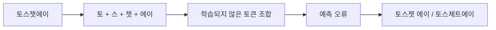
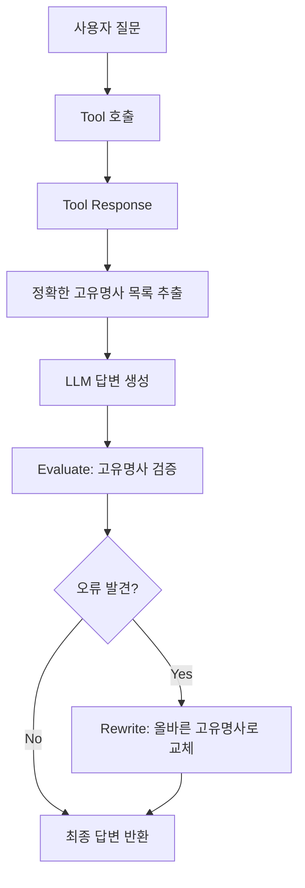

## 1. 문제 발견

헬스케어 도메인의 고객 지원 챗봇을 개발하던 중, 특정 고유명사들을 일관되게 틀리는 현상을 발견했다. 전체적으로는 5% 미만의 낮은 오류율이었지만, 특정 약품명과 병원명에서 반복적으로 오표기가 발생했다.

### 문제의 특징

- 오류율: 전체의 5% 미만
- 특징: **특정 고유명사에 집중**된 오류
- 도메인: 약품명, 병원명, 거래처명 등
- 심각도: 헬스케어 도메인 특성상 고유명사 정확도는 매우 중요

> [!example] 실제 사례
> 사용자: "토스젯에이에 대해 알려주세요"
>
> 기대 응답: "토스젯에이는..."
> 실제 응답: "토스젯 에이는..." 또는 "토스제트에이는..."

## 2. 초기 가설: Context Engineering 문제?

처음에는 프롬프트 길이 때문에 발생하는 문제라고 추측했다.

**초기 가설:**
- 프롬프트에 약품명 리스트, 병원명 리스트 등 많은 컨텍스트를 주입
- 프롬프트가 길어지면서 LLM이 특정 정보에 집중하지 못함
- Context Engineering으로 해결 가능할 것

### 가설 검증 실험

간단한 프롬프트로 격리 테스트를 진행했다:

```
System: 당신은 헬스케어 전문가입니다.
User: 토스젯에이에 대해 설명해주세요.
```

**결과:** 짧은 프롬프트에서도 동일한 오류 발생

→ 프롬프트 길이가 근본 원인이 아님을 발견

## 3. 근본 원인 분석: 토큰화와 Transformer의 한계

### OpenAI Tokenizer 실험

[OpenAI Tokenizer](https://platform.openai.com/tokenizer)에서 고유명사들을 입력하며 실험한 결과, 흥미로운 패턴을 발견했다.

**"토스젯에이" 토큰화 결과:**


> [!note] 토큰화 관찰 결과
> 고유명사가 여러 개의 작은 토큰으로 분리되는 현상을 확인했다. 일반적인 단어들은 하나의 토큰으로 표현되는 반면, 특이한 철자 조합을 가진 고유명사들은 2-3개 이상의 토큰으로 쪼개진다.

### 왜 고유명사를 틀릴까?

**Transformer 기반 LLM의 작동 원리:**

1. **다음 토큰 예측에 최적화**: Transformer 모델은 이전 토큰들을 기반으로 다음 토큰을 예측하도록 학습됨
2. **학습 데이터의 부재**: 특정 도메인의 고유명사는 학습 데이터에 충분히 포함되지 않음
3. **토큰 분리의 악영향**: 고유명사가 여러 토큰으로 쪼개지면, 각 토큰 간의 연결이 학습되지 않아 정확한 재구성이 어려움



**예시:**
- "토스젯에이"가 여러 토큰으로 분리
- 각 토큰 사이의 연결이 학습되지 않음
- LLM은 유사하지만 다른 토큰 조합을 예측
- 결과: "토스젯 에이", "토스제트에이" 같은 오타 발생

> [!important] 핵심 인사이트
> LLM은 일반적인 언어 패턴에는 강하지만, 학습 데이터에 없는 특이한 토큰 조합(도메인 특화 고유명사)을 정확히 재현하는 데는 취약하다.

## 4. 전문가 인터뷰: 실무 관점

문제의 근본 원인을 파악한 후, 해결 방법을 모색하기 위해 Catalin Vieru(전 AWS Principal Cloud Architect, 전 Microsoft Azure Cloud Architect, 현 Google Principal Architect for Generative AI)와 인터뷰를 진행했다.

### 전문가 프로필

**Catalin Vieru**
- 현재: Google LLC, Principal Architect, Generative AI (2024.05 - Present)
- 경력: AWS Principal Cloud Architect (2017-2021), Microsoft Azure Cloud Architect (2016-2017)
- 전문 분야: Data & AI, Machine Learning, Cloud Architecture

### 주요 조언

**1단계: 에이전트 역할 명확히 분리**
- 에이전트는 **순수 데이터 검색**에만 집중
- 추가 토큰 생성을 최소화하여 오류 발생 지점 축소
- 데이터를 반환하되, 해석은 상위 레이어로 위임

> [!quote] Catalin Vieru
> "Agent should focus on data retrieval and minimize additional token generation. Let the supervisor handle final response generation to clearly identify error points."

**2단계: 생성 후 검증 메커니즘 (Evaluation)**
- 정의된 용어 목록(Lexicon)과 실제 응답 비교
- 불일치 발견 시 재시도 루프 실행 (2-3회)
- Microsoft Azure의 평가 서비스 활용 가능
- 99% 이상의 정확도 달성 가능

**3단계: 다층 기술 적용**

1. **정규표현식**: 빠른 오류 탐지 및 교정 (추가 LLM 호출 불필요)
2. **Fine-tuning**: 1,000개 샘플로 도메인 특화 모델 생성
3. **DPO (Direct Preference Optimization)**: 특정 용어 선호도 학습
4. **커스텀 임베딩 모델**: 의료 도메인 특화 임베딩 모델 활용

### 추가 전략

**Context Engineering**
- 복잡한 쿼리를 단계별로 분해
- 각 단계의 중간 결과를 명시적으로 표시
- 투명성 확보로 디버깅 용이

**재검증 프롬프트**
- Supervisor 응답을 LLM에 다시 입력
- "제품 목록에 맞춰 용어 교정" 지시
- 이중 검증으로 정확도 향상

### 유사 사례 및 산업

**금융 산업**
- 전문 용어: bonds, shorts, derivatives
- 맥락에 따라 의미가 달라지는 용어 처리 필요

**바이오의약 산업**
- 약품명, 화학물질명의 정확한 표기
- 규제 준수를 위한 높은 정확도 요구

**법률 산업**
- 판례명, 법률 용어의 정확한 인용
- 오표기 시 법적 문제 발생 가능

> [!important] 핵심 철학
> "복잡한 시스템을 분할하고 LLM의 자유도를 제한함으로써 예측 가능한 동작을 확보한다"

## 5. 이상적인 해결 방법 (하지만 불가능)

가장 근본적인 해결책은 **토크나이저에 고유명사를 학습**시키는 것이다.

**이상적인 접근:**
1. 커스텀 토큰 추가: 우리 도메인의 고유명사들을 단일 토큰으로 등록
2. 토크나이저 재학습: 해당 고유명사들이 쪼개지지 않도록 학습
3. 모델 미세 조정: 새로운 토크나이저로 모델 재학습

**현실적인 제약:**
- OpenAI API 사용: 토크나이저를 수정할 수 없음
- 완전한 모델 재학습은 비용과 시간 측면에서 비현실적
- 빠르게 변경되는 고유명사(신제품, 새 병원)에 대응 불가

## 6. 시도한 해결 방법들

### 6.1. 프롬프트에 약품명 리스트 주입

가장 먼저 시도한 방법은 프롬프트에 약품명 리스트를 직접 넣는 것이었다.

```
System: 당신은 헬스케어 전문가입니다.

다음 약품명을 정확히 사용하세요:
- 토스젯에이
- 베아티정
- 엘리퀴스
...

User: 토스젯에이에 대해 설명해주세요.
```

결과는 실망스러웠다. 프롬프트에 약품명을 명시했는데도 오류는 여전히 발생했다. 프롬프트가 길어질수록 LLM이 특정 정보에 집중하지 못한다고 생각해서, 짧은 프롬프트로도 테스트해봤다. 하지만 문제는 그게 아니었다. 토큰화 레벨의 문제를 프롬프트만으로는 해결할 수 없다는 것을 깨달았다.

### 6.2. Fine-tuning

다음으로 고려한 방법은 고유명사가 포함된 QA 데이터셋을 만들어 모델을 Fine-tuning하는 것이었다. 모델이 직접 고유명사를 학습하면 해결될 것 같았다.

하지만 치명적인 문제가 있었다. 헬스케어 도메인은 변화가 빠르다. 신제품이 계속 출시되고, 새로운 병원이 추가된다. 매번 Fine-tuning을 다시 해야 한다면? 비용과 시간이 너무 많이 든다. 게다가 충분한 학습 데이터를 만드는 것도 쉽지 않다.

빠르게 변화하는 도메인에는 적합하지 않은 방법이라는 결론을 내렸다.

### 6.3. Evaluate + Rewrite (마감에 쫓겨 선택한 방법)

시간이 촉박했다. 여러 방법을 고민하다가 결국 선택한 방법은 생각보다 단순했다. LLM이 답변을 생성하기 전에 사용할 고유명사 목록을 미리 추출하고, 답변 생성 후 검증해서 틀린 부분을 고치는 것이다.



핵심은 타이밍이다. Tool Response는 데이터베이스에서 직접 가져온 정보라 고유명사가 정확하다. 이 단계에서 답변에 사용될 고유명사 목록을 미리 뽑아둔다. LLM을 거치기 전이라 아직 오류가 없다.

그 다음 LLM이 답변을 생성한다. 이때 고유명사 오류가 발생할 수 있다. 하지만 우리는 이미 정답을 알고 있다. 생성된 답변과 정답 목록을 비교해서 틀린 고유명사를 찾고, 문자열 치환으로 교체한다. 추가 LLM 호출이 필요 없으니 빠르다.

결과는 놀라웠다. 고유명사 오류율이 5%에서 거의 0%로 떨어졌다. 응답 시간도 거의 증가하지 않았다. 검증 로직은 단순 문자열 매칭이라 매우 빠르기 때문이다.

이 방법을 선택한 이유는 명확하다. 구현이 간단하고, 새로운 고유명사가 추가되어도 Master Entity List만 업데이트하면 된다. Fine-tuning도 필요 없고, 비용도 거의 안 든다.

### 6.4. 한영 병기 (미시도)

한 가지 더 생각했던 아이디어가 있다. 한글과 영어는 토큰화 방식이 다르다. 그렇다면 두 언어를 함께 제공하면 서로 보완되지 않을까?

```
System: 다음 약품명을 정확히 사용하세요:
- Toszet A (토스젯에이)
- Product B (프로덕트비)
```

영어 토큰화에서 실패해도 한글 정보가 있고, 한글 토큰화에서 실패해도 영어 정보가 있으니 상호 보완이 될 것 같았다.

하지만 시도하지 않았다. Evaluate + Rewrite 방식이 이미 충분히 효과적이었기 때문이다. 굳이 추가 실험을 할 필요성을 느끼지 못했다. 다만 Evaluate + Rewrite를 적용하기 어려운 환경이라면, 한영 병기를 시도해볼 가치는 있을 것 같다.

## 7. 결론 및 인사이트

### 핵심 발견

1. **토큰화가 고유명사 정확도에 미치는 영향**: 특이한 철자 조합을 가진 고유명사는 여러 토큰으로 분리되고, 학습되지 않은 토큰 조합은 LLM이 정확히 재현하기 어렵다.

2. **긴 프롬프트는 원인이 아니었다**: 초기 가설은 틀렸다. 짧은 프롬프트에서도 동일한 문제가 발생했다.

3. **Few-shot은 만능이 아니다**: 프롬프트에 예시를 추가하는 것만으로는 토큰화 레벨의 문제를 해결할 수 없다.

4. **사후 검증의 효과**: 생성 전에 올바른 정보를 확보하고, 생성 후 검증하는 방식이 가장 실용적이고 효과적이었다.

### 실무 적용 가이드

**비슷한 문제를 겪고 있다면:**

1. **문제 정의**: 어떤 고유명사에서 오류가 발생하는가?
2. **토큰화 분석**: OpenAI Tokenizer에서 해당 고유명사가 어떻게 분리되는지 확인
3. **격리 테스트**: 짧은 프롬프트로 테스트하여 Context 문제인지 확인
4. **Evaluate + Rewrite 적용**:
   - Tool Response에서 정확한 고유명사 목록 추출
   - 답변 생성 후 검증 및 교정
   - Master Entity List 관리

**도메인별 적용:**
- **의료/헬스케어**: 약품명, 병원명, 의료 기기명
- **법률**: 법률 용어, 판례명, 법인명
- **금융**: 금융 상품명, 기관명
- **이커머스**: 브랜드명, 제품명

### 남은 질문들

1. **더 나은 토큰화**: 도메인 특화 토크나이저를 학습시킬 수 있다면?
2. **한영 병기의 효과**: 실제로 얼마나 효과가 있을까?
3. **다국어 환경**: 한국어-영어 외 다른 언어 조합에서는?
4. **모델별 차이**: GPT-4, Claude, Gemini 등 모델별로 토큰화 방식과 고유명사 정확도는 어떻게 다를까?

> [!quote] 마무리
> LLM은 강력하지만 완벽하지 않다. 특히 도메인 특화 고유명사처럼 학습 데이터에 충분히 포함되지 않은 정보를 다룰 때는 추가적인 엔지니어링이 필요하다. 문제의 근본 원인을 이해하고, 실용적인 해결책을 찾는 과정이 중요하다.

### 전문가 조언과의 연결점

인터뷰에서 얻은 Catalin Vieru의 조언과 우리가 최종 채택한 방법을 비교하면:

**일치하는 부분:**
- **Evaluate + Rewrite ≈ 생성 후 검증 메커니즘**: 정의된 용어 목록과 실제 응답 비교
- **정규표현식 활용**: 빠른 오류 탐지 및 교정
- **Lexicon 관리**: Master Entity List를 활용한 용어 관리

**차이점:**
- 우리: 문자열 매칭으로 단순하게 구현
- 전문가 제안: Azure Evaluation Service 같은 고급 도구 활용 가능

우리의 접근이 실무 전문가의 조언과 일치한다는 것은, 이 방법이 실무적으로도 검증된 솔루션임을 의미한다.

## 8. 2026년 5월 업데이트: 6개월 후의 풍경

이 글을 처음 정리한 2025년 11월 이후로 6개월이 지났다. 그 사이 LLM 생태계는 빠르게 움직였고, 고유명사 문제에 대해서도 새로운 옵션들이 실용 단계로 내려왔다. 글의 원래 기록은 보존하면서, 지금이라면 무엇을 더 고려할 수 있는지 정리한다.

### 8.1. 채택안의 정당성 재확인

2025년 10월에 공개된 hallucination 미티게이션 서베이([arXiv 2510.24476](https://arxiv.org/html/2510.24476v1))는 "RAG + span-level verification" 조합을 실무 표준으로 권장한다. 우리가 채택했던 "Tool Response에서 엔티티 추출 → 답변 생성 → 문자열 매칭 교정"이 정확히 이 패턴이다.

> [!note] 단일 방어선은 충분하지 않다
> 서베이의 핵심 메시지는 "각 방어층은 이전 층이 처리하지 못한 실패 모드를 다루며, 어떤 단일 층도 충분하지 않지만 누적되면 강력하다"는 것이다. Evaluate + Rewrite는 하나의 견고한 층이지만, 환경이 허락한다면 디코딩 단계의 방어를 한 겹 더 추가하는 것이 이상적이다.

### 8.2. Constrained Decoding이 실용 단계로 내려왔다

5장에서 "이상적이지만 불가능"이라고 분류했던 영역이, self-hosted 환경에선 사실상 무료가 되었다.

핵심 아이디어는 단순하다. Master Entity List를 trie로 만들고, 엔티티 슬롯을 생성할 때 trie에 없는 토큰의 logit을 mask해 확률을 0으로 만든다. "토스젯에이"를 생성할 때 "토" → "스" 다음 자리에서 trie가 "젯"만 허용한다면, 모델은 "스 젯"이나 "제트" 같은 변종 토큰을 아예 선택할 수 없다.

**구현 옵션:**

- **XGrammar**: 2026년 3월 기준 vLLM, SGLang, TensorRT-LLM의 기본 백엔드. 토큰당 40μs 미만 오버헤드로 사실상 무료
- **Outlines**: FSM 기반, multi-turn에서 강함
- **LM Format Enforcer**: 파서 + prefix tree 기반, 0-turn에서 가장 낮은 hallucination 보고([arXiv 2509.06631](https://arxiv.org/html/2509.06631v1))
- **llguidance**: guidance-ai의 최신 구현

OpenAI API를 쓰는 우리 환경에선 직접 적용이 어렵지만, 2025년 11월에 Anthropic이 constrained decoding을 베타로 공개했고 2026년 초에 GA로 풀렸다. Claude로 일부 호출을 옮기는 것도 선택지다.

> [!warning] Structure Snowballing 주의
> 2026년 4월 공개된 [arXiv 2604.06066](https://arxiv.org/abs/2604.06066)은 강한 constrained decoding이 모델의 self-correction을 망가뜨릴 수 있다고 보고한다. 엄격한 포맷팅 규칙을 만족시키는 인지적 부담이 모델을 "포맷팅 함정"으로 몰아넣는다는 것이다. 엔티티 슬롯에만 좁게 적용하고, 추론 본문에는 풀어주는 것이 안전하다.

### 8.3. Structured Output: closed API에서도 사전 차단이 가능해졌다

가장 ROI가 좋은 변화다. OpenAI(2024.08), Anthropic GA(2026 초), Gemini, Cohere, xAI까지 모든 메이저 provider가 JSON Schema 기반 structured output을 지원한다.

활용 패턴이 핵심이다.

```json
{
  "entity_ids": ["TOSJET_A", "HOSPITAL_X"],
  "summary": "환자가 문의한 {ENTITY:TOSJET_A}의 효능은..."
}
```

LLM은 **엔티티 ID만 선택**하게 하고, 최종 렌더링은 서버에서 Master Entity List를 lookup해 치환한다. Evaluate + Rewrite가 "사후 교정"이라면, 이건 "**사전 차단**"이다. LLM이 "토스젯에이"라는 문자열을 직접 생성하지 않으므로 오타 발생 가능성 자체가 사라진다.

우리가 채택한 방법과 함께 쓰면:

1. Structured Output으로 ID 선택 (사전 차단)
2. 서버에서 lookup 치환 (rendering)
3. Evaluate로 누락된 엔티티 검증 (안전망)

세 겹의 방어선이 만들어진다.

### 8.4. Tool Response를 그대로 베끼게 만드는 CopySpec

블로그 시나리오와 가장 잘 맞는 신기법이 EMNLP 2025에서 발표됐다. [CopySpec](https://aclanthology.org/2025.emnlp-main.1337.pdf)은 speculative decoding을 컨텍스트로부터의 copy-paste로 가속하는 기법으로, 부수효과로 모델이 컨텍스트의 토큰 시퀀스를 verbatim copy하는 경향이 강해진다.

Tool Response에 이미 정확한 "토스젯에이"가 있고, 우리는 이걸 답변에 그대로 옮기고 싶다. CopySpec은 디코딩이 그 span을 그대로 emit하도록 유도하므로, 토큰 재구성 과정에서 오타가 끼어들 여지를 줄인다. 단 self-hosted 모델에서만 가능하다.

### 8.5. Vocabulary Customization의 실증

5장에서 "이상적이지만 비현실적"으로 분류했던 토크나이저 확장 방법에 실증 결과가 쌓였다. [arXiv 2509.26124](https://arxiv.org/html/2509.26124)는 의료 도메인에서 토큰 수 15% 감소, 추론 20% 가속, perplexity 개선을 보고한다. 빠르게 변하는 vocabulary에 대해서도 embedding init만 추가하고 fine-tuning 없이 부분적 이득이 있다.

여전히 OpenAI API에서는 불가능하다는 한계는 그대로다.

### 8.6. 한국어 인명에 대한 직접적인 후속 연구

7장 "남은 질문들"에서 모델별 차이와 다국어 환경을 꼽았는데, 한국어 인명·PII에 대한 직접적인 연구가 [MDPI Applied Sciences 2025](https://www.mdpi.com/2076-3417/15/24/12977)로 공개됐다. 한국어 인명은 template-based PII보다 cultural/pragmatic context 의존도가 훨씬 높다는 것을 정량화하고, error-driven prompting framework를 제안한다. Few-shot 예시보다 "오류 패턴을 명시적으로 제시"하는 쪽이 더 효과적이라는 결과다.

### 8.7. 한영 병기에 대한 결론

6.4에서 시도하지 않았던 한영 병기는, 학술적으로 직접 다룬 결과를 찾지 못했다. 다만 의약 RAG의 [drug-name mapping(PMC11570653)](https://pmc.ncbi.nlm.nih.gov/articles/PMC11570653/)이 international vocabularies 간 매핑을 일반화시키고 있어, 비슷한 효과를 "병기"가 아니라 "엔티티 ID 정규화 + 사후 렌더링"으로 우회하는 흐름이 우세해 보인다. Evaluate + Rewrite나 Structured Output ID 패턴을 쓴다면, 한영 병기는 굳이 추가하지 않아도 무방하다.

### 8.8. 환경별 의사결정 매트릭스

| 환경                       | 권장 조합                                                            |
| -------------------------- | -------------------------------------------------------------------- |
| OpenAI API (이 글의 시나리오) | **Structured Output(엔티티 ID placeholder) + Evaluate + Rewrite**    |
| Anthropic Claude            | **Constrained Decoding + Evaluate**                                  |
| Self-hosted (vLLM/SGLang)   | **XGrammar/Outlines + Master Entity Trie + CopySpec**                |
| Fine-tuning 여력 있음        | **Vocabulary Customization + Constrained Decoding**                  |
| 한국어 인명 중심             | **Error-driven prompting + 위 방법 병용**                            |

> [!important] 6개월 후의 핵심 교훈
> 채택했던 Evaluate + Rewrite는 여전히 유효하고, 2026년 서베이에서도 best-practice로 인정받는다. 하지만 "사후 교정"에서 "사전 차단"으로 한 걸음 더 나아갈 수 있다면, Structured Output의 엔티티 ID 패턴이 가장 ROI가 좋은 추가 방어선이다.

## 참고자료

- [OpenAI Tokenizer](https://platform.openai.com/tokenizer)
- [Attention Is All You Need (Transformer 논문)](https://arxiv.org/abs/1706.03762)
- [전문가 인터뷰 전문](https://daglo.ai/share/A8Nd9Z3RSwKNrl58)

### 2026년 업데이트 (8장)

- [Mitigating Hallucination in LLMs — Survey 2025 (arXiv 2510.24476)](https://arxiv.org/html/2510.24476v1)
- [Structure Snowballing — Constrained Decoding 한계 (arXiv 2604.06066)](https://arxiv.org/abs/2604.06066)
- [Guided Decoding in RAG 비교 (arXiv 2509.06631)](https://arxiv.org/html/2509.06631v1)
- [Vocabulary Customization (arXiv 2509.26124)](https://arxiv.org/html/2509.26124)
- [Korean PII Error-Driven Prompting (MDPI 2025)](https://www.mdpi.com/2076-3417/15/24/12977)
- [CopySpec: Accelerating LLMs with Speculative Copy-and-Paste (EMNLP 2025)](https://aclanthology.org/2025.emnlp-main.1337.pdf)
- [Drug Name Mapping with RAG (PMC11570653)](https://pmc.ncbi.nlm.nih.gov/articles/PMC11570653/)
- [LM Format Enforcer](https://github.com/noamgat/lm-format-enforcer)
- [XGrammar](https://arxiv.org/pdf/2411.15100)
- [Outlines](https://github.com/dottxt-ai/outlines)
