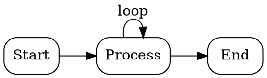

# Diagram Test

Visual check for graphviz and d2 build-time rendering.

## Graphviz


```dot
digraph G {
  rankdir=LR;
  node [shape=box, style=rounded];
  Start -> Process -> End;
  Process -> Process [label="loop"];
}
```

## D2

```d2
users -> api: request
api -> db: query
db -> api: rows
api -> users: response
```
